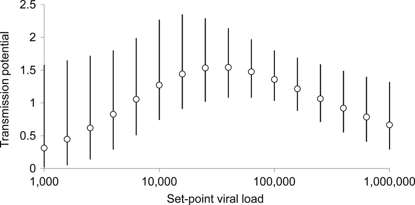

<style type="text/css">
.main-container {
  max-width: 800px;
  margin-left: auto;
  margin-right: auto;
}
h2 { 
 color: #3399ff;		
}
h3 { 
 color: #3399ff;		
}
</style>

```{r setup, include=FALSE} 
knitr::opts_chunk$set(warning = FALSE, message = FALSE) 
```
---


<!-- (pareto, sex biases, viremia, virulence, superinfection, etc. -->


---

### We don't only care about prevalence 

+ <font color='green'> Prevalence </font>: fraction of the population infected (infection is binary here)

+ <font color='green'> Intensity </font>: the number of parasites within an infected host (_how_ infected is the host?)


---

### Why do we care about intensity? 

+ <font color='orange'> outcomes </font> (death is more likely if you have more parasites)

+ <font color='orange'> transmission potential </font> (transmission is more likely when you have more parasites)

+ <font color='orange'> mitigation targets </font> (who do we treat?)


---

### Outcomes (Ebola)

{width="90%"}

<sub> Faye et al. 2015 _PLoS Medicine_ </sub> 


---

### Transmission potential 

+ <font color='green'> supershedders</font>: high infection burden can lead to shedding lots of pathogen in the environment (increases transmission rate) 

+ supershedding is different than superspreading 

+ Transmission potential increases for both external parasites and internal parasites 

+ Even for sexually-transmitted infections (so transmission goes up, even though contact does not change; $\beta = c*a$


---

### An example of HIV 

Higher viremia means higher transmission potential 

{width="50%"}

<sub>Fraser et al. 2007 PNAS</sub>


---

### But once symptoms start, contact goes down 

There is nuance here, as transmission depends on contact and infectivity

{width="90%"}

<sub>Fraser et al. 2007 PNAS</sub>


---

### Timeline of infection 

{width="90%"}

<sub>Arzt et al. 2019 Scientific Reports</sub>


---

### Monogean ectoparasites of guppies 

Saturating transmission potential (there's only so many parasites you can have before transmission potential saturates) 

{width="50%"}

<sub>Walsman et al. 2022 Nature E&E</sub>


---

### Mitigation 

> If we can identify phenotypes of heavily infected individuals, we can target treatment 


---

### Target high-risk individuals 

+ could estimate social contact network (variation in contact rate $c$)

+ or could use measures associated with burden (and subsequently probability of infection)

  + so vaccinate based on which individuals you think are either highest risk or would have the highest burden if infected 


---

### Targeted vaccinations of highly central individuals 

+ Knowing social network structure helps vaccination 

+ Even using traits to target vaccination still works better than random 

{width="90%"}

<sub> Rushmore et al. 2014 Interface </sub> 


---

### What causes variation in infection intensity within a host population?

+ host sex

+ time of exposure

+ superinfection 

+ home range size 

+ immune function


---

### Sex-biased parasitism 

+ 

+ 


---

### Evidence in rodents and bats 

{width="70%"}

<sub>Krasnov et al. 2012 _Mammalia_ </sub>


---

### Sex-biased parasitism 

{width="80%"}

<sub>Krasnov et al. 2012 _Mammalia_ </sub>


---

### Other examples of sex-biased parasitism 


---

### Time of exposure 

+ If all host individuals were equal, there could still be aggregated parasite burdens 

```{r, echo=FALSE}

df <- data.frame(day=1:100, burden=6+sort(log(rexp(100))))

plot(df$day, df$burden, type='b', 
  pch=16, xlab='Day of infection', 
  ylab='Burden', col='dodgerblue')

```


---

### Timeline of infection 

{width="90%"}

<sub>Arzt et al. 2019 Scientific Reports</sub>


---

### Simulated data to show how this matters 

What happens if all hosts are equivalent and timing of exposure is the same? 

```{r, echo=FALSE}

layout(matrix(1:2, ncol=2))
par(mar=c(4,4,1,1))
hist(sample(df$burden[1:10], 1000, replace=TRUE), 
  main='All hosts in first 10 days', 
  xlab='Burden', breaks=15, xlim=c(0,9))

hist(sample(df$burden, 1000, replace=TRUE), 
  main='Random sample', 
  xlab='Burden', breaks=15, xlim=c(0,9))


```


---

### Does not really happen though 

{width="90%"}

<sub> Tinsley et al. 2020 _Parasitology_ </sub> 


---

### Superinfection 

<font color='green'> Superinfection </font> is when an infected individual is exposed again to a parasite, and it infects.

+ This serves to increase pathogen burden in infected hosts, as it disrupts the infection timeline by adding more parasites to an individual. 

+ This effect is pronounced when hosts vary in their exposure probability, such that some individuals just have a higher risk of exposure and resulting superinfection. 


---

### Home range size 


---

### Immune function 


---

<br> 
<br> 
<br> 

<h2> <center> End of lecture 1 </center> </h2> 


---

### What have we learned so far? 

+ There is variation in parasite burden within a population 

+ This variation is related to host traits 


---

### Parasite aggregation 

+ This variation in infection intensity (aka parasite burden) gets at the fundamental idea that <font color='green'> parasites are aggregated within host populations</font> 

<div class="notes">

</div>


---

### What does infection intensity mean for microparasites and macroparasites? 

+ Viremia (viral load)

  + Infectious copies per ml (blood) or g (host tissue)

+ Ectoparasite burdens 

  + Count of individual parasites (sometimes standardized by host weight) 


---

### How do we measure parasite aggregation? 

+ Variance-mean ratio 

+ Negative binomial fit ($k$)

+ Mean crowding 

+ Patchiness 

+ Poulin's $D$ 

+ Hoover's index

https://www.otago.ac.nz/parasitegroup/PDF%20papers/Morrilletal2023-IJP.pdf


---

### Variance-mean ratio 


Variance divided by the mean 

\[ VMR = \dfrac{\sigma^2}{\mu} \]


--- 

### Negative binomial distribution 

```{r, echo=FALSE, fig.width=9, fig.height=4}

layout(matrix(1:3, ncol=3))
hist(rnbinom(1000, size=2, prob=0.4), main='mu=2', 
  xlab='Parasite burden', col='dodgerblue', las=1, breaks=25)
hist(rnbinom(1000, size=5, prob=0.4), main='mu=5',
  xlab='Parasite burden', col='dodgerblue', las=1, breaks=25)
hist(rnbinom(1000, size=10, prob=0.4), main='mu=10',
  xlab='Parasite burden', col='dodgerblue', las=1, breaks=25)

```

\[ k = \dfrac{(\mu^2 - \sigma^2)/N}{(\sigma^2 - \mu^2)} \]


---

### Mean crowding 


\[ m* = \dfrac{\sum x^2_j}{\sum x_j} - 1 \]


---

### Patchiness

\[ P = \dfrac{m*}{\mu} \]


---

### Poulin's D

\[ D = 1 - \dfrac{2\sum^N_i=1 \sum^i_j=1 x_j}{\mu N(N+1)} \]


---

### Hoover's index 

\[ H = \dfrac{\sum^N_i=1 |x_i - \mu | }{2\sum^N_i=1 x_i}  \]


---

### Collinearity among aggregation indices 

{width="80%"}


---

### What causes variation in infection intensity between host species for the same parasite?


+ other stuff. 

+ trait distributions of hosts 

+ phylogenetic bits 

+ parasite specificity 

+ 

<div class="notes">
This is not just aggregated burden in a single host population, but trying to compare variation in infection intensity across host species, where the parasite is the same, but can infect a bunch of different host species. 

</div>


---

### other stuff


---

### trait distributions of hosts


---

### phylogenetic bits


---

### parasite specificity 


---

### Are aggregated burdens comparable across host species? 

Not really


---

### Are aggregated burdens comparable across parasite species? 

Not really


---

### Are aggregated burdens a property of the host or the parasite? 

+ 


---

### 


---

### 


---

### 

