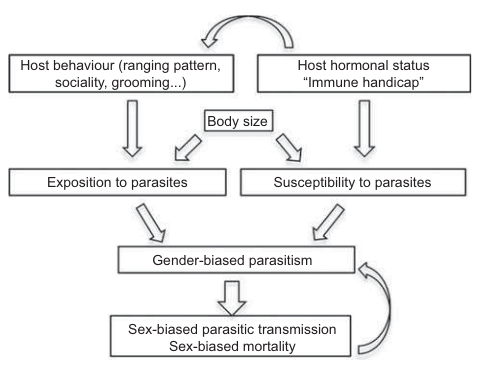

<style type="text/css">
.main-container {
  max-width: 800px;
  margin-left: auto;
  margin-right: auto;
}
h2 { 
 color: #3399ff;		
}
h3 { 
 color: #3399ff;		
}
</style>

```{r setup, include=FALSE} 
knitr::opts_chunk$set(warning = FALSE, message = FALSE) 
```


<!-- (pareto, sex biases, viremia, virulence, superinfection, etc. -->


---

### We don't only care about prevalence 

+ <font color='green'> Prevalence </font>: fraction of the population infected (infection is binary here)

+ <font color='green'> Intensity </font>: the number of parasites within an infected host (_how_ infected is the host?)


---

### But prevalence and intensity are interesting to look at together 

+ Prevalence and intensity are driven by potentially different forces

+ Prevalence is more about encounter ($c$) and intensity is more about host susceptibility ($a$)

+ We'll consider both until next lecture 


---

### Why do we care about intensity in particular? 

+ <font color='orange'> outcomes </font> (death is more likely if you have more parasites)

+ <font color='orange'> transmission potential </font> (transmission is more likely when you have more parasites)

+ <font color='orange'> mitigation targets </font> (who do we treat?)


---

### Outcomes (Ebola)

{width="90%"}

<sub> Faye et al. 2015 _PLoS Medicine_ </sub> 


---

### Transmission potential 

+ <font color='green'> supershedders</font>: high infection burden can lead to shedding lots of pathogen in the environment (increases transmission rate) 

+ Supershedding is different than superspreading 

+ Transmission potential increases for both external parasites and internal parasites 

+ Even for sexually-transmitted infections (so transmission goes up, even though contact does not change; $\beta = c*a$


---

### An example of HIV 

Higher viremia means higher transmission potential 

{width="50%"}

<sub>Fraser et al. 2007 PNAS</sub>


---

### But once symptoms start, contact goes down 

There is nuance here, as transmission depends on contact and infectivity

{width="90%"}

<sub>Fraser et al. 2007 PNAS</sub>


---

### Timeline of infection 

{width="90%"}

<sub>Arzt et al. 2019 Scientific Reports</sub>


---

### Monogean ectoparasites of guppies 

Saturating transmission potential (there's only so many parasites you can have before transmission potential saturates) 

{width="50%"}

<sub>Walsman et al. 2022 Nature E&E</sub>


---

### Mitigation 

> If we can identify phenotypes of heavily infected individuals, we can target treatment 


---

### Target high-risk individuals 

+ could estimate social contact network (variation in contact rate $c$)

+ or could use measures associated with burden (and subsequently probability of infection)

  + so vaccinate based on which individuals you think are either highest risk or would have the highest burden if infected 


---

### Targeted vaccinations of highly central individuals 

+ Knowing social network structure helps vaccination 

+ Even using traits to target vaccination still works better than random 

{width="90%"}

<sub> Rushmore et al. 2014 Interface </sub> 


---

### What causes variation in parasite burden within a host population?

+ host sex

+ time of exposure

+ superinfection 

+ home range size 

+ immune function


---

### Sex-biased parasitism 

+ Generally, males tend to have higher parasite prevalence and intensity than females

+ At least two main drivers:
  + ecological (males have different traits)
  + physiological (different hormone profiles)


---

### Ecological drivers of sex-biased parasitism 

+ <font color='green'> sexual size dimorphism </font>: difference in body size between sexes

+ males tend to (but not always) be larger than females 

+ <font color='red'>However</font>, differences in size are also related to differences in other things which influence parasite encounter (home range size, territoriality, etc.). 

+ Really tough to disentangle differences in size from differences in behavior. 

> How would we test if sex-biased parasitism was driven by size differences versus other behavioral or trait differences? 

<sub> Zuk & McKean 1996 _Int J of Parasitology_</sub>


---

### Physiological 

+ Hormonal differences between the sexes may also play a role in at least two ways
  + hormones may alter immune function
  + hormones may influence behavior


---

### Hormones may alter immune function

+ testosterone suppresses the immune system, increasing susceptibility to infection 

+ note that this does not increase contact rate (which is important for prevalence), but does increase the parasite's ability to increase within the host (which is important for intensity)


---

### Hormones may influence behavior 

+ Testosterone associated with risk-taking behavior, home range size, and movement 

+ This serves to increase encounter rates (which is important for prevalence), but does not increase the parasite's ability to increase within the host (which is important for intensity) 


---

### What does this all mean? 

+ If parasite prevalence and intensity is higher in males, then there are likely multiple forces at work

+ If parasite prevalence is higher, but intensity is not, then it boils down to variation in contact rate, not within-host physiological differences 

+ If parasite intensity is higher, but prevalence is not, then it boils down to variation in physiology/hormones/immune/energy budget, not contact rate


---

### A fun example of sex-biased parasitism 

{width="100%"}

<sub> Swislocka et al. 2020 _Int J Parasitol Parasites Wildlife </sub> 

<div class="notes">
Male moose had higher parasite species richness and prevalence for the majority of the 9 parasite species, but they did not test infection intensity, as fecal egg counts are not super reliable, they argue. 
</div>


---

### Evidence in rodents and bats 

{width="70%"}

<sub>Krasnov et al. 2012 _Mammalia_ </sub>


---

### Sex-biased parasitism 

{width="80%"}

<sub>Krasnov et al. 2012 _Mammalia_ </sub>


---

### Time of exposure 

+ If all host individuals were equal, there could still be aggregated parasite burdens 

```{r, echo=FALSE}

df <- data.frame(day=1:100, burden=6+sort(log(rexp(100))))

plot(df$day, df$burden, type='b', 
  pch=16, xlab='Day of infection', 
  ylab='Burden', col='dodgerblue')

```


---

### Timeline of infection 

{width="90%"}

<sub>Arzt et al. 2019 Scientific Reports</sub>


---

### Simulated data to show how this matters 

What happens if all hosts are equivalent and timing of exposure is the same? 

```{r, echo=FALSE}

layout(matrix(1:2, ncol=2))
par(mar=c(4,4,1,1))
hist(sample(df$burden[1:10], 1000, replace=TRUE), 
  main='All hosts in first 10 days', 
  xlab='Burden', breaks=15, xlim=c(0,9))

hist(sample(df$burden, 1000, replace=TRUE), 
  main='Random sample', 
  xlab='Burden', breaks=15, xlim=c(0,9))


```


---

### Does not really happen though 

{width="90%"}

<sub> Tinsley et al. 2020 _Parasitology_ </sub> 


---

### Superinfection 

<font color='green'> Superinfection </font> is when an infected individual is exposed again to a parasite, and it infects.

+ This serves to increase pathogen burden in infected hosts, as it disrupts the infection timeline by adding more parasites to an individual. 

+ This effect is pronounced when hosts vary in their exposure probability, such that some individuals just have a higher risk of exposure and resulting superinfection. 


---

### Home range size 

+ Species with larger home ranges, or home ranges with more overlap with other species, lead to greater encounter of parasites

+ The potential energetic cost of having a large home range could lead to higher infection intensity 

{width="90%"}

<sub>Godfrey 2013 _Int J Parasitol: Parasites and Wildlife </sub> 


---

### Immune function 

+ We talked about immune function as related to sex differences, but there could also be standing variation in immune function across the population. 

+ We focus here on <font color='green'>innate immunity</font>

---

### Immune function 

+ Variation in immune function will influence infection intensity, but not prevalence 

+ Often tough to disentangle, as it requires immune information before and after parasite infection (or at least before) 

+ Studies tend to look at how parasites influence immune regulation
  
  + e.g., some helminth parasites can downregulate immune function of hosts (McSorley and Maizels 2012 _Clin Microbiol Rev_)


---

<br> 
<br> 
<br> 

<h2> <center> End of lecture 1 </center> </h2> 


---

### What have we learned so far? 

+ There is variation in parasite infection prevalence and intensity within a population 

+ This variation is related to host traits, physiology, etc. 

+ Some things affect infection prevalence, some intensity, some both 


---

### Parasite aggregation 

+ Now we'll focus almost entirely on infection intensity 

+ This variation in infection intensity (aka parasite burden) gets at the fundamental idea that <font color='green'> parasites are aggregated within host populations</font> 

+ Let's dive into some of the terminology and how intensity is measured 

<div class="notes">

</div>


---

### What does infection intensity mean for microparasites and macroparasites? 

+ Viremia (viral load)

  + Infectious copies per ml (blood) or g (host tissue)

+ Ectoparasite burdens 

  + Count of individual parasites (sometimes standardized by host weight) 


--- 

### Issues that we're still struggling with 

+ Do we need to account for host body mass in estimates of infection intensity? 

{width="80%"}


---

### Issues that we're still struggling with 

+ Do we need to account for parasite size or impact? 

{width="70%"}

<sub> Lambden & Johnson 2013 _Ecology & Evolution_</sub>

<div class="notes">
Parasites of amphibians show this clear difference in the number of parasite individuals and the actual burden in terms of percent of host body mass that is parasite. That is, number is related to biovolume, but the slope of that relationship is important to consider, right? Here, we are making the big assumption that larger parasites relative to host mass are having a bigger impact on the host (do larger parasites take more host resources?) 

</div>


---

### What does the distribution of intensity look like? 

{width="60%"}

<sub> Webber & Willis 2020 _Royal Society Open Science_</sub>


---

### What does the distribution of intensity look like? 

{width="100%"}

<sub> Buhat et al. 2021 _Modeling Earth Systems and Env_ </sub>


---

### What does the distribution of intensity look like? 

{width="100%"}

<sub> https://parasiteecology.wordpress.com/2014/04/09/how-many-worms-is-too-many/</sub>


---

### Tradeoffs in infection intensity 

+ Taking too many host resources (e.g., when intensity is high) can kill the host, or reduce parasite fitness

+ There should be a sweet spot of intensity 

+ But this spot is super dependent on amount of host resources, host lifespan, parasite transmission mode, parasite survival in the environment, etc. etc. etc. 


---

### Tradeoffs in infection intensity 


{width="80%"}

<sub> https://parasiteecology.wordpress.com/2014/04/09/how-many-worms-is-too-many/</sub>


---

### How do we measure parasite aggregation? 

+ Variance-mean ratio 

+ Negative binomial fit ($k$)

+ Mean crowding 

+ Patchiness 

+ Poulin's $D$ 

+ Hoover's index


<sub>Morill et al. 2023 _Int J for Parasitology </sub> 


---

### Variance-mean ratio 

+ Basically a test of dispersion

+ Values greater than 1 mean variance is larger than the mean (overdispersed)

+ So there's more aggregation when VMR is high 

\[ VMR = \dfrac{\sigma^2}{\mu} \]


--- 

### Negative binomial distribution 

+ By fitting a known distribution, we get a single measure of aggregation based on the distribution of parasite infection intensity values 

+ As aggregation increases, $k$ decreases 

+ As infection intensity becomes _random_, $k$ goes to infinity 

\[ k = \dfrac{(\mu^2 - \sigma^2)/N}{(\sigma^2 - \mu^2)} \]


---

### Negative binomial distribution 

```{r, echo=FALSE, fig.width=9, fig.height=4}

layout(matrix(1:3, ncol=3))
hist(rnbinom(1000, size=2, prob=0.4), main='mu=2', 
  xlab='Parasite burden', col='dodgerblue', las=1, breaks=25)
hist(rnbinom(1000, size=5, prob=0.4), main='mu=5',
  xlab='Parasite burden', col='dodgerblue', las=1, breaks=25)
hist(rnbinom(1000, size=10, prob=0.4), main='mu=10',
  xlab='Parasite burden', col='dodgerblue', las=1, breaks=25)

```


---

### Mean crowding 

+ Basically, the average number of parasites infecting host (but not quite) 

\[ m* = \dfrac{\sum x^2_j}{\sum x_j} - 1 \]


---

### Patchiness

+ Mean crowding divided by the sample mean

+ _Crowding_ on single host from the perspective of any one parasite, in units of the
mean abundance. 

+ Could be considered as how many times more _crowded_ an average parasite is, compared with if the same parasites were distributed randomly among hosts 

\[ P = \dfrac{m*}{\mu} \]


---

### Poulin's D (discrepancy)

+ Compares observed aggregation with the case of all the sampled parasites being on a single host

+ Based around the Lorenz curve (not unique to this measure) 

+ This measure is also called the Gini index in economics 

\[ D = 1 - \dfrac{2\sum^N_{i=1} \sum^i_{j=1} x_j}{\mu N(N+1)} \]


---

### Lorenz curve 

+ Developed in economics to describe wealth inequality 

{width="80%"}

<sub>McVinish & Lester 2020 _Interface_ </sub>


---

### A note about Poulin's D (the Gini index)

+ So the Gini index, based on the Lorenz curve, is an attempt to get at inequality 

+ The overall goal is to say something about _super_ heavy-tailed distributions 

+ But the Gini index does not get at these heavy tails _as good as it could_ 

+ And we will stop before we go down this statistics rabbit hole


---

### Hoover's index 

+ proportion of parasites that would need to be redistributed to achieve an even distribution among hosts 

+ e.g., value of 0.7 indicates that 70% of the parasites would need to be redistributed in the sample to achieve evenness

\[ H = \dfrac{\sum^N_{i=1} |x_i - \mu | }{2\sum^N_{i=1} x_i}  \]


---

### Collinearity among aggregation indices 

{width="90%"}

<sub>Morill et al. 2023 _Int J for Parasitology </sub> 


---

### This is not good 

> Why is this a problem? 


---

### What causes variation in infection intensity between host species for the same parasite?

+ host immune profiles

+ trait distributions of hosts 

+ parasite specificity 

+ shared habitat use 


<div class="notes">
This is not just aggregated burden in a single host population, but trying to compare variation in infection intensity across host species, where the parasite is the same, but can infect a bunch of different host species. 

</div>


---

### Evidence for differential host use 

{width="60%"}

<sub> Fenton et al. 2015 _Am Nat_</sub> 


---

### host immune profiles 

+ Differences among host immune response could mean some host species have higher (lower) infection intensities 

+ Variable host condition (ability to mount immune response) could drive variation in infection intensity (Beldomenico & Begon2010 _TREE_)

<div class="notes">

</div>


---

### Bats are weirdos 

{width="100%"}

<div class="notes">
We'll talk later about how bats are weirdos, but they tend to be more _tolerant_ to parasite infections, leading to high infection intensity without as much cost as other species may see. This relates to how their immune systems work. I searched for like 30 minutes and couldn't find a good clear figure from a paper to demonstrate this though. 

</div>


---

### trait distributions of hosts

+ Host traits influence both prevalence and intensity 

+ So different distributions of host traits will influence encounter ($c$) and susceptibility ($a$)


---

### trait distributions of hosts

{width="60%"}

<sub>Greenberg et al. 2017 _Evolutionary Applications_</sub>


---

### parasite specificity 

+ Parasites are better at infecting some hosts than others 

  
{width="80%"}

<sub>Dallas et al. 2019 _PRSB_</sub>


---

### parasite specificity 

+ This could be for a number of reasons 
  
  + parasites infecting fewer host species might be better suited to infect those particular host species 
  
  + distantly related host species may be harder to infect for a given parasite (phylogenetic distance is important!)


---

### shared habitat use 

+ intensity could increase when contact increases (provided superinfection possible)

+ e.g., if host prefers same microclimate as parasite, could lead to higher intensities for that species, and potentially shifts in distribution of infection intensity 


---

### A fun side note 

+ Mean-variance scaling relationships in infection intensity 

+ Mean burden is related to the variation in burden 

{width="80%"}

<sub>Johnson & Hoverman 2014 _J Animal Ecology_</sub>


---

### What causes variation in infection intensity for the same host species across parasites?

+ It's not just about host differences 

+ Parasites differ in their transmission, ecology, habitat preferences, tissue infected, etc. etc. etc. 

+ All of these things influence the resulting infection intensity possible for a given parasite

+ Even if it's infecting the same host


---

### But this is pretty obvious

+ If this is a shock, it shouldn't really be 

+ More similar parasite species should have similar infection intensities in the same host though 


---

### A holistic view of prevalence and intensity

{width="100%"}

<sub>Holian & Dallas 2023 _in prep_ </sub>


---

### Hosts are less variable in their parasite intensities

{width="100%"}

<sub>Holian & Dallas 2023 _in prep_ </sub>


---

### Standing questions for thought 

<br> 
<br> 

> Are aggregated burdens comparable across host species? 

> Are aggregated burdens comparable across parasite species? 

> Are aggregated burdens a property of the host, the parasite, or the location? 


