<style type="text/css">
.main-container {
  max-width: 800px;
  margin-left: auto;
  margin-right: auto;
}
h2 { 
 color: #3399ff;		
}
h3 { 
 color: #3399ff;		
}
</style>

```{r setup, include=FALSE} 
knitr::opts_chunk$set(warning = FALSE, message = FALSE) 
```


<!-- Behavioral (self medication, parasite manipulation, etc.) and immunological responses (plus resistance-tolerance tradeoffs and Th1/Th2 within host dynamics) week 8 from Park 2019 --> 


---

### Parasite infection alters host behavior

+ Behavioral defense (e.g., grooming)

+ Parasite manipulation (e.g., parasite-induced changes to host behavior)

+ Sickness behavior (e.g., fever)

<sub> </sub> 


--- 

### Grooming 

+ Societal benefits 

+ Removal of ectoparasites
  + which can vector some rough parasites

<br> 

> Humans groom, but what are other related activities that we do? 


---

### Desert rodent grooming behavior and flea mortality

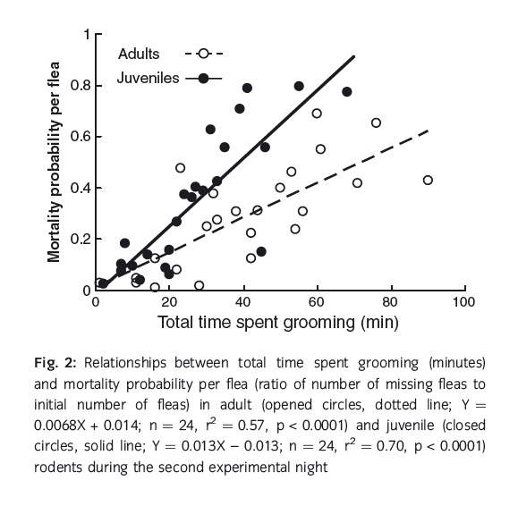{width="80%"}


<div class="notes">

Point out differnces in grooming behavior at different host ages, and how juveniles appear to be "better groomers"? 

</div>


---

### Preening 

Birds will use their beaks to reorient their feathers, clean plumage, and check for ectoparasites. 


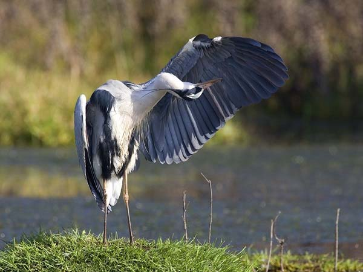{width="65%"}


---

### Uropigeal gland

This gland contains oil that the birds use during preening, distributing it among their feathers. 

+ good for waterproofing
+ anti-parasitic
+ anti-bacterial


<div class="notes">
This is my *note*.

</div>


---

### Bird bill size influences ability to remove parasites 


+ Parasites specialize on certain host species. 

+ Lice specialize on birds they can parasitize. 

+ Tends to lead a relationship where bigger birds have bigger lice. 


---

### Bigger host, bigger parasite

This is called "Harrison's rule" and has mixed support. 

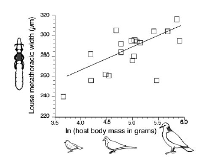{width="80%"}


--- 

### What's driving this? 

+ Differences in attachment rate? (no)

+ Differences in feeding success? (no)

+ Escaping from preening (yes) 


--- 

### Medicinal plant use 

Hosts will change their diet to combat parasites 


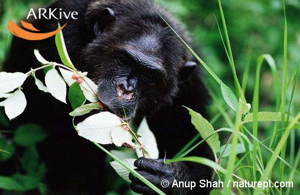{width="70%"}


--- 

### Monarchs and medicinal plant use (ish)


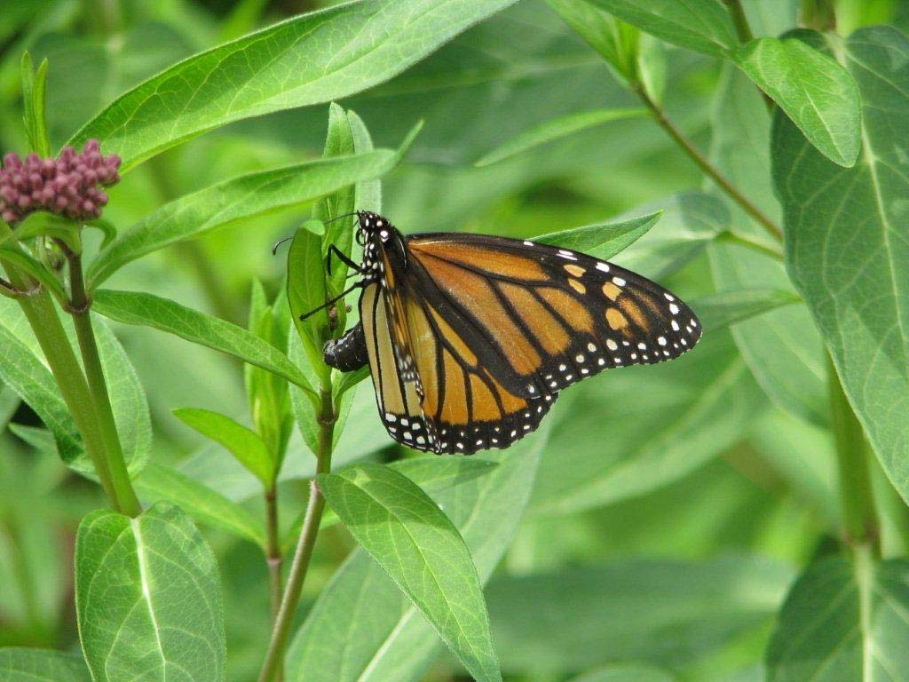{width="70%"}


--- 

### (ish) because used for anti-predator and anti-parasite 

+ Monarch butterflies are a classic example
  + sequester cardenolides from milkweed plants
  + deters predators
  + reduces spore load of OE parasite 


---

### If infected, preferentially lay eggs on toxic plant

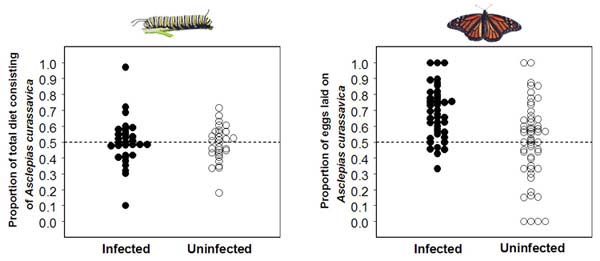{width="100%"}


---

### Using the environment in your favor 

+ Hosts may preferentially occupy different environments to avoid parasite encounter or infection


---

### _Entomophthora muscae_, fungal pathogen of house flies


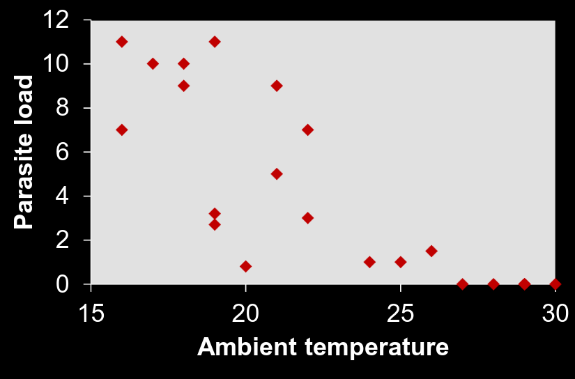{width="100%"}


---

### Behavioral fever 

+ Flies can't generate their own body heat to change internal temperature. 

+ If infected, prefer warmer environments 

<sub> Kalsbeek et al. 2001. Biological control, 21:264-273. </sub>


---

### Behaviors to avoid encounter 

> Just go where the parasites are not, right? 

Typically manifests in two ways: 

+ uninfected individuals spending more time "away" from parasites

+ uninfected individuals avoid infected individuals 


---

### Host behavior responses to infection risk

+  Parasite removal
  + Grooming
  + Medicinal plant use
  + Behavioral fever

+ Behavioral avoidance
  + Self-annointing / swatting
  + Seeking low-risk habitats
  + Avoid infected conspecifics


--- 

### Parasite manipulation of host behavior 

Some behaviors predispose host to things that benefit the parasite

+ increased growth rate of parasite inside host

+ increased predation risk for trophically-transmitted parasite 


> Let's go through some cool examples of this 


---

### _Cordyceps sp._ (fungi) in insect hosts 


<iframe width="560" height="315" src="https://www.youtube.com/embed/vijGdWn5-h8?si=JNsvIuPYXB33_tJt" title="YouTube video player" frameborder="0" allow="accelerometer; autoplay; clipboard-write; encrypted-media; gyroscope; picture-in-picture; web-share" allowfullscreen></iframe>


---

### _Leucochloridium paradoxum_ (trematode) infecting snails

<iframe width="560" height="315" src="https://www.youtube.com/embed/XMoP_47575c?si=aDMG5L2nulunpqH0" title="YouTube video player" frameborder="0" allow="accelerometer; autoplay; clipboard-write; encrypted-media; gyroscope; picture-in-picture; web-share" allowfullscreen></iframe>


---


### _Myrmeconema neotropicum_ (nematode) infecting ants

<iframe width="560" height="315" src="https://www.youtube.com/embed/DUAVTJ-lauk?si=jGYcEP-5YLJ3qJql" title="YouTube video player" frameborder="0" allow="accelerometer; autoplay; clipboard-write; encrypted-media; gyroscope; picture-in-picture; web-share" allowfullscreen></iframe>


---

### Host behavior can 

+ reduce parasite burden (e.g., grooming)

+ enhance parasite burden (e.g., parasite manipulation) 


---

### What types of parasites would benefit most from manipulating host behavior? 


> And what parasites would really not want to directly manipulate host behavior? 


---

### Sickness behaviors 

+ Typically include anorexia, fatigue, and reduction in social and reproductive activities

+ Hypothesized to be adaptive changes for host

+ Incidental though, as some of these behaviors are result of body fighting parasite 


---

### Incidental changes in behavior 

+ Sleepiness results in reduced contact with others
  + could aid in recovery 
  + but could also increase transmission of some parasites 

> What hypothesis could we pose around the expression of sickness behaviors across parasite species? 


---

### Decreased cognitive ability 

+ COVID brain fog (jk)

+ _Bombus impatiens_ infected by _Crithidia bombi_ (protozoan)


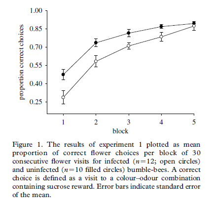{width="50%"}


--- 

### Questions to think about 

+ When are sickness behaviors maladaptive to the parasite? 

+ What parts of the transmission process (encounter + susceptibility) do each of these behaviors (grooming, sickness, manipulation) affect? 

+ Where would self-medication of hosts fall in the continuum of resistance and tolerance tradeoffs? 


<!-- End of lecture 1 --> 


---

<br> 
<br> 
<br> 

<h2> <center> End of lecture 1 </center> </h2> 


---

### Host immunological responses to infection

+ Adaptive and innate immune defenses 

  + *innate*: general non-specific response to anything (generally larger extracellular things)

  + *adaptive*: responds to specific antigens (targeted response) 


--- 

### Innate immunity 

+ generalist immune response to any invader, including sensing wounds or trauma 

+ the immune system you are born with 

+ includes physical structures in the loosest definition (skin and mucous) 

+ activate general cells to attack invader and initate repair of damaged tissue 


---

### Adaptive immunity 

+ *specficity*: ability to recognize and attack specific cell types. 

+ *memory*: ability to remember cells that have invaded previously 

+ *diversity*: ability to respond to wide range of invasive organisms

+ *self-tolerance*: ability to recognize and not attack self (e.g., auto-immune disorders) 


<div class="notes"> 


In contrast to innate immunity, adaptive immunity recognizes small regions of parasite molecules which could be as small as 5 or 10 Amino acides of  a specific parasite cell wall protein.  
This specificity means that different parasites species - and even different strains of the same parasite - often differ in terms of their recognition sites. 
In addition to this specificity, there are three other hallmarks of adaptive immunity in vertebrates, and these include:  

</div> 


---

### Some jargon before we dive into adaptive immunity 

*Antigen*

+ each pathogen generates multiple *antigens*, or molecule that stimulates an immune response 

*Antibodies*

+ immune molecules that bind to antigens 

<div class="notes">

Specific host immunity recognizes and binds to a small molecular site wthin a larger paraiste particle
The term antigen originally came from ANTIbody GENerator
Antigens are the general term for sites on a pathogen than can stimulate immune response
Antibodies are immune molecules produced by the host’s immune system that serve several key functions. 
Antibody binds to a single antigenic site
A diversity of antibodies can recognize many pathogens
Here is the typcial drawing of an anitbody and this is an immunoglobulin molecule with a general base and some specific arms, with the arms having a molecular structer that can bind to antigen kind of like a lock and key mechanism 
Each antibody is specific to a pathogens’s antigen
</div>


---

### Major histocompatiability complex 

+ labels foreign bodies for immune system to decide 'self' or 'not self' 
+ reason why skin grants and transplanted organs get rejected 
+ wide variation in MHC (2-3 people will share be close match out of every 100,000 people) 


<div class="notes">
The genes in question instruct cells to make the proteins of the Major Histocompatability Complex, one of the immune system's key markers of identity. MHC proteins attach to foreign bodies and present them to the immune system for a verdict of self or not self. The system attacks anything that does not pass the test. That includes foreign MHC proteins, which is why skin grafts and transplanted organs are rejected unless the donor's MHC is very similar to the recipient's.
There are more than 100 MHC genes on human Chromosome Six and so many versions of each gene, that in a typical population of 100,000 people, only two or three people are likely to match very closely.
</div>


---

### The two branches of adaptive immunity 

+ Cell-mediated (intracellular)

+ Humoral (extracellular)


---

### Cell-mediated 

+ necessary to destroy pathogens within host cells 

2 types of T-lymphocytes
  + T-helper cells recognize antigens presented on surface of macrophages
    + Th1: assist with intracellular immunity 
    + Th2: assist with extracellular immunity 

  + cytotoxic T-cells
    + bind and destroy infected host cells (also called "killer T-cells")

<div class="notes">
Cell mediated adaptive immunity involves lymphocytes too – 
IF B-lymphocytes or B-cells are the key to humoral immunity, then T-cells are the key to cell-mediated immunity.  Called T-cells because they are produced by the thymus. 
These cells are important for a couple of functions, a key one of whichi is to destroy intracellular pathogens 
But in fact, there are several types of T-cells – there are T-helper cells, which can recognize antigens on the surfaces of macrophages
Th-1 cells assist with intracellular immunity, and specifically cells that destroy pathogens or infected cells
Th-2 cells assist with humoral immunity because they stimulate production of specific B-cells
Finally, Cytotoxic T-cells, also called CD8 cells or Killer T-cells, bind to and destroy infected host cells
</div> 


--- 

### Humoral 

+ attacks pathogen outside of host cells

+ produced by B-cells (lymphocytes) activated by T-helper cells (Th2 response) 

+ activated B-cells also produce memory cells 

+ bind to antigens to block active sites 

+ *agglutination*: clumping of immune cells around pathogens 


<div class="notes">

Antibodies are invovled in humoral immunity – which means extracellular immunity

These anitbodies are floating around in the blood serum and plasma, and if they find an appropriate pathogen and bind to it, other steps are initiated

Antibodies are produced by B-cells – a special type of lymphocyte called B-cell because they are produced in the bursa of birds and bone marrow of mammals

</div> 


---

### Major histocompatiability complex 

Class 1: tagging intracellular pathogens 

Class 2: tagging extracellular pathogens 


--- 

### How effective is immune system at combating different types of parasites? 

+ complete removal and lasting immunity (classic microparasite response) 

+ partial control with longer-term persistence or reinfection (classic macroparasite) 

+ total failure to control pathogen (novel pathogens, immuncompromise) 


--- 

### Multiple challenges and tradeoffs 

+ Co-infection (being infected by two or more parasites at the same time) can be bad 

+ Mounting a Th1 and Th2 response is demanding 

+ So challenges of a macroparasite and a microparasite might be worse off than two microparasites, right? 


<sub> See work from Amy Pederson and Vanessa Ezenwa looking at some cool natural examples of coinfection </sub> 


--- 

### Host resistance evolution 

+ Selective force is on the parasite to evolve ways to bypass host immune defenses 

+ Selective force is on the host to effectively respond to parasites


---

### Definition of host resistance 

+ ability to prevent or limit parasite infection (inverse of susceptibility) 

+ *'resistant'*: rarely or never infected 

+ *susceptible*: commonly infected 

+ *tolerance*: perform well despite infection (in terms of survival/growth/reproduction) 


---

### Note that resistant is differently defined than how we previously talked about 

+ A <font color='green'> resistant </font> host is rarely infected, but when we talk about resistance-tolerance tradeoffs, it is assumed that the parasite has infected the host, and the host can respond to this in at least two ways; <font color='red'> resistance </font> or <font color='red'> tolerance </font> 


---

### Tolerance example 

Low elevation birds had lower mortality and higher weight despite having higher parasitemia 

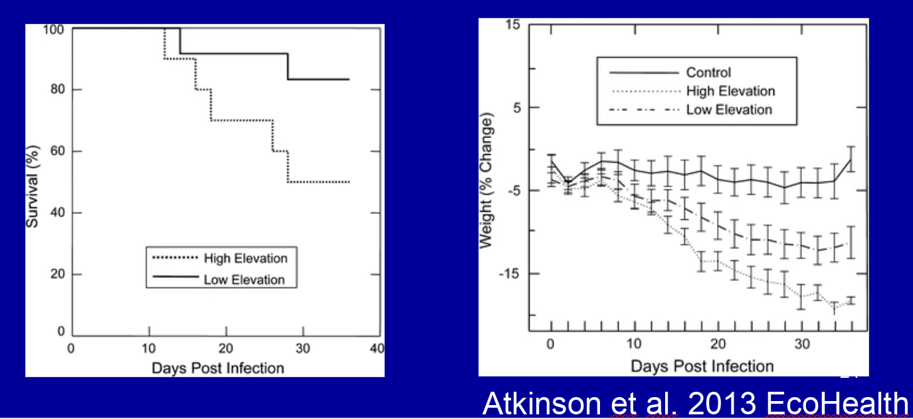{width="100%"}

<div class="notes"> 

We document emergence of tolerance rather than resistance to avian malaria in a recent, rapidly expanding low elevation population of Hawai‘i ‘Amakihi (Hemignathus virens) on the island of Hawai‘i. Experimentally infected low elevation birds had lower mortality, lower reticulocyte counts during recovery from acute infection, lower weight loss, and no declines in food consumption relative to experimentally infected high elevation Hawai‘i ‘Amakihi in spite of similar intensities of infection. Emergence of this population provides an exceptional opportunity for determining physiological mechanisms and genetic markers associated with malaria tolerance that can be used to evaluate whether other, more threatened species have the capacity to adapt to this disease.

</div> 


---

### resistance-tolerance tradeoffs 

Imagine the host has a choice in how it can respond to a pathogen

> Does the host focus on fighting the negative effects of pathogen?

> Does the host focus on reducing damage of pathogen, allowing more focus on survival/growth/reproduction? 


<sub> Not inherently a tradeoff, but often presented as such </sub> 


---

### Parasite facilitation through host immune costs 

One paper you read this week was from Ezenwa et al. _Am Nat_. This is a clear empirical demonstration of apparant facilitation between two coinfecting parasites (Tuberculosis and an intestinal helminth in African buffalo). 

<br> 

> Anybody want to summarize this paper for the class? 


<div class="notes">

Infection by helminths triggers Th2 response over Th1 (important for microparasites), so being infected by a helminth can actually enhance infection by microparasites like Tuberculosis. They tested this in a wild buffalo population and some fun modeling. Demonstration of synergistic effects that parasites can have through regulation of host immune system. Cool genetic work showed that there is a 'resistant' phenotype to nematodes. 

More info here: https://ezenwalab.yale.edu/research

</div> 


--- 

### Why don't have more examples of evolution of host resistance? 

<br> 

Given strong selection, why don't all hosts evolve resistance? 

<div class="notes">

Lack of genetic variation in resistance
Host-parasite genetic interactions 
Red-queen dynamics (haven't gone over yet) 
Costs of resistance 

</div> 


---

### Tasmanian devil facial tumor disease 

Transmissible cancer affecting devils 

> "Genetic impoverishment has made the immune system blind" 

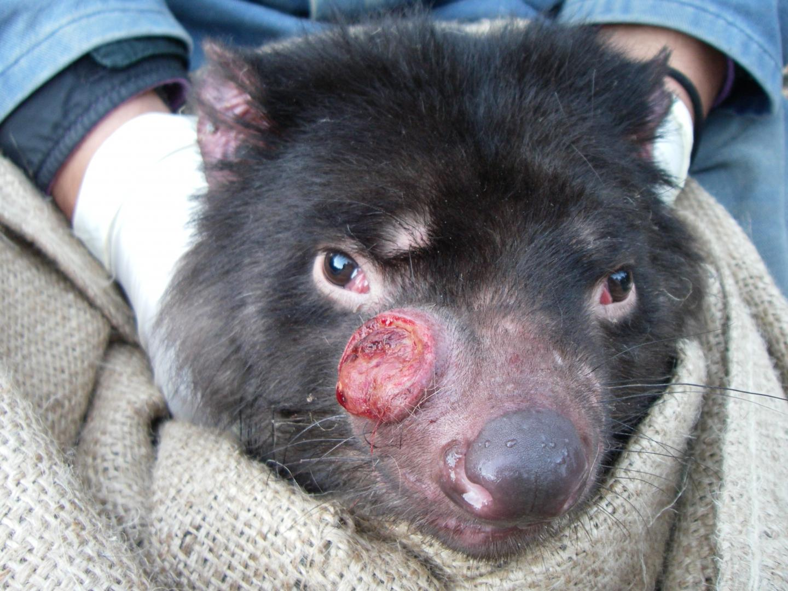{width="50%"}


<sub> Siddle et al. 2007 _PNAS_ </sub> 

<div class="notes">

The devil, a marsupial carnivore native only to Tasmania, has had an up-and-down demographic history since Europeans and their livestock colonized the island. Perceived as inimical, like coyotes in the American West, it suffered bounty killing in the 19th century and poisoning with strychnine in the early 20th. By the time it became appreciated as an iconic element of Tasmania’s indigenous wildlife, it had passed through severe (but not precisely measurable) population bottlenecks — that is, periods of badly reduced abundance, during which devils were scarce on the landscape. Thanks to its high reproductive rate and opportunistic behavior, it had recovered nicely — at least in sheer numbers — and by the 1990s, according to one estimate, the wild population stood at about 150,000. But of course genetic diversity rebounds much more slowly than population size.

</div> 


---

### Strain-specific immunity 


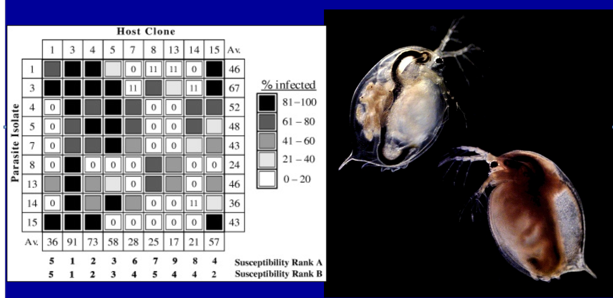{width="100%"}


<div class="notes">
Daphnia magna and the bacteria Pasteuria ramosa. No host clone is resistant to all parasite isolates, and no parasite isolate can infect all host clones
</div>


---

### Costs of resistance 

+ Traits that confer resistance could lower other fitness components 

+ Some good papers on when these should occur and if they are even _really_ a thing. 

Cost = <font color='green'> S fitness</font> - <font color='red'> R fitness</font>


<sub> reviewed in Burrington 2000; good critique from Lenormand et al. 2018 _Rethinking Ecology_ </sub>


---

### What happens when we do see the evolution of host resistance? 

We tend to see the co-evolution of the parasite. 

*Red-queen dynamics*: co-evolutionary arms race between host and parasite. 


---

### A snail example

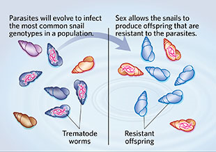{width="90%"}


