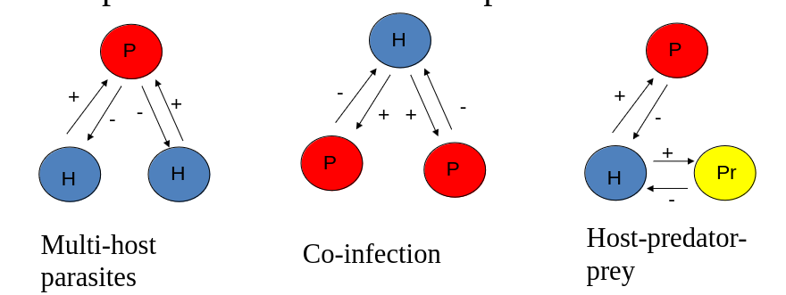
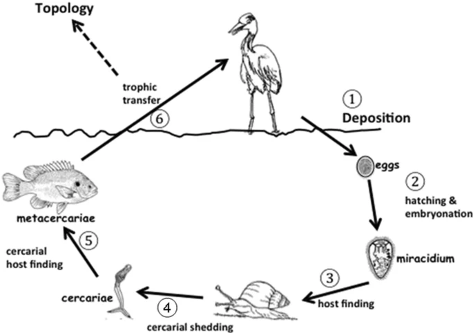
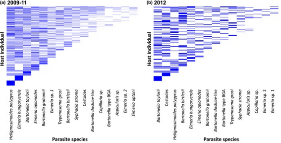
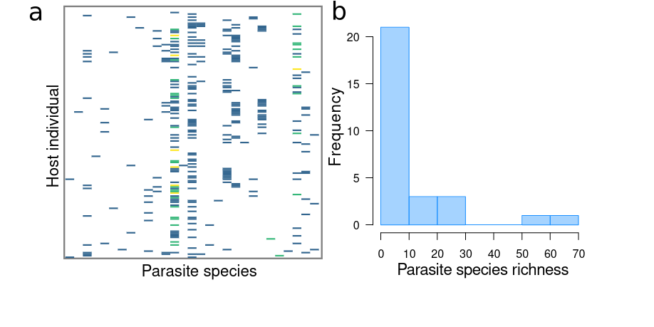
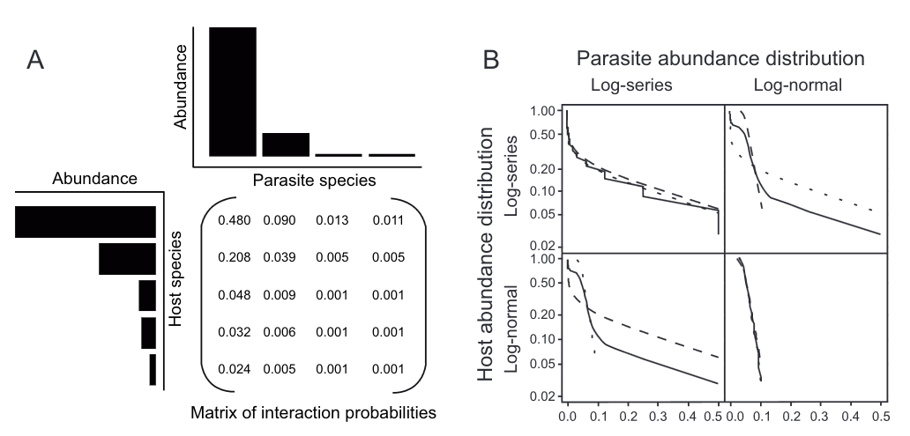
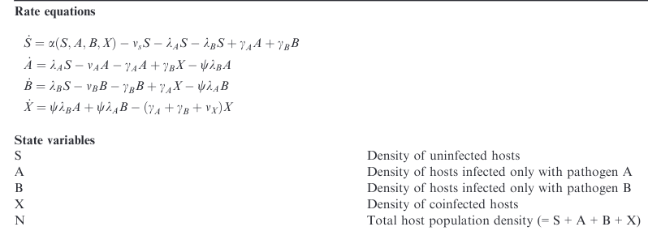
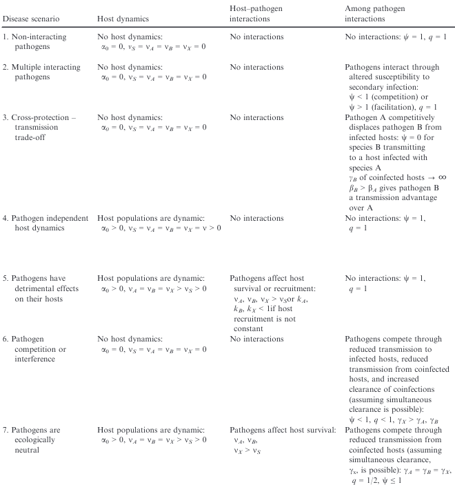
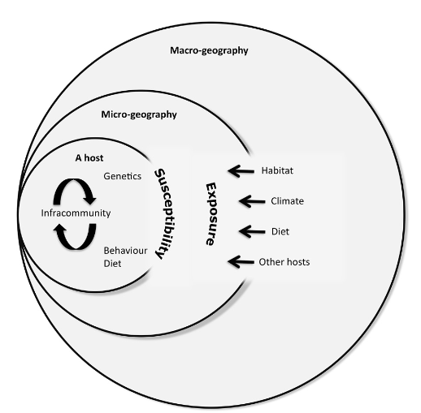

<style type="text/css">
.main-container {
  max-width: 800px;
  margin-left: auto;
  margin-right: auto;
}
h2 { 
 color: #3399ff;		
}
h3 { 
 color: #3399ff;		
}
</style>

```{r setup, include=FALSE} 
knitr::opts_chunk$set(warning = FALSE, message = FALSE) 
```


<!-- (within host competition, pederson's work, priority effects, altered susceptibility, competition changing outcomes for host, )  
week 11 from Park 2019; include bits of parasite extinction stuff from week 14 as well --> 
 


---

### Community epidemiology 

+ mult-host, multi-parasite interactions in a community context

{width=100%} 


---

### Multi-host parasites 

+ One parasite that infects multiple host species (recall previous lectures)

+ Can be either at species (rabies) or individual (mosquitos) level 


---

### Host-predator-prey 

+ Predator eats prey, prey gets infected by parasite 

+ Important in a couple ways:
  + trophic transmission 
  + healthy herds 


---

### Trophic transmission 

+ consumption of prey is necessary for the parasite to advance life cycle
+ the parasite infects the predator as well 

{width=60%}


---

### Healthy herds 

+ Predators might eat prey non-randomly 
+ Sickness behaviors leave prey weaker or more isolated from groups
+ The consumption of infected prey by the predator could reduce disease burden in the host population 


---

### Co-infection 

+ The same host individual is infected by more than one parasite species 

+ Extremely common 

{width=80%}


--- 

### Co-infection 

+ Do parasites interact?

+ Through what mechanisms? 
  + <font color='green'> bottom up </font> (e.g, competition)
  + <font color='green'> top down </font> (e.g, immune-mediated)

+ How do interactions within infected hosts affect population-level patterns? 


---

### Coinfection can result in non-linear changes to 

+ disease severity
+ host survival 
+ parasite replication and shedding
+ design of control programs


---

### Detecting parasite-parasite associations 

{width=80%} 

<sub> Dallas et al. 2019 _PRSB_</sub> 


---

### Types of interactions 

<font color='green'> Bottom-up </font>
+ Within-host competition for resources or space 
+ Ecological interference via reduced contact or density 

<font color='green'> Top-down </font> 
+ Facilitation via host defenses (HIV and opportunistic infections)
+ Indirect competition via host defenses (e.g., immune priming or cross protection)


---

### How do we estimate the effect of coinfection? 

+ Either parasite species richness (treats infection by parasite $i$ as binary) or an estimate of infection intensity for each coinfecting parasite 

+ Hosts with lots of parasites are not necessarily the ones with highest burdens 
  + If parasites compete or that host is mounting a strong but failing immune response 

+ The effect of host traits, geography, etc. need to be considered
  + We'll get into a conceptual framework for thinking about coinfection later 


---

### Some definitions before we start to conceptualize how this works 

+ <font color='green'> Infracommunity </font>: all the parasite species within a single infected host 

+ <font color='green'> Component community </font>: all the parasite species within a host population (basically a local estimate of parasite species richness for a species)


---

### Let's start with a null model 

+ Null models incorporate no ecological process

+ They make really simple assumptions that provide good benchmarks 

> What would the distribution of coinfection look like if all hosts were equally probable of getting infected and all parasites were distributed independently? 


---

### So we'll start with assumptions 

+ All hosts equally likely to be infected 
+ All parasites are distributed independently 

{width=80%} 


---

### Uses of null models to understand host-parasite communities

{width=100%} 


<sub> Canard et al. 2014 _Am Nat_ </sub> 


---

### Incorporating non-random processes could lead to expected differences 

+ So what could we incorporate into our null to address this? 

> - Covariance between parasite distributions (some hosts are more likely) 
> - Incorporate host traits like body size (big hosts more parasites) 
> - other stuff


---

### Examples of coinfection and how we study it 

+ Observational field studies 

+ Experimental field studies 

+ Models 


---

### Observational field studies 

+ Tuberculosis and helminth coinfection in wild buffalo (Ezenwa)


---

### Experimental field studies 

+ Mice (Pederson) 


---

### Models 

{width=100%} 


<sub> Seabloom et al. 2015</sub>


---

### Models

{width=100%} 

<sub> Seabloom et al. 2015</sub>


---

### 


---

### 


---

### 


---

### 


---

### A conceptual framework of coinfection 

Exposure versus susceptibility as drivers of coinfection 


---

### A conceptual framework of coinfection 

{width=50%}


---

### Exposure 

+ geography 

+ behavior 

+ host traits 


---

### Susceptibility 

+ genetics (immune or defense traits)

+ diet 

+ costs of immunity 

+ microbiome 


---

<div class="columns-2">

</div> 

<font color='green'>  </font> 

<sub> Dallas et al. 2019 _PRSB_</sub> 


---

<br> 
<br> 
<br> 

<h2> <center> End of lecture 1 </center> </h2> 


---

### What have we learned? 

+ 


---

### Models of coinfection 

Seabloom et al. 2015 Ecol Letters


---

### Parasite community assembly processes 

+ Co-infection doesn't just magically happen, right? 

+ priority effects 


---

### How can we get at parasite community assembly? 

+ mark-recapture studies in wild populations 

+ experimental lab studies 

+ models 


---

### mark-recapture studies in wild populations 


---

### experimental lab studies 


---

### models 

beta as a function of other parasite beta 


---

### 


---

### 


---

### 


