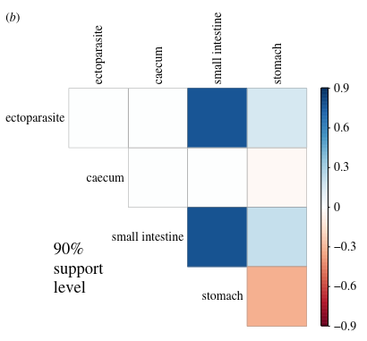

<style type="text/css">
.main-container {
  max-width: 800px;
  margin-left: auto;
  margin-right: auto;
}
h2 { 
 color: #3399ff;		
}
h3 { 
 color: #3399ff;		
}
</style>

```{r setup, include=FALSE} 
knitr::opts_chunk$set(warning = FALSE, message = FALSE) 
```


<!-- (within host competition, pederson's work, priority effects, altered susceptibility, competition changing outcomes for host, )  
week 11 from Park 2019; include bits of parasite extinction stuff from week 14 as well --> 
 


---

### Community epidemiology 

+ mult-host, multi-parasite interactions in a community context

{width=100%} 


---

### Multi-host parasites 

+ One parasite that infects multiple host species (recall previous lectures)

+ Can be either at species (rabies) or individual (mosquitos) level 


---

### Host-predator-prey 

+ Predator eats prey, prey gets infected by parasite 

+ Important in a couple ways:
  + trophic transmission 
  + healthy herds 


---

### Trophic transmission 

+ consumption of prey is necessary for the parasite to advance life cycle
+ the parasite infects the predator as well 

{width=60%}


---

### Healthy herds 

+ Predators might eat prey non-randomly 
+ Sickness behaviors leave prey weaker or more isolated from groups
+ The consumption of infected prey by the predator could reduce disease burden in the host population 


---

### Co-infection 

+ The same host individual is infected by more than one parasite species 

+ Extremely common 

{width=80%}


--- 

### Co-infection 

+ Do parasites interact?

+ Through what mechanisms? 
  + <font color='green'> bottom up </font> (e.g, competition)
  + <font color='green'> top down </font> (e.g, immune-mediated)

+ How do interactions within infected hosts affect population-level patterns? 


---

### Coinfection can result in non-linear changes to 

+ disease severity
+ host survival 
+ parasite replication and shedding
+ design of control programs


---

### Detecting parasite-parasite associations 

{width=70%} 

<sub> Dallas et al. 2019 _PRSB_</sub> 


---

### Types of interactions 

<font color='green'> Bottom-up </font>
+ Within-host competition for resources or space 
+ Ecological interference via reduced contact or density 

<font color='green'> Top-down </font> 
+ Facilitation via host defenses (HIV and opportunistic infections)
+ Indirect competition via host defenses (e.g., immune priming or cross protection)


---

### How do we estimate the effect of coinfection? 

+ Either parasite species richness (treats infection by parasite $i$ as binary) or an estimate of infection intensity for each coinfecting parasite 

+ Hosts with lots of parasites are not necessarily the ones with highest burdens 
  + If parasites compete or that host is mounting a strong but failing immune response 

+ The effect of host traits, geography, etc. need to be considered
  + We'll get into a conceptual framework for thinking about coinfection later 


---

### Some definitions before we start to conceptualize how this works 

+ <font color='green'> Infracommunity </font>: all the parasite species within a single infected host 

+ <font color='green'> Component community </font>: all the parasite species within a host population (basically a local estimate of parasite species richness for a species)


---

### Let's start with a null model 

+ Null models incorporate no ecological process

+ They make really simple assumptions that provide good benchmarks 

> What would the distribution of coinfection look like if all hosts were equally probable of getting infected and all parasites were distributed independently? (5 minute small group discussion) 


---

### So we'll start with assumptions 

+ All hosts equally likely to be infected 
+ All parasites are distributed independently 

{width=90%} 


---

### Uses of null models to understand host-parasite communities

{width=100%} 


<sub> Canard et al. 2014 _Am Nat_ </sub> 


---

### Incorporating non-random processes could lead to expected differences 

+ So what could we incorporate into our null to address this? 

>- Covariance between parasite distributions (some hosts are more likely) 
>- Incorporate host traits like body size (big hosts more parasites) 
>- other stuff


---

### Examples of coinfection and how we study it 

+ Observational field studies 

+ Experimental field studies 

+ Meta-analysis 

+ Models 


---

### Observational field studies 

{width=70%} 

<sub> Ezenwa & Jolles 2011 _Int & Compar Biology_ </sub>


---

### Tuberculosis and helminth coinfection in wild buffalo

{width=70%} 

<sub> Ezenwa & Jolles 2011 _Int & Compar Biology_ </sub>


<div class='notes'>

Key results emerging from this work are that nematode infection is capable of depressing the host Th1 response (Ezenwa et al. 2010), suggesting that helminth coinfection is likely to increase general microparasite susceptibility. But the environment mediates this interaction, with the tradeoff only being observed in the dry season. 

</div> 


---

### Infection intensity of intestinal helminths 

+ Positive relationship between infection intensities of coinfecting parasites 

+ What else could be driving this apart from joint parasite effects? 

{width=100%} 

<sub> Lello et al. 2004 _Nature_</sub>


<div class='notes'>
Differences in host traits and intrinsic susceptibility could make non-interacting parasites look like they're interacting. A neutral model with host trait variation could reproduce these patterns. 
</div>


---

### Experimental field studies 

<div class="columns-2">

+ Wood mice have many parasites 

+ Are they interacting? 

+ Tested using nematode parasite knock-downs by treating wild populations with ivermection


{width=80%} 


<sub> Knowles et al. 2013 _PRSB_ </sub>

</div> 


---

### No entire community response, but found something 

<div class="columns-2">

{width=60%} 

+ A protozoan parasite significantly increased in abundance when nematode abundance was knocked down 

+ This parasite is located in the same tissue, suggesting a potential role of parasite-parasite competition 

<sub> Knowles et al. 2013 _PRSB_ </sub>

</div> 


---

### Meta-analysis 


{width=75%} 


<sub> Griffiths et al. 2011 _J of Infection_ </sub>


---

### Models 

{width=100%} 

<sub> Gorsich et al. 2018 _PNAS_ </sub> 

---

### Models 

{width=100%} 

<sub> Gorsich et al. 2018 _PNAS_ </sub> 

---

### Models 

{width=60%} 

<sub> Gorsich et al. 2018 _PNAS_ </sub> 


<!-- provide more detail on Seabloom model structure and how it differs from Gorsich -->


---

### Models 

{width=100%} 

<sub> Seabloom et al. 2015</sub>


---

### Side by side 


<div class="columns-2">

{width=100%} 

Seabloom 


{width=100%} 

Gorsch 


</div>


---

### Models

{width=100%} 

<sub> Seabloom et al. 2015</sub>


---

### A conceptual framework of coinfection 


<div class="columns-2">

{width=100%}

+ Exposure and susceptibility as drivers of coinfection 

+ This mirrors how we think about transmission as being encounter * susceptibility 

<sub> Viney & Graham 2013 chapter in book _Advances in Parasitology_ </sub> 

</div> 


---

### Exposure 

+ <font color='green'>geography</font>: host and parasite must occupy the (micro)habitat 

+ <font color='green'>behavior</font>: host behavior modifies exposure to parasites

+ <font color='green'>host traits</font>: host traits modify exposure to parasites (e.g., home range size)


---

### Susceptibility 

+ <font color='green'> genetics</font>: immune or defense traits

+ <font color='green'> diet</font>: can control exposure (through contact) and susceptibility (through host condition)

+ <font color='green'> behavior</font>: can control exposure (through contact) and susceptibility (if behavior is costly) 


---

<br> 
<br> 
<br> 

<h2> <center> End of lecture 1 </center> </h2> 


---

### What have we learned? 

+ Coinfection is incredibly common 

+ Generally has negative consequences to host fitness 

+ A bit on null models and some fun coinfection examples 


---

### Models of coinfection 

Pathogen coexistence, with dashed line being immunosuppression and dotted line being cross-protection. 

{width=65%} 


<sub> Seabloom et al. 2015 _Ecol Letters_ </sub> 


--- 

### Small group activity 

3 minutes to provide an interpretation of this figure

+ explain the figure to your neighbor

+ have your neighbor explain the figure to you 

+ come up with a composite explanation 


---

### Parasite community assembly processes 

+ Parasite exposure can occur at the same time, but is this likely? (not really)

+ The timing of parasite exposure matters to the resulting parasite community! 


---

### Priority effects 

+ Priority effects describe the process of community assembly, in which the order of arrival determines the resulting community structure 

+ This is related to coinfection, as being exposed to two parasites at the same time might have very different outcomes from being exposed to two parasites at different times 


--- 

### Infection trials at the same time 

Increasing parasite richness decreased parasite persistence

{width=65%} 

<sub> Johnson & Hoverman 2012 _PNAS_ </sub> 


--- 

### Infection trials at the same time 

But even if parasites did not persist, host survival declined with increasing parasite richness 

{width=70%} 

<sub> Johnson & Hoverman 2012 _PNAS_ </sub> 


--- 

### Infection trials at the same time 

And parasite load increased 

{width=70%} 

<sub> Johnson & Hoverman 2012 _PNAS_ </sub> 


---

### How can we get at parasite community assembly? 

+ mark-recapture studies in wild populations 

+ experimental lab studies 

+ models 


---

### mark-recapture studies in wild populations 

+ Work from folks that we've shown

  + Amy Pedersen (mouse-helminth system) 
  + Pieter Johnson (amphibian-helminth system)

+ Idea to is to longitudinally monitor individuals, which allows parasite community assembly to be estimated directly 

+ pros and cons? 


<div class='notes'>
Pros: natural setting, so variation in encounter/susceptibility etc. are maintained

Cons: No way to really say that the two parasites are interacting, no control over parasite dose/possibility of superinfection, role of environment, etc.
</div> 


---

### experimental lab studies 

+ Work from folks that we've shown

  + Daniel Benesh (fish-helminth system)
  + Pieter Johnson (amphibian-helminth system)


+ Idea is to experimental control timing and dose of parasites to explore how parasite communities could assemble. 

+ pros and cons? 


<div class='notes'>
Pros: more control (all possible combinations), can do more parasite species, no env influence

Cons: is resulting variation in parasite community relevant to natural systems? 

</div> 


---

### models 

{width=70%} 

+ Work from folks that we've shown: Gorsich, Seabloom, Ezenwa, etc. 

+ Idea is to generate testable hypotheses by leveraging both disease theory and community assembly theory from free-living organisms. 

+ Pros and cons? 


<div class='notes'>
Pros: generate testable hypotheses. Can look at full scope of possible outcomes (vary dose, infectivity, immune suppression, facilitation, host condition, etc.)

Cons: maybe generate untestable or infeasible hypotheses. Difficulty in generalizing across systems? 

</div> 


---

### coinfection models can get a bit wild 

{width=100%} 

<sub> Marchetto and Power 2018 _Am Nat_ </sub> 


---

### Why is it so difficult to model the impact of coinfections on resulting disease dynamics? 

5-10 minutes in small groups 


<div class='notes'>

+ need to consider virulence 

+ lots of parameters to get at

+ priority effects can be tricky 

+ extending to more than 2 parasites becomes untenable 

</div>


---

### So coinfections influence host fitness non-linearly 

+ explorations of parasite community assembly and coinfection suffer from feasibility issues and chonky models

  + but tons of great work here 

+ What if we simplify the approach? 

  + What is the expected distribution of parasites in a host population if coinfection just happens randomly? 

  + i.e., there is no facilitation, there is no host trait variation that promotes coinfection, coinfecting parasites do not interact. 


---

### One parasite 

```{r, echo=FALSE}
par(mar=c(4,4,0.5,0.5))
hist(rnbinom(1000, 1, 0.2), main='', xlab='Infection intensity', las=1)
```


---

### Two parasites 

```{r, echo=FALSE}
par(mar=c(4,4,0.5,0.5))
plot(rnbinom(1000, 1, 0.2), 
  rnbinom(1000, 1, 0.2), pch=16, col=adjustcolor(1,0.5),
  main='', xlab='Infection intensity (A)', 
  ylab='Infection intensity (B)', las=1)
legend('topleft', legend=c('the least extreme case'), bty='n')

```


---

### Two parasites 

To what extent does high burden of one parasite correspond to high burden of another? 

```{r, echo=FALSE}

par(mar=c(4,4,0.5,0.5))
plot(sort(rnbinom(1000, 1, 0.2)), 
  sort(rnbinom(1000, 1, 0.2)), pch=16, col=adjustcolor(1,0.5),
  main='', xlab='Infection intensity (A)', 
  ylab='Infection intensity (B)', las=1)
legend('topleft', legend=c('the most extreme case'), bty='n')

```


---

### Is this a good approach? 

+ Doesn't really get at costs of coinfection 

+ Can't tease apart role of host condition 

+ Assumes that priority effects don't matter 

+ It is extensible to 
  + a lot of parasite species 
  + variation in host infection probability 
  + different distributions of infection intensity 
  + host and parasite communities combined 


---


<font color='green'> So that was an odd note to go out on, but I wanted you to link some of the work of infectious disease in community models with some of how we previously talked about aggregated burdens to this lecture on coinfection dynamics </font> 


Next time we'll talk about large-scale patterns of parasite diversity and some other fun bits 


