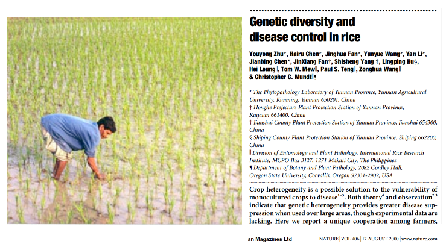

<style type="text/css">
.main-container {
  max-width: 800px;
  margin-left: auto;
  margin-right: auto;
}
h2 { 
 color: #3399ff;		
}
h3 { 
 color: #3399ff;		
}
</style>

```{r setup, include=FALSE} 
knitr::opts_chunk$set(warning = FALSE, message = FALSE) 
```


 <!-- 
  reservoir hosts/importance of community 
  multi-host parasites (modeling multi-host parasites; dobson paper maybe my daphnia ecology paper)
  apparent competition through shared parasitism 
  trying to get at parasite associations (prsb paper)
  bit on parasite specificity at network level (structure of host-parasite networks) 
  maybe go into prediction of host-parasite associations? 
  
  diversity-disease relationships (basics, theory, lyme, then genetic diversity bits)


  week 11 from Park 2019.  --> 
 


---

### Bits to recall from previous lectures 

+ Parasites can infect multiple hosts 

+ Prevalence and infection intensity can differ across host species

+ So the same host-parasite interaction may look quite different in different host communities, or through time as the host community changes 


---

### Multi-host parasites 

+ What do you think the host range is of the average...
  + ectoparasite? 
  + virus? 
  + bacteria?
  + protozoan? 
  + fungi? 

+ Do you think host range captures specificity? 


--- 

### Host specificity of primate parasites 

{width=100%}


---

### Phylogenetic host specificity of parasites

<div class="columns-2">

+ Negative values indicate more phylogenetically-specific parasites 

{width=100%}

<sub> Park et al. 2018 _PRSB_ </sub> 
</div> 


---

### Some notable outliers 

+ Rabies virus can infect all mammals, but only a few species are important reservoirs 

+ poxviruses also tend to have large host ranges (cowpox can infect 27 groups of hosts)

+ Cucumber mosaic virus can infect 1000+ plant species 

> What's up with all the viruses? 


---

### Viruses 

{width=100%}


---

### Helminths 

{width=100%}


---

### What do we gain by looking at the entire community? 

+ If you want to study West Nile Virus in humans, you need data on reservoir hosts, right? 

+ Even for non-vector-borne parasites, the host community is _very important_ 

+ So how do we do it? 
  + model a single pathogen in a host population 
  + examine the entire community of interacting species as a network 


---

### Comparison of approaches 

<div class="columns-2">

### single pathogen 
+ tractable for fun math and prediction 

+ ignores parasite-parasite interactions 

+ predictions only good for single parasite 

<br>

### entire community 

+ not super tractable (generally need to make some simplifying assumptions)

+ can incorporate parasite-parasite interactions (but rare to do so) 

+ predictions are for an entire system

</div> 


---

### Single pathogen in multi-host community 

Recall the SIR model 

\[
 \begin{aligned}
 \frac{dS}{dt}   &=  S\lambda - \beta SI  \\
 \frac{dI}{dt}   &=  \beta SI - dI - \alpha I  \\
 \frac{dR}{dt}  &=  dI - \alpha R 
 \end{aligned}
\]

> Let's extend this to look at multiple host species 


---

### SIR model for all host species 

+ Host species is identified as $i$
+ Competition only occurs within host species (intraspecific limitation, but no interspecific)
+ What does this _really_ mean? 

{width=70%}

<sub> Dobson 2004 _Am Nat_ </sub> 


---

### Table of parameter values that we will refer back to

{width=100%}

<sub> Dobson 2004 _Am Nat_ </sub> 


---

### Carrying capacity 

This means that the <font color='green'> carrying capacity</font> of each host species $i$ is set only through interactions with itself 

{width=30%}

<sub> Dobson 2004 _Am Nat_ </sub> 


---

### But transmission of the parasite depends on the entire host community 

+ $c_ij$ is a modifier to change the cross-species transmissibility relative to the transmission of the parasite from species $i$ to itself 


{width=30%}

<sub> Dobson 2004 _Am Nat_ </sub> 


---

### Scaling between-species transmission 


{width=100%}


---

### What hypotheses does this model generate? 

{width=50%}

+ Can estimate the force of infection: 
  + exerted on species $j$ by rest of community
  + placed on the community due to infections in species $j$ 

<sub> Dobson 2004 _Am Nat_ </sub> 


---

### What hypotheses does this model generate? 

{width=50%}

+ The sensitivity of the dynamics to who gets infected first could be explored 

+ Allows modeling of entire pathogen burden in a community 

<sub> Dobson 2004 _Am Nat_ </sub> 


---

### Allows us to create different host communities

{width=100%}

> What is this figure telling us? 


---

### There's one key assumption in the model

+ caveat: if I'm not just wrong 

+ The overall size of the community is not fixed

+ Adding more species means adding more individuals and increasing overall community size 

+ Is this why we're seeing diversity increase $R_0$? 


---

### Dobson discusses this a bit 

<br> 

> "_First, in the density-dependent case, increases in species diversity lead to increases in the number of contacts between infected individuals and potentially susceptible hosts. Increased host diversity will always lead to increased values of R0 and a greater potential for disease outbreaks..._"
<sub> Dobson 2004 _Am Nat_ </sub> 

+ So since contact is density-dependent, increasing diversity leads to more individuals and more contact

+ Solution to this would be to enforce an overall maximum community size somehow 


---

### And 8 years later does a similar thing 

{width=80%}

<sub> Roche 2012 _Phil Trans_ </sub> 


---

### And 8 years later does a similar thing 

+ Force of infection for each species $i$ ($\lambda_i$) is

{width=30%}

<sub> Roche 2012 _Phil Trans_ </sub> 


---

### What is the difference between this model and the previous one? 

<br> 

<div class="columns-2">

<font color='green'> Roche et al. 2012</font>

{width=100%}


<br> 


<font color='green'>  Dobson 2004 </font>

{width=100%}

</div> 


---

### What's the difference between this model and the other? 

+ Tough to parse apart, but 

  + force of infection $\lambda$ is simplified, where it was previously in the $\beta_ij$ matrix 
  + intraspecific competition term is absent in Roche et al. 2012
  + recovery rate $\sigma$ same for all host species in Roche et al. 2012

> Could be really interesting to let that contact matrix $c$ be used to model interspecific competition 

+ <font color='green'> assumption</font>: individuals that contact each other a lot tend to also compete more strongly


---

### Going back to this figure from Dobson 

{width=50%}

+ Why does frequency-dependent $R_0$ decrease with more species? 

<sub> Dobson 2004 _Am Nat_ </sub> 


---

### NOTE 

<br> 
<br> 
<br> 

<font color='green'> The Roche et al. 2012 paper is required reading </font> 


---

### Influence of the environment

+ the effect of the community on resulting infection dynamics may be influenced by the environment 

+ thinking about competition, we can think about two host species that compete for a resource 

+ how does resource availability influence resulting population and infection dynamics? 


---

### An example system where this occurs 

+ Daphnia communities compete for phytoplankton food resources 

+ The density of these resources determines their feeding rate 

+ Their feeding rate is directly related to pathogen exposure 

+ Environmentally-transmitted pathogen can be removed by non-competent hosts 

+ <font color='green'> Possible 'friendly competition' </font> 

<sub> Hall et al. 2009 _Ecology_</sub> 


---

### Host species varied in their suitability 

<div class="columns-2">

{width=90%} 


+ plus panel D shows that one host may be removing pathogen from the environment! 

<sub> Hall et al. 2009 _Ecology_</sub> 

</div> 


---

### Decreased prevalence in two lakes when "diluters" present 

{width=60%} 

<sub> Hall et al. 2009 _Ecology_</sub> 


---

### Super cool! 

+ They have a model as well in that paper 

+ So species interactions and the amount of algal resource can influence disease dynamics! 


---

### But what if we change feeding rate to be a function of resources 

+ If the competitor reduces resources, this could increase feeding rate of other species, increasing transmission 

<font color='green'> So I made an overcomplicated model </font> 

{width=60%} 

<sub> Dallas et al. 2016 _Ecology_</sub> 


---

...which predicted that competitor density was non-linearly related to infection prevalence in a susceptible host 

{width=60%} 
<sub> Dallas et al. 2016 _Ecology_</sub> 


---

...even though competitor density reduced the susceptible host density through competition 

{width=60%} 
<sub> Dallas et al. 2016 _Ecology_</sub> 


---

### Two-host one-pathogen experiment 

{width=30%} 

<sub> Dallas et al. 2016 _Ecology_</sub> 


---

### Neat, right!? 

+ This is not to say that Hall et al. missed something 

+ The point of this was to demonstrate the complexity of understanding disease dynamics in multi-host single-parasite systems

<font color='green'> Species interactions and environmental forces are important</font>


---

### Apparent host competition 

<font color='green'> Apparent competition </font>: corresponding fluctuations in abundance between two species that appears as if the species are interacting, when they are not. 

+ e.g., a predator which feeds on two prey species. An increase in the abundance of one host might increase predator populations, to the detriment of another prey species. 


---

### Apparent host competition 

+ This can be mediated by parasites as well, as multi-host parasites have negative impacts on host fitness, such that an increase in parasite populations (and density-dependent transmission) would cause a higher burden for all hosts of a multi-host parasite 

+ This is part of what Dobson was getting at! 

  + We need to consider the host community to really understand the force of infection and the role of host community dynamics on parasite pressure 


---

### Apparent parasite competition 

+ Parasites may also be in apparent competition through the modification of the host immune system 

+ Two co-infecting parasites may have different (or similar) immune responses from hosts, resulting in changes to parasite abundance within the infected host 

+ This would appear as if parasites are interacting, when they could be in different host tissues entirely


---

### Detecting parasite-parasite associations 

+ It may be possible to detect potential parasite-parasite associations 

+ Using models that fit entire parasite communities instead of just presence-absence of single parasite 

+ One output from such a model would be a residual covariance matrix which is basically what the model couldn't explain about parasite joint distributions 

+ These are potential parasite associations. If parasites were competing, we'd expect more negative values for parasites infecting the same host tissue 


---

### Detecting parasite-parasite associations 

{width=60%} 

<sub> Dallas et al. 2019 _PRSB_</sub> 


---

### Detecting parasite-parasite associations 

+ From this analysis, it almost seems like parasites infecting the same tissue have a facilitative association 

+ e.g., the presence of one gut parasite might actually increase the probability of having another gut parasite 


---

<br> 
<br> 
<br> 

<h2> <center> End of lecture 1 </center> </h2> 


---

### What have we learned? 

+ Multi-host parasites are interesting

+ To understand the force of infection, we need to consider the entire host community 

+ Environmental factors and competition (both between hosts and parasites) might influence resulting disease dynamics 

+ Increasing host diversity might increase or decrease parasite burden 


---

### Diversity-disease relationships 

+ Around 2000 or so, Keesing and Ostfeld coined the term <font color='green'> dilution effect </font> 

+ The idea was that adding hosts to a community would tend to reduce disease pressure _in a focal host_ 

+ So Dobson focused on the $R_0$ of the parasite as a function of the community, but what if we only cared about one species? 


---

### Diversity-disease relationships 

+ But the <font color='green'> dilution effect </font> term is a bit one-sided, as the addition of host diversity could increase the force of infection to a focal host, right? 
  + we saw this in terms of the Dobson model 

+ So let's just call these <font color='purple'> diversity-disease relationships </font> instead, with the two bounds being a <font color='green'> dilution effect </font> and an <font color='red'> amplification effect </font> 


> What are the underlying mechanisms!?


---

{width=100%} 

---

{width=100%} 

---

{width=100%} 

---

{width=100%} 

---

{width=100%} 


---

### The nuance of the thing 

+ This paper was focused on how the addition of a <font color='green'> non-host </font> could influence disease in a focal host 

+ Since then, it's been mangled by many to suggest that host diversity in general will reduce parasite burdens in some focal host (or sometimes in the entire community) 

+ But the potential mechanisms are murky


---

<div class="columns-2">

### Amplification effect 

+ added species are competent (either at getting infected, contacting susceptible hosts, or shedding pathogen)

+ added species simply increase the overall community size (density-dependent transmission) 


<br> 


### Dilution effect 

+ added species are not as competent (dead-end hosts, competition, behavior changes, groom lots?)

+ added species reduce abundance of a focal host (density-dependent transmission)

</div>


---

### 'Dilution effect' came from a vector-borne disease system 

+ But the focus on mechanisms for directly-transmitted parasites does not align well with how the initial idea was created 

+ Folks wanted to know how infection prevalence in black-legged ticks was related to the host community 


---

### Lyme disease 

+ A bacterial pathogen (_Borrelia burgdorferi_) transmitted by the blacklegged tick (_Ixodes scapularis_)

+ The tick is a three-host tick, taking a bloodmeal as larvae, nymph, and adult

+ Who the tick bites determines risk of getting the pathogen 


---

{width=100%} 


---


{width=100%} 


---

### The types of hosts in less diverse communities matters 

+ Less diverse communities tend to be occupied by really competent host species (white-footed mice) 

+ Adding other hosts (especially opossums) reduces infection prevalence in ticks for two reasons 
  + opossums are less competent hosts for the pathogen 
  + opossums groom lots and lots (killing tons of ticks) 


---

### But opossums are not actually the host with the greatest 'dilution potential'

{width=90%} 

<sub> LoGiudice et al. 2003 _PNAS_ </sub> 


---

### But they kinda are 

Dilution potential = $NIP{_mice} - NIP_{mice+other}$

+ $NIP$ is nymphal tick infection prevalence 

+ So this is the fraction of nymphal ticks that are infected with Lyme that were found on host $x$ 

> Why is this a good measure of dilution potential? Why is this an imperfect measure? (5 minutes small groups)


---

### Other things we might want to consider 

>- Host abundance 

>- Host grooming (Opossums are tick killing machines) 

>- Host habitat usage 

>- other things that I didn't think of that you all might have 


---


<div class="columns-2">

### But negative diversity-disease relationships have been found for directly-transmitted parasites 

{width=100%} 

</div>  


---

### But not really 

{width=100%} 


---

### But sometimes ...

{width=100%} 

<sub> Johnson et al. 2013 _Nature_ </sub> 


---

### But sometimes ...

{width=70%} 

<sub> Johnson et al. 2013 _Nature_ </sub> 


---

### But sometimes ...

{width=50%} 

<sub> Johnson et al. 2013 _Nature_ </sub> 


---

### This gets at a neat thing about land use change 

+ Fragmentation of habitats tends to favor certain species 

+ These species, due to life history tradeoffs or just our bad luck, tend to be the most competent hosts 

+ Other species are lost from these fragments, resulting in <font color="green"> more potential for disease in fragmented landscapes </font> 


---

### This is independent of other effects of land use change 

+ Land use change also tends to bring humans into closer contact with wildlife, and there numerous studies showing how land use change can lead to emerging or re-emerging infectious diseases in humans 

<br> 

<sub> Wilkinson et al. 2018 _Interface_; McCallum & Dobson 2002 _PRSB_; Allan et al. 2003 _Conservation Bio_ </sub> 


---

### Then it went off the rails 

+ Translating host diversity, ignoring the vector, and just counting human cases as response 

+ Increased host diversity reduces Lyme disease cases in humans? 


---

<div class="columns-2">

{width=90%} 

<br> 
<br> 
<br> 

+ Ground-dwelling richness increased disease? 

+ This figure is largely cited for panel b, in support of dilution effect ideas 


</div>


--- 

### Where are we now with diversity-disease relationships? 

+ Seem system-specific, with little generality 

+ Bit of a nerd ~~fight~~ discussion 
  + "Pangloss revisited: a critique of the dilution effect and the biodiversity-buffers-disease paradigm"
  + "Does biodiversity protect humans against infectious disease?"
  + "Straw men don't get Lyme disease: Response to Wood and Lafferty"
  + "It's a myth that protection against disease is a strong and general service of biodiversity conservation: Response to Ostfeld and Keesing"


--- 

### Still a super neat area of research

+ Can lead to other hypotheses 

> Is there an analogy between host diversity to genetic diversity? 


<font color='green'> Do populations of more genetically diverse host species have lower pathogen pressure? </font> 


---

### A story of rice 

+ intercropping is a practice where crops are not planted in large <font color='green'> monocultures </font>, but are planted with other crops

+ Why intercrop? 
  + some plants may provide nutrients/shade/etc. that help the other plant 
  + volatiles produced by one plant might reduce pests 
  + potential reduction in disease transmission through some of the mechanisms we've talked about 


---

### A story of rice 

+ Rice infected by a fungus (_Oryzae sativa_)
+ Intercroppped rice had less disease prevalence and infection intensity of infected plants 

{width=100%} 


---

### Let's brainstorm some fruitful pathways for this research 

+ What types of experiments would you want to see to provide more rigorous tests of diversity-disease relationships? 

> 5-10 minutes group discussion followed by some writing on blackboard 


