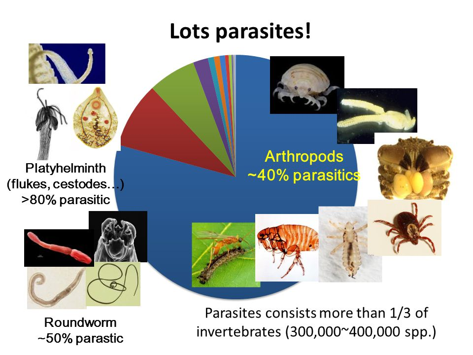

<style type="text/css">
.main-container {
  max-width: 800px;
  margin-left: auto;
  margin-right: auto;
}
h2 { 
 color: #3399ff;		
}
h3 { 
 color: #3399ff;		
}
</style>


---

### Title


{width="90%"}


<div class="notes">
This is my *note*.

</div>


---

# Modeling host-parasite interactions

Despite the variety of parasite life history and transmission modes, one flexible model which can capture many fundamental aspects of host-parasite infection dynamics is the SIR model. This is a compartmental model where host individuals can be either susceptible (S), infected (I), or recovered/removed (R). Other forms of this simple model exist, including latent periods after transmission but before the host becomes infectious (E for exposed), as well as extensions for multi-host scenarios, recovery with waning immunity (i.e., recovered individuals get susceptible at some rate), and others.

\begin{align}
\frac{dS}{dt} & =  -\beta SI \\
\frac{dI}{dt} & =  \beta SI - \gamma I \\
\frac{dR}{dt} & =  \gamma I
\end{align}


where $\beta$ is the transmission rate and $\gamma$ is parasite-induced mortality or the recovery rate, depending if the $R$ class are dead or recovered with immunity. $1/\gamma$ is the average infectious period. Importantly, we are modeling the proportions of a fixed-size population, such that $S+I+R = N$. More specifically, we often only care about the relative proportion of each class, and assume some scaling. That is, $\frac{S}{N}+\frac{I}{N}+\frac{R}{N} = 1$.

### Model Assumptions:

- A well-mixed population
- Same susceptibility for every individual
- No births of new susceptible individuals
- Permenant immunity after recovering


```{r}
library(deSolve)

sir <- function(time, state, parameters) {
  with(as.list(c(state, parameters)), {
    dS <- -beta * S * I
    dI <-  beta * S * I - gamma * I
    dR <-                 gamma * I
    return(list(c(dS, dI, dR)))
  })
}

init       <- c(S = 1-1e-6, I = 1e-6, R = 0.0)
parameters <- c(beta = 1.25, gamma = 0.15)
times      <- seq(0, 100, by = 1)


out <- ode(y = init, times = times, func = sir, parms = parameters)
out <- as.data.frame(out)

head(out, 10)


plotSIR <- function(x){
  par(mar=c(4,4,0.5,0.5))
  plot(x$S, type='l', las=1, 
    ylim=c(0,1), xlim=c(0,100), 
    xlab='Time', ylab='Fraction in class', 
    col='forestgreen', lwd=2)
  lines(x$I, col='red', lwd=2)
  lines(x$R, col='blue', lwd=2)
  legend('topright', c('Susceptible', 'Infected', 'Removed'), 
    pch=16, col=c('forestgreen', 'red', 'blue'), bty='n')
}


plotSIR(out)

```


What happens if we change the transmission and/or recovery rates?

```{r}

parameters <- c(beta = 2, gamma = 0.15)
out1 <- ode(y = init, times = times, func = sir, parms = parameters)
out1 <- as.data.frame(out1)

plotSIR(out1)
lines(out$I, col='red', lty=3)


parameters <- c(beta = 1.5, gamma = 0.5)
out2 <- ode(y = init, times = times, func = sir, parms = parameters)
out2 <- as.data.frame(out2)

plotSIR(out2)
lines(out$I, col='red', lty=3)

```


Here, the _basic reproductive ratio_ or _basic reproductive number of infection_ ($R_0$) describes the number of secondary infections generated by a single infected individual in a wholly susceptible population. 

\begin{equation}
R_0 = \frac{\beta S*}{\gamma} = \frac{\beta}{\gamma}
\end{equation}

One useful thing about estimating $R_0$ is that it essentially allows the estimation of the probability that a pathogen will invade a given host population (called a _pathogen invasion threshold_). That is, $R_0 \geq 1$ causes pathogen invasion, while $R_0 < 1$ means the pathogen does not invade. Also, we can look at each component of $R_0$, and get an idea of how to control a disease. That is, at the beginning of the infection, $R_0$ is made up of two terms:

- $\beta$ the transmission rate
- $\gamma$ parasite-induced mortality (_or_ recovery rate)

If $\gamma$ is big, the pathogen cannot invade. If $\beta$ is small, the pathogen cannot invade.

Loosely speaking, the outcome of an initial pathogen infection event in the SIR model can have 3 possible outcomes. First, the $R_0$ is below 1, and the infected individual moves to the recovered/removed class without causing any further infection. Second, the pathogen invades, infects a bunch of people, and then leaves the population (an epidemic pathogen). Third, the pathogen invades, and maintains sustained low levels of infection in the population (an endemic pathogen). 

Another related quantity to $R_0$ is the _force of infection_, which is simply $\beta I$, which captures the transmission rate times the number of infected individuals (a measure which is proportional to transmission potential to the susceptible population $S$).


**How do we reduce $R_0$?** The model above is simple, in that it assumes direct transmission (infected individuals transmit pathogen as soon as they are infected at the same rate until they recover or die). What other things could influence $R_0$?

> What if the pathogen is vector-borne (i.e., transmitted by a mosquito or other insect)? 

> What if the pathogen has a latent period after transmission before the host becomes infectious? 

> Can you think of other things that would influence $R_0$?


**Vaccination** One way we could reduce pathogen invasion is through vaccination. What happens if we can pre-emptively treat some fraction of the population? It is possible to vaccinate enough of the population that the $R_0$ is reduced below 1, and the entire population is not susceptible to pathogen invasion. This is called _herd immunity_, and the threshold fraction of the population required to vaccinate to achieve herd immunity is $1 - \frac{1}{R_0}$. This is because, $R_0$ is the number of secondary cases given a wholly susceptible population $S$. If we can reduce $S$, we can actually reduce the risk that any one single infection will propagate.  

```{r}

sirV <- function(time, state, parameters) {
  with(as.list(c(state, parameters)), {
    dS <- -(beta * S * I) - (v*S) 
    dI <- (beta * S * I) - (gamma * I)
    dR <- (gamma * I) + (v*S)
    return(list(c(dS, dI, dR)))
  })
}

init       <- c(S = 1-1e-6, I = 1e-6, R = 0.0)
parameters <- c(beta = 1.25, gamma = 0.15, v=0)
times      <- seq(0, 100, by = 1)


outV <- ode(y = init, times = times, func = sirV, parms = parameters)
outV <- as.data.frame(outV)

plotSIR(outV)
lines(out$I, col='red', lty=3)


parameters <- c(beta = 1.25, gamma = 0.15, v=0.05)
outV2 <- ode(y = init, times = times, func = sirV, parms = parameters)
outV2 <- as.data.frame(outV2)

plotSIR(outV2)
lines(out$I, col='red', lty=3)


```


### Adding an exposed class

Often, the transmission process does not immediately make a person infectious. That is, when a pathogen is first transmitted, that individual does not immediately become infectious to others, as the pathogen often has to first reproduce inside the infected host. We can incorporate this into our model by adding a new compartment; an exposed ($E$) class. 


\begin{align}
\frac{dS}{dt} & =  -\beta SI \\
\frac{dE}{dt} & =  \beta SI - \omega E\\
\frac{dI}{dt} & =  \omega E - \gamma I \\
\frac{dR}{dt} & =  \gamma I
\end{align}


```{r}

seir <- function(time, state, parameters) {
  with(as.list(c(state, parameters)), {
    dS <- -(beta * S * I)
    dE <- (beta * S * I) - (omega * E)    
    dI <- (omega * E) - (gamma * I)
    dR <- (gamma * I) 
    return(list(c(dS, dE, dI, dR)))
  })
}

init       <- c(S = 1-1e-6, E=0, I = 1e-6, R = 0)
parameters <- c(beta = 1.25, gamma = 0.15, omega=0.5)
times      <- seq(0, 100, by = 1)


out4 <- ode(y = init, times = times, func = seir, parms = parameters)
out4 <- as.data.frame(out4)
plotSIR(out4)
lines(out4$E, col='orange', lwd=2)
lines(out$I, col='red', lty=4)

```


> How do we calculate the $R_0$ of this model? 


### Next generation estimation of R_0

Next generation operator ($\mathbf{FV}^{-1}$) gives rate at which individuals in compartment $j$ generate new infections in compartment $i$ times average length of time individual spends in single visit to compartment. The dominant eigenvalue of this next generation operator is $R_0$. We will take that to be true without proof at this point, as diving down into it is a bit beyond the scope here.  


Write down matrix $\mathbf{F}$, which defines rate of new infections in different compartments,differentiated with respect to $E$ and $I$ and evaluated at disease-free equilibrium

\begin{equation}
\mathbf{F} = 
\begin{bmatrix}
0 & \beta S* \\
0 & 0 
\end{bmatrix}
\end{equation}


Now, we write a new matrix $\mathbf{V}$ that defines rate of transfer of infectives from one compartment to another

\begin{equation}
\mathbf{V} = 
\begin{bmatrix}
\omega & 0 \\
-\omega & \gamma 
\end{bmatrix}
\end{equation}


This is Next Generation Operator. R 0 given by largest
eigenvalue of this matrix:

\begin{equation}
R_0 = eigen(\mathbf{FV}^{-1})
\end{equation}


```{r}

parameters <- c(beta = 1.25, gamma = 0.15, omega=0.5)

F <- matrix(c(0,parameters[1], 0,0), ncol=2)
V <- matrix(c(parameters[3],0,-parameters[3], parameters[2]), ncol=2)

FV <- F %*% solve(V)
eigen(FV)

```


\begin{equation}
R_0 = \dfrac{\beta \omega}{\gamma \omega} 
\end{equation}

Now we verify that both estimates of $R_0$ are equal.
```{r}

a <- (parameters[1]*parameters[3]) / (parameters[2]*parameters[3])

b <- eigen(FV)$values[1]

a == b

```


> Want to learn more about epidemic modeling? Plenty of materials online exist, including a great set of workshops from Dr. John Drake (available at https://daphnia.ecology.uga.edu/drakelab/?page_id=2326) aimed at graduate researchers. 


## A couple of examples demonstrating why simple models may miss key things

The classic SIR model makes a whole bunch of assumptions. 

**Superspreaders** One of which is that individuals are equally good at becoming infected, and have an equal number of contacts. This may not be true though. For instance, during the spread of Typhoid fever in the early 1900's, Mary Mallon was an asymptomatic carrier of Typhoid, _and_ worked in a job where she had many more contacts than the average person (a cook). She infected over 50 people with Typhoid. 

**A well-mixed population** All individuals are modeled to interact with all other individuals, such that we don't need to worry about the variation in contact rates or spatial structure. In London, there was a cholera outbreak in 1854. Cholera is transmitted through contaminated water, which wasn't really known at the time (they thought cholera was caused by "bad air"). John Snow was a physician who mapped out cases of cholera, and found that most of the cases were spatially aggregated around one water pump (Broad Street Pump). He applied enough pressure to the city council to have this pump handle removed, albeit temporarily, which may have caused the epidemic to decline. 


# Evolution of virulence and the Red Queen

But $R_0$ isn't necessarily a static quantity, but can potentially change through time. This occurs for a number of reasons. One of the reasons is that transmission parameters can change. 

Virulence should evolve to be relatively low, as parasites need their hosts, right? However, parasites that replicate too slowly may not pass on their genes to future generations, and damage to the host is inevitable for many parasite species. This leads to questions about how virulence should change over time for a given parasite, which has lead to a large body of research on virulence evolution.

Hosts and parasites are in a constant arms race, where hosts evolve resistance mechanisms to the pathogen, and the pathogen evolves ways to get around these host defenses. This process of host-parasite co-evolution is referred to as _Red Queen_ dynamics.

_A good example_:

A mixed sexual and asexual (clonal) population of snails was exposed to a pathogen. They found that over time, the asexual (clonal) types disappeared entirely due to infection pressure, while the sexual types were able to develop a resistance to the pathogen. This is evidence for one aspect of the Red Queen (the parasite drives host evolution). 

The other aspect is the evolution of the parasite to overcome host defenses. We've documented this often, in terms of virus evolution to evade detection from the host immune system, among other examples. 


# Environmental controls of disease spread

The environment influences infection dynamics in a number of ways. 

First, the environment could influence the transmission process. An example of this would be if host individuals encountered a pathogen at higher rates in warmer environments. This would happen if foraging behavior of the host increased, pathogen shedding rate increased (the rate at which the pathogen is dispersed from an infected individual), or environmental pathogen survival increased at higher temperatures. This gets back to niche concepts, as marginally higher temperatures might increase transmission, but very high temperatures will reduce transmission, and potentially kill host and/or pathogen. A good example of this is _Daphnia_ species that are infected with a yeast pathogen can be cleared of pathogen ("cured" in a sense) after exposure to UV light. The UV kills the pathogen, but the host can tolerate it (to a certain point).

Second, the environment could influence the growth of pathogen within an infected host. To keep the same environmental factor, elevated temperature can cause increased pathogen growth rates inside infected host individuals, which could result in increased virulence or increased pathogen load (number of infectious units per infected host individual). Elevated temperature could also stress host immune function, leading to a reduced ability of the host to fight off infection. Recall that elevated temperature could also simulate a "fever response", where immune function is enhanced at warmer temperatures. 

Third, the environment can control host or vector behavior. For instance, host individuals exposed to rising temperatures might seek refuge (use habitat differently) which could enhance parasite transmission. More frequent drought can shift host distributions in space and may enhance or reduce parasite transmission. In terms of the vector behavior, a good example is when there is an interaction between infection status of a vector and the environment. Mosquitoes infected by Plasmodium (the pathogen which causes malaria) tend to prefer to occupy warmer habitats, which increases pathogen growth. That is, the pathogen modifies the host behavior to enhance the growth of the pathogen within the host individual.


# Social contact networks and disease invasion/spread

The SIR model which we introduced assumes a well-mixed population, which doesn't really incorporate spatial structure or variation in contact rates among individuals. Let's sketch out how networks are typically structured and how they might influence pathogen spread. 

- Number of links
- Clustering of interactions
- Directionality of links (e.g., river networks)
- Variation in transmission (as a function of distance between individuals, etc.)


```{r}


```


**Why are social contact networks essential in some situations?**

Sexual contact networks are often really variable in terms of number of links per person, and considering the structure of the network is super important to understanding the spread of sexually-transmitted infections.

Designing vaccination strategies should incorporate information on the structure of the network (larger bodied individuals tend to have more links, etc.).

Fragmenting the network into groups is a good way at isolating and protecting subgroups of nodes (e.g., will draw an example of this in the notes). The idea is that we can fragment the network into two subgroups that aren't connected, even if the pathogen invades one part of the network, the other will be great. 


# Land use change and disease spread

Human land use change has influenced pathogen spillover events (when zoonotic pathogens infecting wildlife transfer to human populations). There are a number of reasons for this, partly related to the environmental effects discussed above, and partly to due with how land use change influences host communities. 

For starters, land use change results in increased contact of wildlife and human populations, which can potentially enable zoonotic pathogens to spillover into human populations. 

Land use change also alters host communities, as some species are less affected by disturbance. These species tend to become more abundant in disturbed landscapes, and are often pretty competent disease carriers. Here, competence means that the host individual is good at carrying and spreading the pathogen. An example would be that white-footed mice are found in higher abundance in urban and disturbed environments. These mice are also really competent vectors of a number of diseases (e.g. Lyme disease). An example not related only to vector-borne disease is the spread of a horizontally transmitted pathogen of house sparrows (conjunctivitis) in urban environments. Food supplementation (bird feeders, etc.) has caused these birds to come in close contact with other bird species (and with other individuals of their own species). This close contact has lead to the infection prevalence (percent of individuals infected) being higher in urban environments (where contact rates between birds are higher) than in more natural environments. 


