<style type="text/css">
.main-container {
  max-width: 800px;
  margin-left: auto;
  margin-right: auto;
}
h2 { 
 color: #3399ff;		
}
h3 { 
 color: #3399ff;		
}
</style>

```{r setup, include=FALSE} 
knitr::opts_chunk$set(warning = FALSE, message = FALSE) 
```


<!-- (transmission modes, env survival, contact networks?, go hard into freq v dependent transmission, ) week 10 and 12 from Park 2019 

first lecture on env-transmission and water-borne disease 
second lecture on STIs -->


---

### Environmentally-transmitted disease

+ In 1990, 76% of pop had access to 'improved drinking water'. Up to 91% by 2015 

+ This still leaves 663 million people relying on unimproved sources, including 159 million dependent on surface water 

+ 1.8 billion people use drinking water source contaminated with feces 

+ Water-borne disease, especially for fecal-oral pathogens, is a huge risk to these populations

+ Contaminated water causes at around 500k diarrhoeal deaths per year 


---

### Water-borne disease 

+ Bacteria (salmonellosis, shigellosis, leptospirosis, typhoid fever, cholera)

+ Viruses (rotavirus, norovirus, hepatitis A)

+ Protozoa (ascaris, ringworm, crytposporidiosis)

> Reservoirs in the water include the sediment and biota (e.g., snails) 


<div class="notes">


</div>


---

### Transmission 

+ fecal-oral (enteric) 
  + direct ingestion 
  + indirect ingestion 

+ dermal 

+ wound 

+ eyes

+ ears 


> Risk and illness often proportional to duration of exposure and pollution level

> Risk and illness is related to susceptibility (age, immune status, etc.)


---

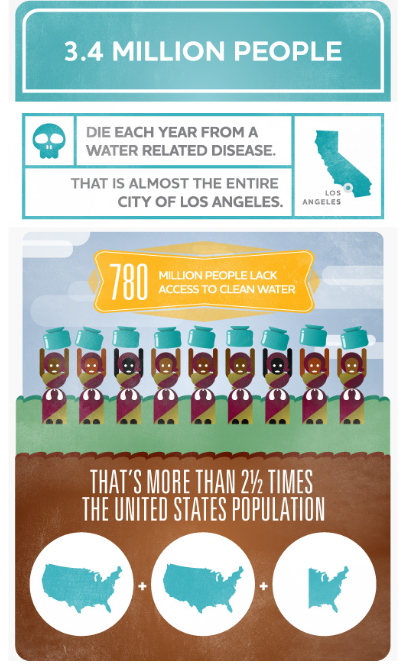{width="50%"}


---

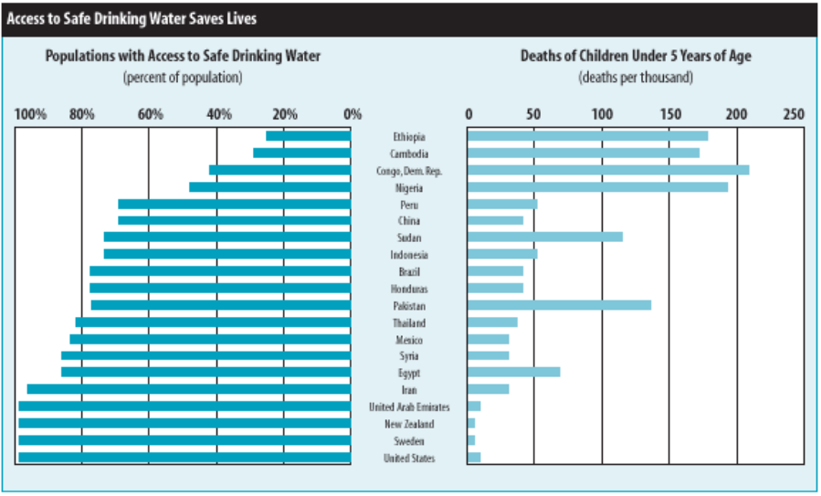{width="90%"}


---

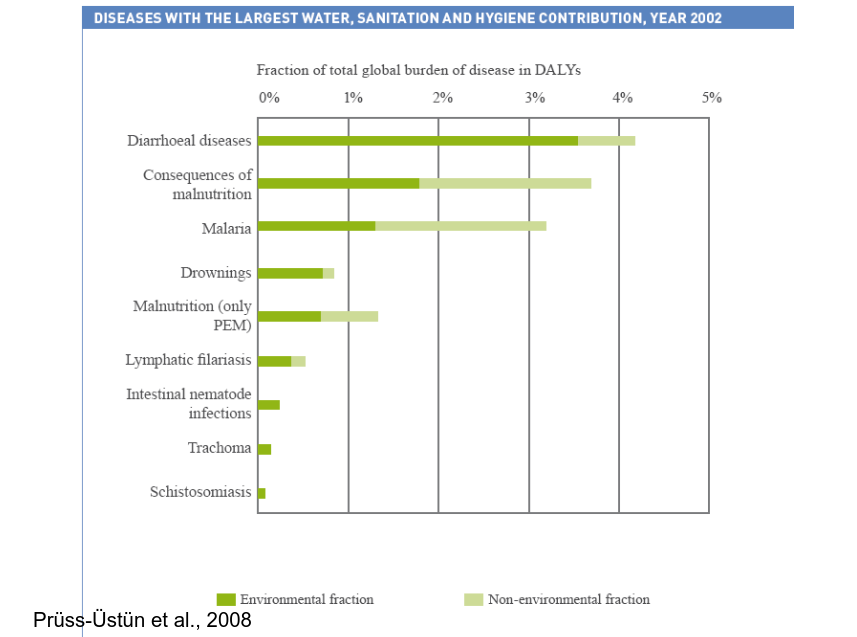{width="90%"}


---

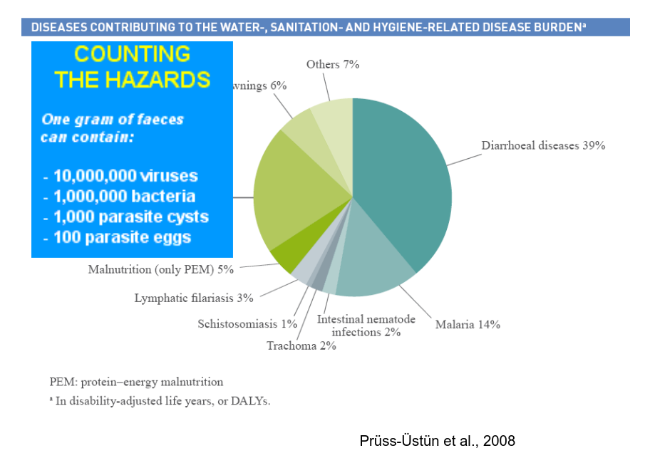{width="90%"}


---

### Barriers to transmission 

_pre-emptive_:

+ Improved sanitation 

+ Improved water distribution infrastructure 

_reactionary_: 

+ Treatment of disease 

+ Isolation of cases 


---

### Improved sanitation 

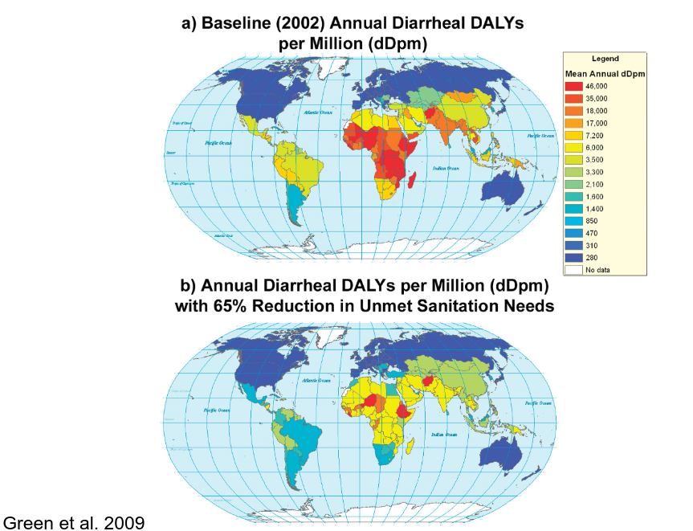{width="90%"}


---

### Improved sanitation 

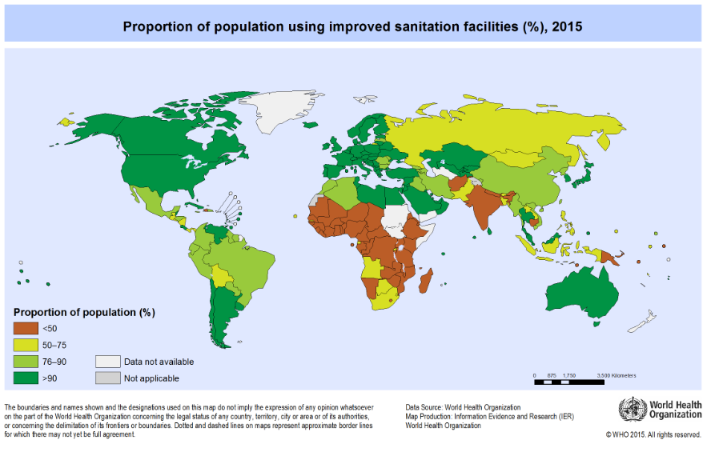{width="90%"}

---

### Improved sanitation 

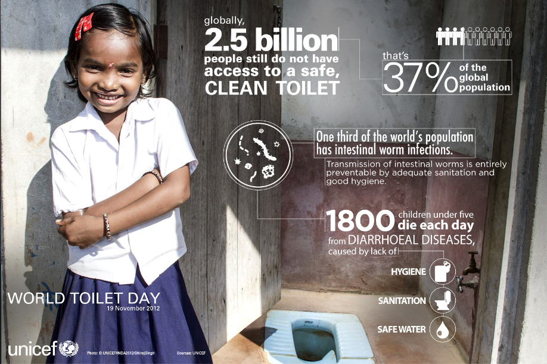{width="90%"}


---

### Improved hygeine/access/infrastructure

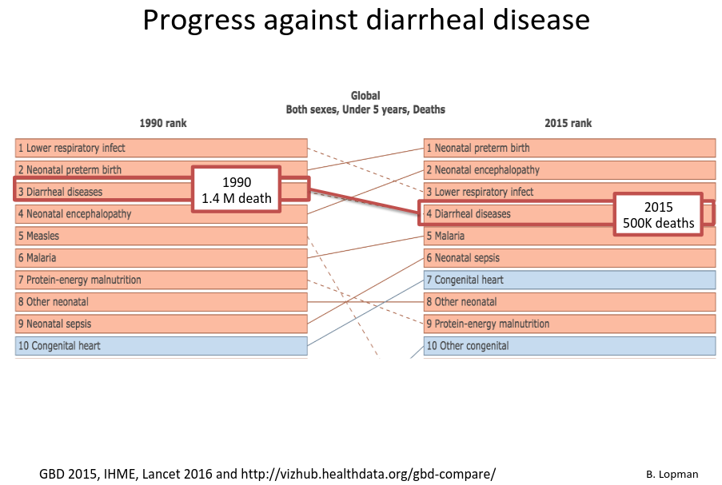{width="90%"}

---

### Improved hygeine/access/infrastructure

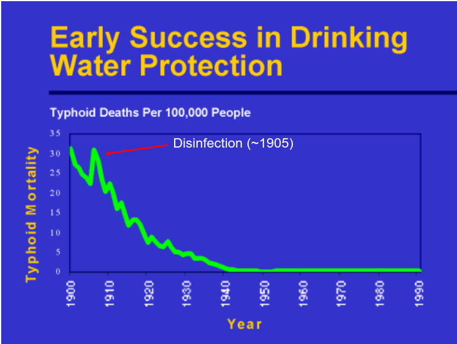{width="90%"}


---

### Improved hygeine/access/infrastructure

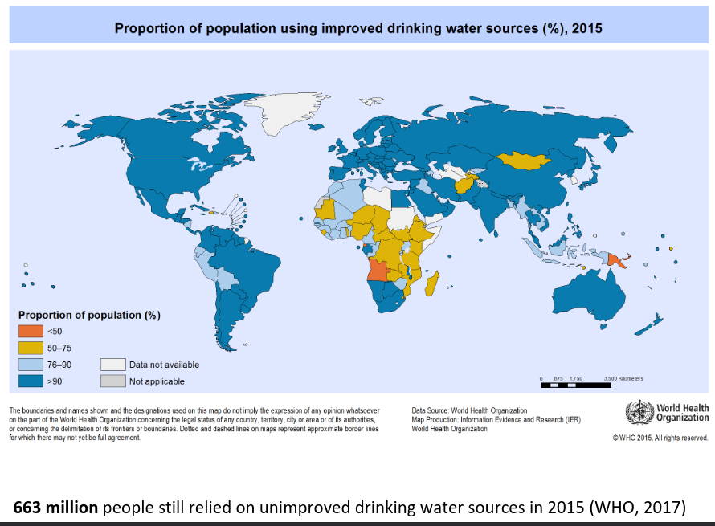{width="90%"}


---

### Case study: Cholera 

<font color='green'> Sanitation, hygeine, environment, etc.</font> 

+ Cholera is a tough one (known since Hippocrates ~450 BC) 

+ First epidemic described in 1563 in India 

+ 7 known cholera pandemics (7th was in 1961)


---

### History of Cholera 

+ Cholera linked to water-borne transmission in 1854 

+ 500+ fatal cases over 10 days during London cholera outbreak 

+ Linked to a single water pump (Broad St. pump) 

+ John Snow identified and disabled the pump handle

+ Robert Koch isolated bacteria (_Vibrio cholerae_) in 1883


---

### _Vibrio cholerae_

+ Infection via 

  + water 
  + shellfish 
  + person-to-person 

+ Only freshwater _Vibrio_ species 

+ Water temperature constrains pathogen growth and survival 


---

### _Vibrio cholerae_

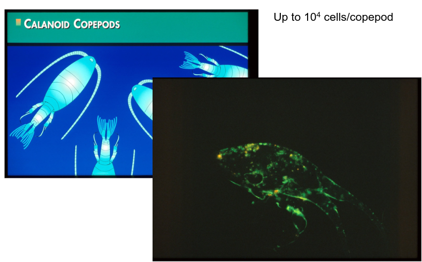{width="90%"}


---

### _Vibrio cholerae_

+ But can also grow on biofilms and in other aquatic species 


---

### Cholera

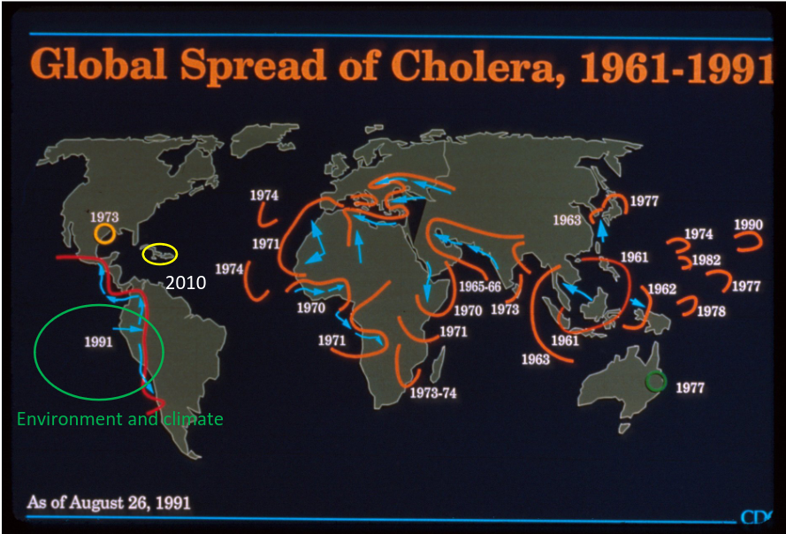{width="90%"}


---

### Cholera

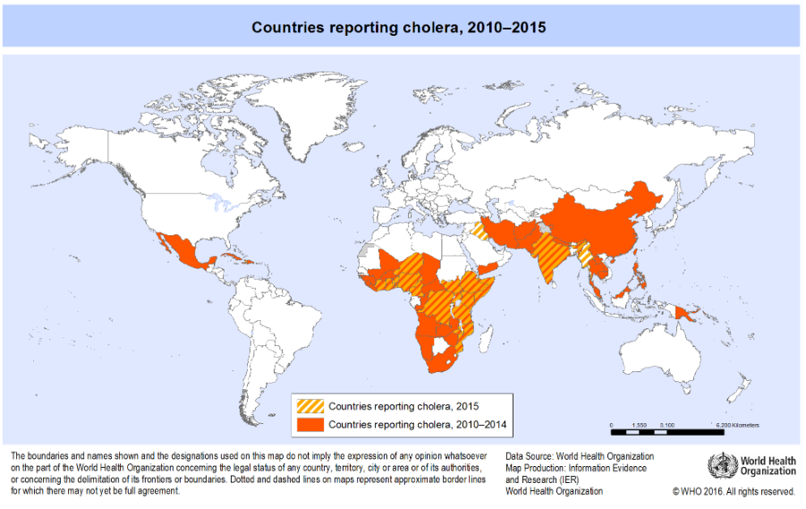{width="90%"}


---

### Cholera

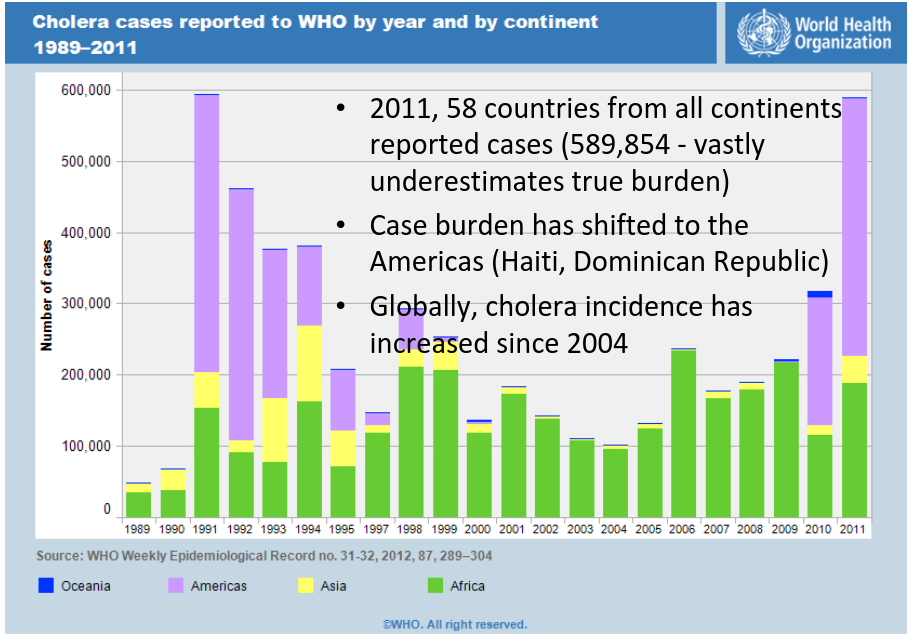{width="90%"}


---

### Cholera prevention 

+ improved infrastructure

+ filtering water 

+ treating water 

> an ongoing problem, as the disease spreads incredibly quickly 


--- 

### How we model environmentally-transmitted pathogens? 

<br>

<font color='green'> The standard SIR </font> 

<br>
\[
  \begin{aligned}
 \frac{dS}{dt}   &=  -\beta SI  \\
 \frac{dI}{dt}   &=  \beta SI - dI  \\
 \frac{dR}{dt}  &=  dI 
 \end{aligned}
\]


--- 

### How we model environmentally-transmitted pathogens? 
<font color='orange'> Environmental SIR </font> 

\[
  \begin{aligned}
 \frac{dS}{dt}   &=  -\beta SP  \\
 \frac{dI}{dt}   &=  \beta SP - dI  \\
 \frac{dR}{dt}   &=  dI \\
 \frac{dP}{dt}   &=  bP + \omega I - cP
 \end{aligned}
\]

<font color='green'> $b$ </font>: pathogen growth in the environment 

<font color='green'> $\omega$ </font>: infected host shedding

<font color='green'> $c$ </font>: pathogen death rate


---

### Model dynamics 

```{r, echo=FALSE}
library(deSolve)

plotSIR <- function(x, ylim=c(0,1), xlim=c(0,100)){
  par(mar=c(4,4,0.5,0.5))
  plot(x$S, type='l', las=1, 
    ylim=ylim, xlim=xlim, 
    xlab='Time', ylab='Fraction in class', 
    col='forestgreen', lwd=2)
  lines(x$I, col='red', lwd=2)
  lines(x$R, col='blue', lwd=2)
  legend('topright', c('Susceptible', 'Infected', 'Removed'), 
    pch=16, col=c('forestgreen', 'red', 'blue'), bty='n')
}

sirp <- function(time, state, parameters) {
  with(as.list(c(state, parameters)), {
    dS <- -beta * S * P
    dI <-  beta * S * P - gamma * I
    dR <-                 gamma * I
    dP <- (b*P) + (omega*I) - (c*P)
    return(list(c(dS, dI, dR, dP)))
  })
}

init       <- c(S = 100, I = 1, R = 0.0, P=10)
times      <- seq(0, 100, by = 1)
parameters <- c(beta = 0.01, gamma = 0.05, omega=0.5, b=0.2, c=0.9)

out <- ode(y = init, times = times, func = sirp, parms = parameters)
out <- as.data.frame(out)

plotSIR(out, ylim=c(0, 100))
lines(out$P, col='orange', lwd=2)

```


---

### What happens when the pathogen can survive a bit better in the environment? 

Bad stuff

```{r, echo=FALSE}

init       <- c(S = 100, I = 1, R = 0.0, P=10)
times      <- seq(0, 100, by = 1)
parameters <- c(beta = 0.01, gamma = 0.05, omega=0.5, b=0.2, c=0.1)

out <- ode(y = init, times = times, func = sirp, parms = parameters)
out <- as.data.frame(out)
plotSIR(out, ylim=c(0, 300))
lines(out$P, col='orange', lwd=2)

```


---

### $R_0$ 

We could go into how we would go about calculating $R_0$ here...but...

+ it involves a Jacobian matrix, some linear algebra like ...

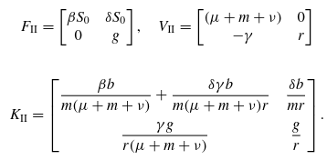{width="60%"}


---

### Why does it get so rough to compute? 

+ $R_0$ calculation is based on infective stages

+ When we had 1 infective stage ($I$), it was easy to solve 

+ But $P$ is also an infective stage here

<sub> Bani-Yaghoub et al. 2012 _J of Biological Dynamics_ </sub> 


---

### Questions to think about 

<br> 

+ How would each of those parameters in the model influence resulting disease dynamics? 

+ What are some other control measures we did not discuss? 

+ What determines how we should allocate resources to different control measures?


---

<br> 
<br> 
<br> 

<h2> <center> End of lecture 1 </center> </h2> 


---

### What have we learned? 

+ Environmentally-transmitted diseases are a big deal 

+ Modeling environmentally-transmitted disease represents some interesting challenges 

+ Don't drink out of streams! 


---

### Sexually-transmitted infections 

+ Pathogens that are transmitted through sexual contact 


<!--

background on STIs 
  - prevalence 
  - impact
  - variety
  - not just humans 

why should we in particular care? 
  - SC has lots of STIs 
  - why? 
  - 

comparison to other diseases (less virulent, more about transmission)
  - but some of the symptoms definitely don't help with transmission (postules)
  - 
  - 

examples in animals 
  - 
  - 
examples in plants 
  - anther smut 
  - corn smut (we eat it!)


examples in humans 
  - 
  - 


modeling STIs 
  - importance of contact 
  - frequency-dependent transmission 
  - depends on sexual contact network 

vertical transmission

what's the perfect STI? 
  - no symptoms 
  - long persistent infection 
  - non-virulent 
  - 

the role of host behavior 
  - 
  - 


 --> 


---

### Background
  - Frequency-dependent transmission 
  - Less virulent and generally more asymptomatic than other diseases
    - good cases of virulence evolution towards reduced virulence 

  - Some symptoms definitely don't help with transmission (e.g., postules)
  - Can include micro (bacteria, fungi, viruses) and macroparasites (lice)
  - Can have serious consequences (e.g., monkeypox, HIV, etc.)


---

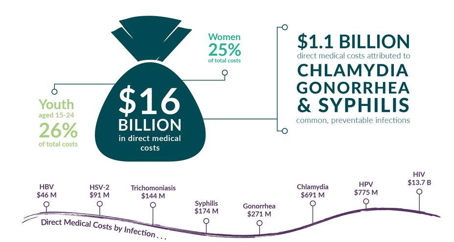{width="100%"}

<sub> _Sexually Transmitted Diseases_ issue 48(4) 2021 </sub> 


---

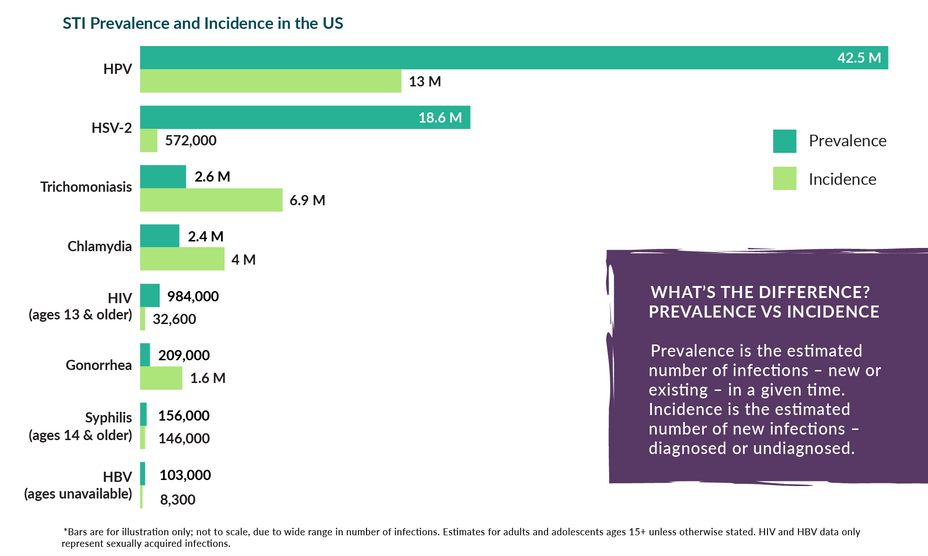{width="100%"}

<sub> _Sexually Transmitted Diseases_ issue 48(4) 2021 </sub> 


---

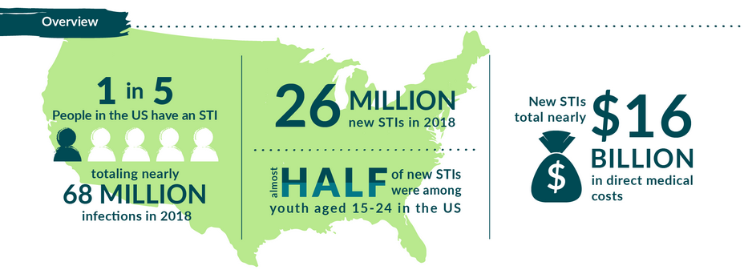{width="100%"}

<sub> _Sexually Transmitted Diseases_ issue 48(4) 2021 </sub> 


---

### why should we in particular care? 
  
  + SC has some of the highest rates of common STIs 
  
  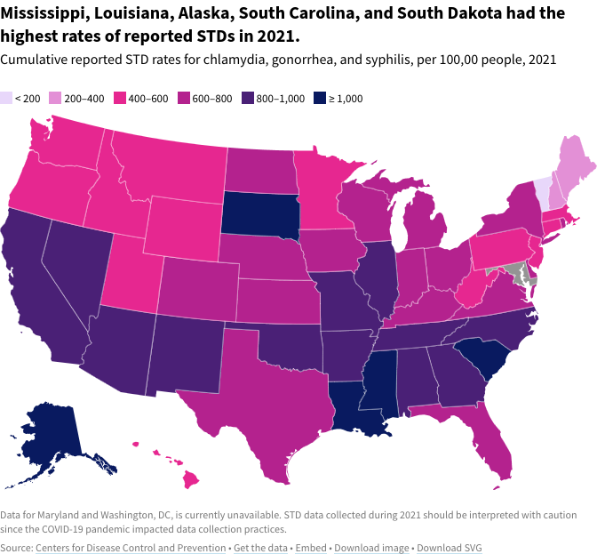{width="60%"}


---

{width="100%"}


---

### Not just a human problem 

  + We will talk about STIs in humans, plants, and animals 
  
  + The reason why this is an entirely different lecture is so we can talk about how we model these types of diseases 

  + >200 STIs in 27 orders of hosts (that we know of) 

  + mammals, birds, insects, earthworms, snails, etc. etc. 


---

### Chlamydia 

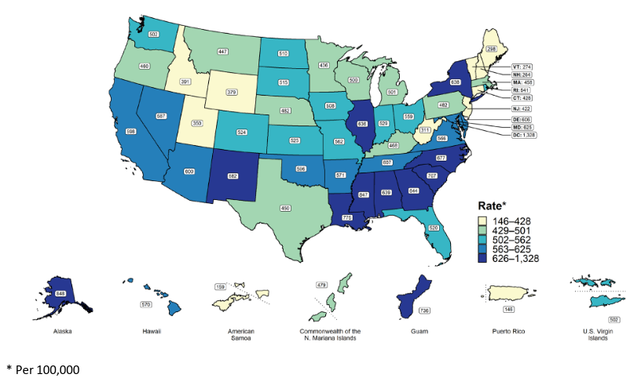{width="100%"}

<sub> CDC </sub>


---

### Chlamydia 

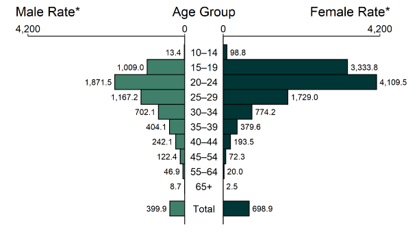{width="90%"}
<sub> CDC </sub>


---

### Chlamydia in animals (Koalas!)

+ Different pathology than in humans

+ Infects eyes, leaving them partially or wholly blind 

+ Infect urogenital tracts, resulting in co-infection with bacteria and the bad effects of that (bladder inflamation/kidney issues) 

+ Some populations with extremely high prevalence, as a result of numerous transmission pathways 
  + mothers produce a type of "food poop" which babies eat, and that can lead to infection (https://peerj.com/articles/4452/)

+ 8+ species of Chlamydia, most host-specific (3 or so infect humans)


---

### Gonorrhea

+ _Neisseria gonorrhoeae_ bacterium 

+ High tissue tropism (cervix, uterus, fallopian tubes, urethra, mucuous membranes of mouth/throat/eyes) 


---

### Gonorrhea

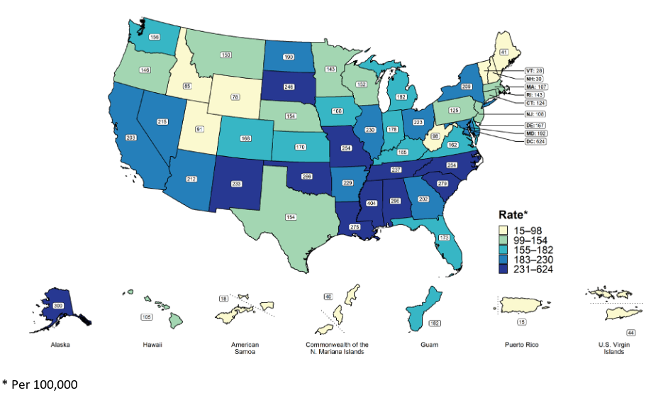{width="100%"}

<sub> CDC </sub>


--- 

### The global burden of STIs 

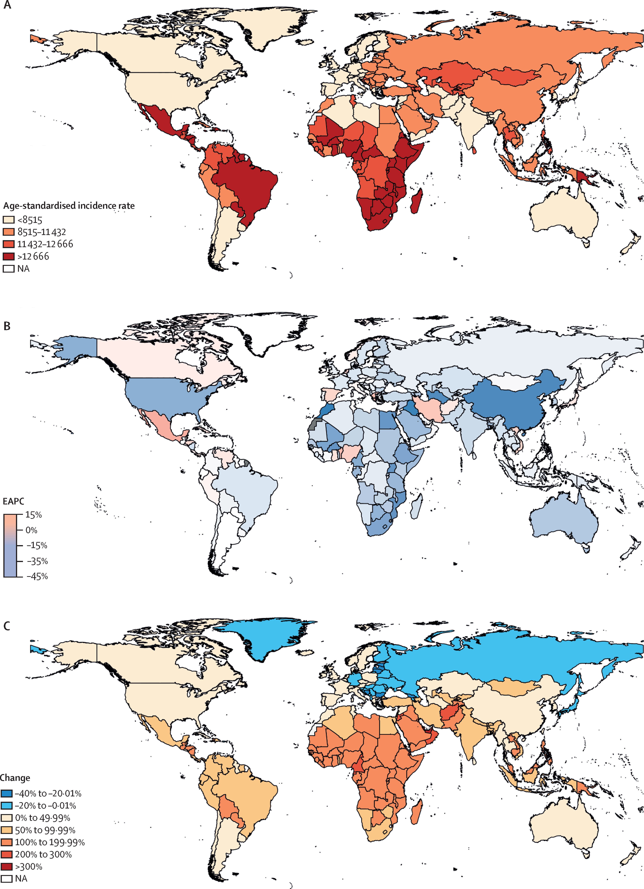{width="50%"}

<sub> Zheng et al. 2021 _Lancet Infectious Diseases_ </sub> 


--- 

### The global burden of STIs 

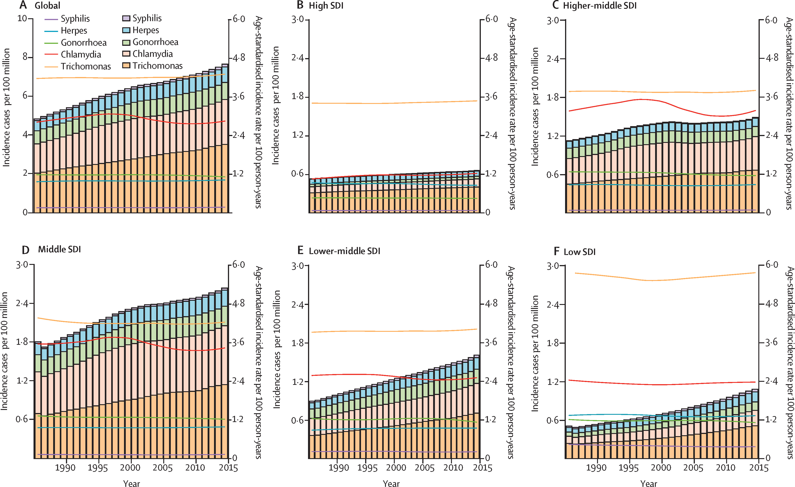{width="95%"}

<sub> Zheng et al. 2021 _Lancet Infectious Diseases_ </sub> 


---

### What is the most common STI in humans? 

+ HPV (Human papillomavirus)

+ Why? 
  + 100 varieties, often no symptoms, very transmissible (skin to skin contact) 
  + Sometimes referred to as the 'cost of being sexually active'

+ Linked to multiple types of cancer

+ HPV vaccine exists 


---

### Insect STIs

  - STIs are far from a human (or even animal) issue 
  - A review found evidence for 73 parasite species of insects capable of sexual transmission 
  - Most of these were multi-cellular ectoparasites (which is different from humans and plants) 
  - Life history determines number of STIs (need overlapping adult generations to persist)

<sub> Knell and Webberley 2003 _Biological Reviews_ </sub> 


---

### Plant STIs 

  + Corn smut (similar transmission pathway and tissue tropism as other smut species)
  
  + Fungal pathogen 
  
  + Infects ovaries of plants creating galls of 4-5 inches
  
  + Infected corn can be eaten, and is delicious (_huitlacoche_ originated from Aztec cuisine, but is fairly common in contemporary Mexican cuisine)


---

### Vertical transmission 

  + Infected mothers can pass the disease 
    + either through placenta or at birth

  + Multiple transmission modes and asymptomatic infections makes STIs tough to treat 

  + e.g., HIV, gonorrhea, and chlamydia 


---

### What's the perfect STI? 
  
  - no symptoms 
  
  - long persistent infection 
  
  - non-virulent 
  
  - resistant (or quickly evolving) 


---

### Antibiotic resistance 

  + Many common STIs are increasingly becoming resistant to antibiotics

  + How does this happen? 
  

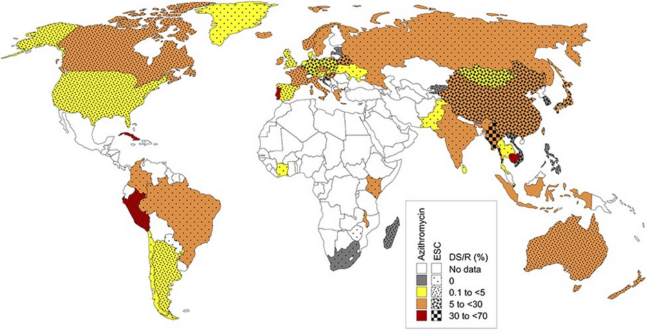{width="70%"}

<sub> Tien et al. 2019 _J of Travel Medicine_ </sub>


---

### Antibiotic resistance 

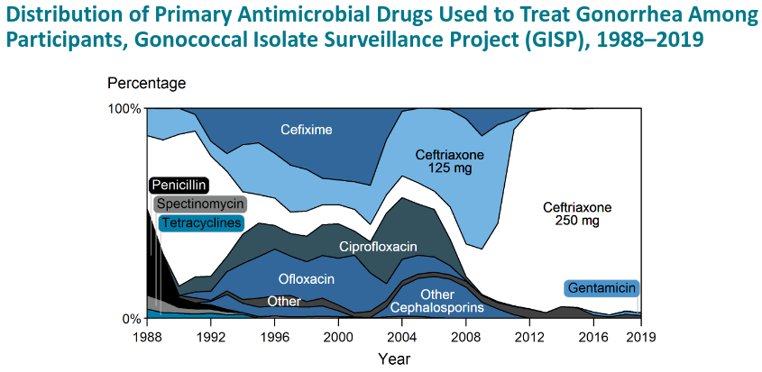{width="100%"}

<sub> CDC </sub>


---

### modeling STIs 
  - importance of contact 
  - frequency-dependent transmission 
  
---

### Transmission is rarely from environment 

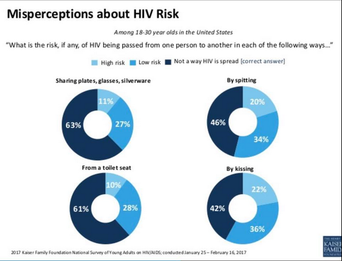{width="70%"}


---

### Transmission depends largely on sexual contact 

- So we must consider the network of sexual contacts to understand disease spread 

- The role of the few 
  + hubs in networks drive infection patterns, and sex contact networks tend to be a bit _hubby_


---

### Network models 

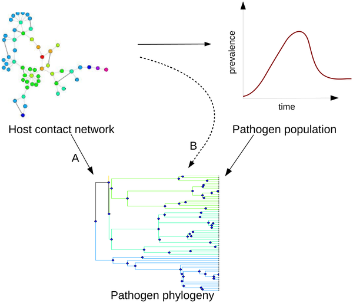{width="75%"}


---

### How infection occurs on a network

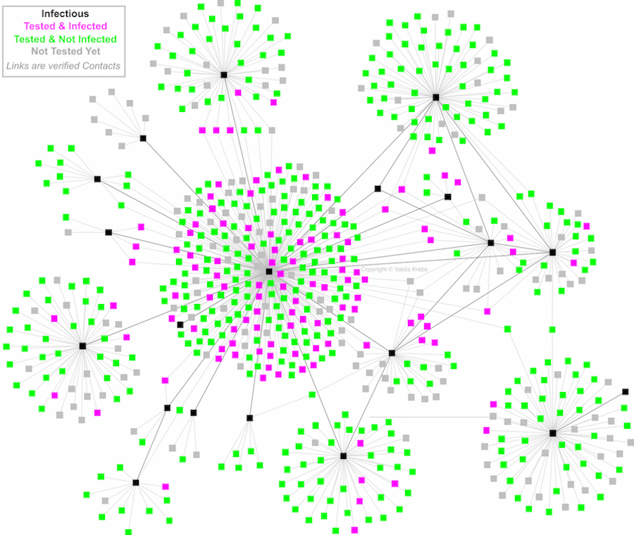{width="75%"}


---

### SIR model on network 

```{r}
library(igraph)
g <- sample_gnm(100, 100)
sm <- igraph::sir(g, beta=5, gamma=1)
plot(sm)

```


---

### How important is network structure? 

+ Here is an epidemic on a random graph (Sexual contact networks are _very non-random_ though)

+ The idea of preferential attachment (remember aggregation lecture?)

```{r, echo=FALSE, fig.align='center', fig.height=4, fig.width=4}

#' Run the SIR model on the network
#' 
#' @param g
#' @param gamma
#' @param steps
#' @param makeGraph
#' @param removalFunction
#' @param neighborSize
#' @param includeInfected
#' @param numberInfected
#' @param gout
#' 
#' @return list of 2 elements

SIRnetwork <- function(g, gamma, steps=100, 
  makeGraph=FALSE,
  removalFunction=NULL, neighborSize=1, 
  includeInfected=TRUE, numberInfected=1, 
	gout=NULL, age=FALSE){

  V(g)$status <- 0

  if(all(V(g)$status == 0)){
    warning('no infected nodes. selecting 1 individual randomly...')
    V(g)$status[sample(1:length(V(g)), numberInfected)] <- 1
  }
  
  ret <- matrix(0, ncol=3, nrow=steps)
  
  for(i in 1:steps){
    infected <- V(g)[V(g)$status==1]

    #recovery
    recovery <- rbinom(length(infected), 1, gamma)
    if(any(recovery == 1)){
      recovereds <- infected[which(recovery==1)]
      V(g)$status[which(V(g) %in% recovereds)] <- 2
    }

    #infection
    if(length(infected!=0)){
      for(z in 1:length(infected)){
        cnts <- neighbors(g, infected[z])
        cnts <- cnts[which(cnts %in% V(g)[V(g)$status == 0])]
        if(length(cnts) != 0){
          transmission <- rbinom(length(cnts), 1, 
            prob=g[as.numeric(infected)[z], as.numeric(cnts)])
          if(any(transmission == 1)){
            newInfection <- cnts[transmission == 1]
            V(g)$status[which(V(g) %in% newInfection)] <- 1
          }
        }
      }
    }
    ret[i,] <- c(S=sum(V(g)$status==0),
      I=sum(V(g)$status==1),
      R=sum(V(g)$status==2))
      colnames(ret) <- c('S', 'I', 'R')
  }
  ret <- as.data.frame(ret)
  return(ret)
}
g0 <- sample_pa(100, power=1, directed=FALSE)
g1 <- sample_pa(100, power=2, directed=FALSE)
g2 <- sample_pa(100, power=3, directed=FALSE)
r0 <- sample_gnm(100, m=length(E(g0)))

sm <- igraph::sir(g0, beta=5, gamma=1)
par(mar=c(4,4,0,0))
plot(sm)

```


---

### Degree distribution and link aggregation 

+ We talked about aggregation of parasites within hosts, leading to heavy-tailed distributions of parasite diversity and infection intensity 


---

### Degree distribution and link aggregation 

+ The distribution of number of sexual partners is also heavy-tailed 

```{r, echo=FALSE}
layout(matrix(1:4, ncol=2, byrow=TRUE))
par(mar=c(4,4,1,1))
hist(degree(r0), main='')
title('random graph', line=-1)

hist(degree(g0), main='', col='yellow')
title('some preferential attachment', line=-1)

hist(degree(g1), main='', col='orange')
title('lots of preferential attachment', line=-1)

hist(degree(g2), main='', col='red')
title('unreasonable preferential attachment', line=-1)

```


---

### 


```{r, echo=FALSE}

layout(matrix(1:4, ncol=2, byrow=TRUE))
par(mar=c(1,1,1,1))
plot(r0)
title('random graph', line=0)
plot(g0)
title('some preferential attachment', line=0)
plot(g1)
title('lots of preferential attachment', line=0)
plot(g2)
title('unreasonable preferential attachment', line=0)
```


---

### How we simulate infection 

+ pick a random node to infect 

+ probabilistic infection process of sexual contacts of infected individuals 

+ recovery of infected individuals occurs at rate $\gamma$ 


---

### Epidemic size on these different graphs 

```{r}

g0SIR <- SIRnetwork(g0, gamma=0.8)
r0SIR <- SIRnetwork(r0, gamma=0.8)
g1SIR <- SIRnetwork(g1, gamma=0.8)
g2SIR <- SIRnetwork(g2, gamma=0.8)

epidemicSize <- c(r0SIR$R[100], g0SIR$R[100], 
  g1SIR$R[100], g2SIR$R[100])

epidemicSize 

```


---

### But recall that infection is probabilistic

+ I run that code again and I get a different result (maybe)

```{r}

g0SIR <- SIRnetwork(g0, gamma=0.8)
r0SIR <- SIRnetwork(r0, gamma=0.8)
g1SIR <- SIRnetwork(g1, gamma=0.8)
g2SIR <- SIRnetwork(g2, gamma=0.8)

epidemicSize <- c(r0SIR$R[100], g0SIR$R[100], 
  g1SIR$R[100], g2SIR$R[100])

epidemicSize 

```


---

### Let's run it 20 times 


```{r, echo=FALSE}
epidemicSize <- matrix(0, ncol=4, nrow=20)
for(i in 1:20){
  g0SIR <- SIRnetwork(g0, gamma=0.8)
  r0SIR <- SIRnetwork(r0, gamma=0.8)
  g1SIR <- SIRnetwork(g1, gamma=0.8)
  g2SIR <- SIRnetwork(g2, gamma=0.8)

  epidemicSize[i,] <- c(r0SIR$R[100], g0SIR$R[100], g1SIR$R[100], g2SIR$R[100])
}
epiMean <- apply(epidemicSize, 2, mean)
epiSD <- apply(epidemicSize, 2, sd)

plot(x=1:4, y=epiMean, ylab='Epidemic size', 
  xlab='', xaxt='n', las=1, col='dodgerblue', 
  ylim=c(20,100), pch=16)
axis(1, at=1:4, c('random', 'low PA', 'med PA', 'high PA'))
segments(x0=1:4, y0=epiMean+epiSD, 
  y1=epiMean-epiSD, col='dodgerblue')

```


---

### The role of _connectance_ 

+ All the networks above had the same number of nodes (people) and the same number of edges (sexual contact links) 

+ _Connectance_ is the fraction of realized links in the network 

  + Value of 1 means every single node is connected to every single other node 
  + Value of 0 means nobody is connected to anyone 

+ This is super important to disease spread, as it determines transmission 


---

### Connectance 


```{r, echo=FALSE}
c0 <- sample_gnm(100, m=50)
c1 <- sample_gnm(100, m=100)
c2 <- sample_gnm(100, m=200)
c3 <- sample_gnm(100, m=400)
c4 <- sample_gnm(100, m=800)
c5 <- sample_gnm(100, m=1600)
cG <- list(c0, c1, c2, c3, c4, c5)

maxx <- (100*(100-1)) / 2
con <- c(50, 100, 200, 400, 800, 1600) / maxx 

```


```{r}

cSIR <- lapply(cG, SIRnetwork, gamma=0.8)
epidemicSize <- sapply(cSIR, function(x){x$R[100]})
epidemicSize 

```

---

### Connectance

```{r, fig.align='center', fig.height=4, fig.width=6}
plot(x=con, y=epidemicSize, col='dodgerblue', 
  pch=16, las=1, type='b', cex=1.5, 
  ylab='Epidemic size', xlab='Connectance')
```


---

### The role of initial infection 

+ The randomness in these simulations is not _only_ due to the probabilistic infection process 

+ The initial person infected is chosen randomly 

+ What makes a node "good" at spreading disease? 


---

### What are some assumptions the model makes? 

> - Transmission is equally likely for all individuals 

> - No sex structure (everyone is just as likely to have sex with any other node) 

> - others?


---

### How would we start to calculate $R_0$ here? 

\[ R_0 = \dfrac{\beta}{\gamma} \]

+ This ignores all the fun bits about network structure and connectance

+ This is from a model that assumes that all individuals contact all other individuals 

+ So a better $R_0$ would be something like ...

+ $R_0$ = <font color='green'> infection parameters </font> x <font color='purple'> network structure </font> 


---

### Most common approach 

\[ R_0 = \dfrac{\beta}{\gamma} \times \dfrac{\sigma_{\langle k \rangle}}{\langle k \rangle} \]

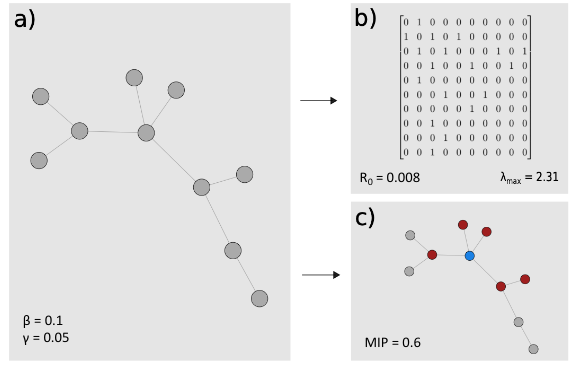{width="60%"}

<sub> McKee & Dallas 2024 _Infectious Disease Modeling_ </sub> 


---

### Things that complicate this approach 

+ The only important part of network structure is the variance in degree divided by the mean? 

  + Many different graph structures can have the same var/mean relationship, but have wildly different disease dynamics 

+ Does not incorporate individual variation in infection probability (above we treated $\beta = 1$) 

+ Host behavior is important 


---

### The role of host behavior

<div class="columns-2">

+ Avoidance behaviors

<sub> Stockmaier et al. 2021 _Science_</sub> 

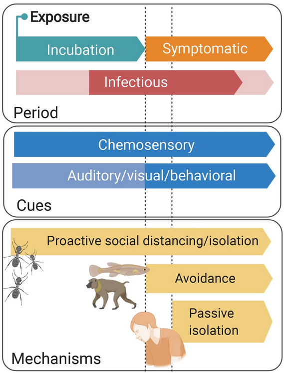{width="100%"}

</div>


---

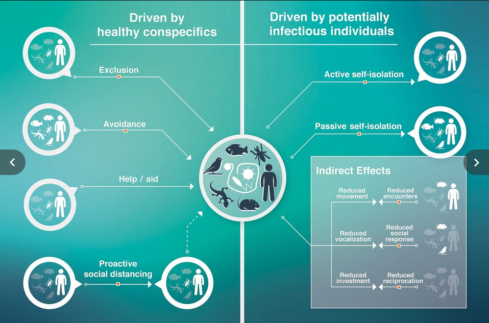{width="100%"}

<sub> Stockmaier et al. 2021 _Science_</sub> 


---

### Questions to think about 


+ How would mitigation efforts differ between environmentally-transmitted diseases and sexually-transmitted pathogens? 

+ How would you design a mitigation strategy for an STI? 

+ Why don't we model other infectious disease using networks? 


