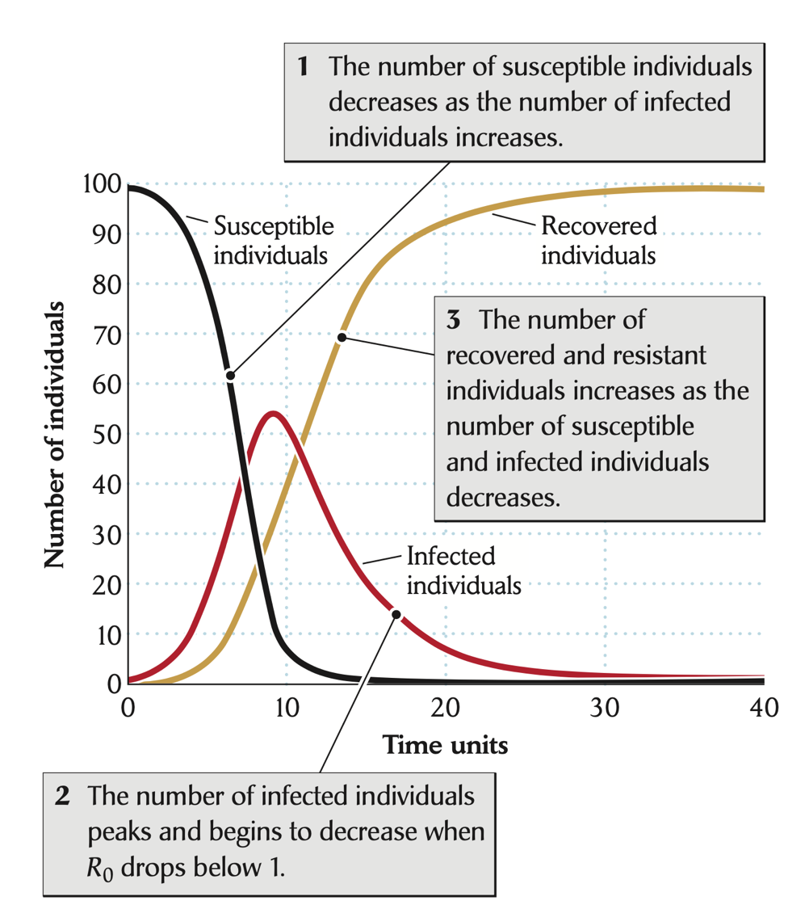

<style type="text/css">
.main-container {
  max-width: 800px;
  margin-left: auto;
  margin-right: auto;
}
h2 { 
 color: #3399ff;		
}
h3 { 
 color: #3399ff;		
}
</style>

```{r setup, include=FALSE} 
knitr::opts_chunk$set(warning = FALSE, message = FALSE) 
```


<!--  week 3 lecture 4 from Park and Altizer  and https://hankstevens.github.io/Primer-of-Ecology/disease.html--> 


---
 
### Epidemics 

> Rapid spread of disease through a population in a relatively short time (defined by host lifespan)

Different from endemic diseases, which occur at some equilibrial level in the population (e.g., malaria, HIV)


* note that malaria and HIV may have _epidemic phases_ where they increase rapidly (especially when driven by things like climate/vector abundance/etc.), but there is always some baseline amount of disease. 


---

### What are they? 

**Emergence**: Previously unknown disease to a given population/region/country


**Re-emergence**: Known disease that is coming back in a given population/region/country after a period of absence


**Outbreak**: Known disease in a given population/region/country 


> What are examples of each of these? 


<div class="notes">
Be clear about this distinction. 
</div>


--- 

### What is the cost of epidemics? 

SARS-COV2: $11-16 trillion

Influenza: $60-90 billion 


> But tough to say. These estimates consider missed work in these estimates, among other things. Perhaps it's better to think about the cost of epidemics in terms of _disability adjusted life years_ (1 DALY = 1 year of healthy life lost). 


<div class="notes">


</div>


---

### Why do we model epidemics? 


*Mitigation*: we want to lessen disease burden 

*Understanding*: modeling allows us to understand when, why, and how epidemics emerge

*Blame*: some models can be used to identify key locations or persons responsible for epidemic initiation


<div class="notes">


</div>


---

### Early mitigation efforts


{width="60%"}

<sub> https://inferentialthinking.com/chapters/02/1/observation-and-visualization-john-snow-and-the-broad-street-pump.html </sub>


---

### How do we model epidemics? 


*Compartmental models of infectious disease*
(will definitely cover)


*Individual-based or network models* 
(potentially will have time to cover)


*Fitting statistical distributions to time series data*
(may not have time to cover)


---

### Modeling infectious disease : S-I-R

*S* : susceptible individuals

*I* : infectious individuals

*R* : recovered (and immune) individuals


> Costs of parasitism do not have to involve death


---

### S-I-R model

\[
 \begin{aligned}
  \frac{dS}{dt}   &=  -\beta SI  \\
  \frac{dI}{dt}   &=  \beta SI - dI  \\
  \frac{dR}{dt}  &=  dI 
 \end{aligned}
\]


---

### SIR curves
{width="50%"}


---

### S-I-R model

\[
  \begin{aligned}
 \frac{dS}{dt}   &=  -\beta SI  \\
 \frac{dI}{dt}   &=  \beta SI - dI  \\
 \frac{dR}{dt}  &=  dI 
 \end{aligned}
\]


### Model assumptions

- A well-mixed population
- Same susceptibility for every individual
- No births of new susceptible individuals
- Permenant immunity after recovering


---

### The basic reproduction number ($R_0$)

$R_0$: the number of secondary infections generated by a single infected individual in a wholly susceptible population

+  It provides a powerful framework for exploring the dynamics and control of epidemics

$\frac{dI}{dt}>0$ only if $\beta SI > dI$

$R_0 =  \frac{\beta SI}{dI} = \frac{\beta S}{d}$

$\frac{1}{d}$: the average duration of infection


---

### $R_0$ of COVID-19 by 23 May, 2020

{width="80%"}


Ives and Buzzuto, 2021 
https://www.nature.com/articles/s42003-020-01609-6


---

### 

{width="100%"}

<div class="notes">
</div>


---

### How do we reduce $R_0$?

$$R_0 = \frac{\beta S}{d}$$

- $d$ ?
- $\beta$ ?
- $S$ ?


---

### Let's play around with the SIR 

https://shiny.ovpr.uga.edu/DSAIDE/


---


### Vaccination: what fraction of population to achieve _herd immunity_?

<br/> 

$R_0 = \frac{\beta S (1 - c)}{d} < 1$

$c > 1 - \frac{d}{\beta S} = 1 - \frac{1}{R_0}$


---

{width="90%"}


---

### If $R_0$ of COVID-19 is 4, that means we need to vaccinate 75% of population to control the pandemic

https://covid.cdc.gov/covid-data-tracker/#vaccinations_vacc-people-booster-percent-pop5


--- 

### Pathogen invasion potential 

$R_0$ gives us a nice criteria for whether a pathogen will invade a particular host population. 

Invasion potential is often driven by host density, but also on many aspects of the infection process which are not considered in $R_0$, like ... 

> Think-pair-share: 5 minutes to talk with your neighbors about what you think drives pathogen invasion potential that is _not_ in $R_0$. 


<sub> Dallas, T. A., Krkošek, M., & Drake, J. M. (2018). Experimental evidence of a pathogen invasion threshold. Royal Society open science, 5(1), 171975. </sub> 


<div class="notes">

Threshold host density, invasion potential, and critical community size are all names for essentially the same thing. 

</div>


---

{width="80%"}

<sub> Clif et al. 1981 </sub>


---

### $R_0$ is naught without criticism 

+ $R_0$ estimation is dependent on the model used, right? 

+ Diseases with $R_0 < 1$ may persist (HOW!?) 

+ Makes a fair number of assumptions (examples?)


<sub> https://web.stanford.edu/~jhj1/teachingdocs/Jones-on-R0.pdf, https://www.hindawi.com/journals/cmmm/2011/527610/, etc. etc. </sub>


---

### Is $R_0$ still helpful? 

{width="100%"}


<div class="notes">
This is the 2nd time this is shown. I want people to think about impact versus R0. HIV is 2-5 but is brutal. Chickenpox is 10-12, but does not cause the same host mortality. Pandemic flu is the same as HIV, but why did pandemic flu cause so much more issues? 

</div>


--- 

### Mitigation 

The goal is to reduce transmission or move people out of the susceptible class, right? 

> How do we do these things? 


<div class="notes"> 

Vaccinate to remove individuals, but we can also either increase recovery rate or decrease transmission rate, right? How do we do these things? 

</div> 


---

### Let's play around with a model with mitigation in it 


https://marcoapintoo.shinyapps.io/sir-model/


+ Good at showing extensibility of the model, but a bit opaque 


---

### Hold up.

The SIR model from our reading this week is different. 

<div class="columns-2">

<br>
\[
  \begin{aligned}
 \frac{dS}{dt}   &=  -\beta SI  \\
 \frac{dI}{dt}   &=  \beta SI - dI  \\
 \frac{dR}{dt}  &=  dI 
 \end{aligned}
\]


<br>

<br>

\[
 \begin{aligned}
 \frac{dS}{dt}   &=  S\lambda - \beta SI  \\
 \frac{dI}{dt}   &=  \beta SI - dI  \\
 \frac{dR}{dt}  &=  dI 
 \end{aligned}
\]

</div>

> What's going on here?


---

### Host population size can change, right? 

Typically epidemics are on a timescale where might ignore demographic changes. 

> What if we don't? 


\[
 \begin{aligned}
 \frac{dS}{dt}   &=  S\lambda - \beta SI  \\
 \frac{dI}{dt}   &=  \beta SI - dI  \\
 \frac{dR}{dt}  &=  dI 
 \end{aligned}
\]

> What happens in this model to the host population size in the absence of disease? 


---

### But considering birth without death isn't realistic 


Consider $\lambda$ to be birth - death. But infected and recovered individuals can die too, right? 

\[
 \begin{aligned}
 \frac{dS}{dt}   &=  S\lambda - \beta SI  \\
 \frac{dI}{dt}   &=  \beta SI - dI - \alpha I  \\
 \frac{dR}{dt}  &=  dI - \alpha R 
 \end{aligned}
\]

> What might this do to population dynamics? 

> What might this do to infection dynamics? 


<div class="notes">

A form of population regulation. But the death of infecteds might reduce epidemic potential, so that mortality is actually "good". This will also put a negative term of overall population growth rate, dependent on the infected and recovered population, such that it's not as likely to lead to exponential growth of the host. 

A pathogen that is able to invade in this model may lead to endemic persistence of the pathogen, as the supply of new hosts to get infected will perpetuate the infection process. 

</div>


---

### How do we mitigate infectious disease epidemics? 

$\beta SI$, where $\beta$ is encounter * susceptibility 

+ So you reduce encounter or you reduce susceptibility 


---

### Methods to reduce transmission 

+ culling or vaccination 

+ other stuff? 


---

<br> 
<br> 
<br> 

<h2> <center> End of lecture 1 </center> </h2> 


---

### Recap 

We went over: 

+ <font color="green">Epidemics</font>: 
  + what are they and why do we care? 
  + how do we model them? 
  + how does additional complexity influence models? 

+ density v. frequency dependent transmission 
+ $R_0$ as a concept 


---

### Extending the standard SIR 

The SIR model is <font color="green">incredibly simple </font>, but also <font color="green">incredibly extensible </font>


---

### Adding an exposed class

\[
\begin{align}
\frac{dS}{dt} & =  -\beta SI \\
\frac{dE}{dt} & =  \beta SI - \omega E\\
\frac{dI}{dt} & =  \omega E - \gamma I \\
\frac{dR}{dt} & =  \gamma I
\end{align}
\]


---

### SEIR dynamics 

```{r, echo=FALSE}
library(deSolve)

plotSIR <- function(x, ylim=c(0,1), xlim=c(0,100)){
  par(mar=c(4,4,0.5,0.5))
  plot(x$S, type='l', las=1, 
    ylim=ylim, xlim=xlim, 
    xlab='Time', ylab='Fraction in class', 
    col='forestgreen', lwd=2)
  lines(x$I, col='red', lwd=2)
  lines(x$R, col='blue', lwd=2)
  legend('topright', c('Susceptible', 'Infected', 'Removed'), 
    pch=16, col=c('forestgreen', 'red', 'blue'), bty='n')
}

seir <- function(time, state, parameters) {
  with(as.list(c(state, parameters)), {
    dS <- -(beta * S * I)
    dE <- (beta * S * I) - (omega * E)    
    dI <- (omega * E) - (gamma * I)
    dR <- (gamma * I) 
    return(list(c(dS, dE, dI, dR)))
  })
}

sir <- function(time, state, parameters) {
  with(as.list(c(state, parameters)), {
    dS <- -beta * S * I
    dI <-  beta * S * I - gamma * I
    dR <-                 gamma * I
    return(list(c(dS, dI, dR)))
  })
}

init       <- c(S = 1-1e-6, I = 1e-6, R = 0.0)
times      <- seq(0, 100, by = 1)
parameters <- c(beta = 1.25, gamma = 0.15, omega=0.5)

out <- ode(y = init, times = times, func = sir, parms = parameters)
out <- as.data.frame(out)

init       <- c(S = 1-1e-6, E=0, I = 1e-6, R = 0.0)
out4 <- ode(y = init, times = times, func = seir, parms = parameters)
out4 <- as.data.frame(out4)
plotSIR(out4)
lines(out4$E, col='orange', lwd=2)
lines(out$I, col='red', lty=4)

```


<div class="notes"> 
Often, the transmission process does not immediately make a person infectious. That is, when a pathogen is first transmitted, that individual does not immediately become infectious to others, as the pathogen often has to first reproduce inside the infected host. We can incorporate this into our model by adding a new compartment; an exposed ($E$) class. 
</div> 


---

### $R_0$ for SEIR model 

+ $R_0$ is not affected by the addition of the exposed class, as all exposed individuals will get infected. 

+ Since all exposed individuals get infected, the number of secondary infections from 1 infected individual in a wholly susceptible population ($R_0$) is the same as the SIR. 

\[ R_0 =  \frac{\beta SI}{dI} = \frac{\beta S}{d} \]


<div class="notes">
</div>


---

### We can do this another way 

\[ \frac{d(E+I)}{dt} = (\beta S - \gamma)I \]

The above will become negative if 

\[ \beta S_0 - \gamma < 0 \]

Then we can solve for the threshold condition 

\[ R_0 = \frac{\beta S_0}{\gamma} \] 


<div class="notes">
</div>


---

### Are populations well-mixed? 

The well-mixed assumption means that everyone interacts with everyone else, such that every individual has the same risk of infection. 


<div class="notes">
</div>


--- 

### Frequency-dependent transmission in SIR 

<br> 

Density-dependent transmission:   $\beta SI$ 

<br> 

Frequency-dependent transmission: $\beta S \frac{I}{N}$


> <font color="green"> WHAT? WHY? </font> 

<sub> Begon et al. 2002 _Epidemiology and Infection_ </sub> 


<div class="notes">

In DD transmission, the contact rate (c) depends on the population density.  In FD transmission, the contact rate (c’) does not depend on the population density.

It all boils down to how we model the contact rate as a function of density. The details of this are a bit beyond the scope of what I want to cover here, but interested folks should check out Begon 2002
</div>


---

### How does this influence infection dynamics? 

Classic density dependent transmission in SIR 

```{r, echo=FALSE}
SIRd <- function(t, y, p) {
  {
        S <- y[1]
        I <- y[2]
        R <- y[3]
    }
  with( as.list(c(y, p)), {
    dS.dt <- -B*I*S
    dI.dt <- B*I*S - g*I
    dR.dt <- g*I
   return( list(c(dS.dt, dI.dt, dR.dt)) )
  } )
}
SIRf <- function(t, y, p) {
  {
        S <- y[1]
        I <- y[2]
        R <- y[3]
        N <- S + I + R
    }
  with( as.list(c(y,p)), {
    dS.dt <- -B*I*S/N
    dI.dt <- B*I*S/N - g*I
    dR.dt <- g*I
   return( list(c(dS.dt, dI.dt, dR.dt)) )
  } )
}

parms <- c(B=.001, g=1/7)
N <- 10^3; I <- R <- 1; S <- N - I - R
y <- c(S=S, I=I, R=R)
weeks <- seq(0, 20, by=0.01)
out1 <- data.frame( ode(y, weeks, SIRd, parms) )
out2 <- data.frame( ode(y, weeks, SIRf, parms) )

plotSIR(out1, ylim=c(0,1000), xlim=c(0,2000))

```


--- 

### How does this influence infection dynamics? 

Classic frequency dependent transmission in SIR 


```{r}
plotSIR(out2, ylim=c(0,1000), xlim=c(0,2000))

```


--- 

### How do they compare? 


```{r, echo=FALSE}
R <- 0; S <- I <- 1000; Ss <- Is <- seq(1, S, length=11); N <- S+I+R
betaD <- 0.1; betaF <- betaD*N

# sapply will calculate the transmission functions for each combination of
# the values of $I$ and $S$.
mat1 <- sapply(Is, function(i) betaD * i * Ss)
mat2 <- sapply(Is, function(i) betaF * i * Ss / (i + Ss + R) )
# Now we plot these matrices. 

{
  layout(matrix(1:2, nr=1))
persp(mat1, theta=20, phi=15, r=10, zlim=c(0,betaD*S*I), 
      main="Density Dependent",
      xlab="I", ylab="S", zlab="Transmission Rate")
persp(mat2, theta=20, phi=15, r=10, zlim=c(0,betaF*S*I/N), 
      main="Frequency Dependent",
      xlab="I", ylab="S", zlab="Transmission Rate")
}

```


---

### What are the implications? 

For <font color="green">frequency-dependent transmission</font>, population size does not matter. 

For <font color="green">density-dependent transmission</font>, it definitely does. 


---


### epidemic dynamics as function of population size 

```{r, echo=FALSE}
S <- 4^(0:4);  I <- 1; parmsf <- c(B=1, g=0)
Months <- seq(0, 12, by=0.1)
outf <- sapply(S, function(s) {out <- ode(c(s,I,R), Months, SIRf, parmsf)
                               out[,3]/apply(out[,2:4], 1, sum) } )
outf.t <- cbind.data.frame(Months=Months, Transmission="Frequency", outf)
names(outf.t)[3:7] <- paste("N =", S+1)
outf.tl <- tidyr::pivot_longer(outf.t, cols=3:7, names_to="N", values_to="Prevalence")
outf.tl$N <- factor(outf.tl$N, levels = paste("N =", S+1) )
#TR <- sapply(S, function(s) {R <- s/2; parmsf["B"]*s*I/(s+I+R)})
ggplot2::ggplot(outf.tl, ggplot2::aes(Months, Prevalence, colour=N)) + ggplot2::geom_line()  
```


---

### But where is the pathogen coming from? 

In the SIR model, the pathogen is already there, and it is going through a <font color='green'> closed </font> population. 

> What happens when we consider spatial spread of an emerging pathogen? 


---

### Harbor seals in the North Sea 

<div class="columns-2">

{width="100%"}

In 1988, Harbor seals were having massive die-offs (~60% of the colony) across much of this area 

</div> 


---

### Phocine distemper virus 

The cause of these declines was a virus (morbillivirus) related to measles and canine distemper. 


+ spread through respiratory aerosol 

+ affects lungs of seals causing starvation (can't dive)

+ recovered individuals become immune 


---

### Epidemic progression across space

{width="90%"}

Each location experienced it's own epidemic, separated in time. 


---

### Evidence for spatially-linked epidemics

{width="90%"}


---

### Why does SIR ignore between host differences? 

+ Because it's not meant for that

+ ...but within host dynamics are important and have consequences for population-level spread.


---

### Superspreaders 

>  unusually contagious organism infected with a disease

This can happen a number of ways, but all essentially influence $\beta$.

A superspreader can:

+ have a lot of contacts (or have the 'right' contacts)
+ have limited disease symptoms (be asymptomatic)
+ have lots of pathogen in them 


---

### Typhoid Mary 

+ A cook for multiple families (lots of contacts)

+ Had no (or very minor) symptoms (asymptomatic)

+ 22 people presented signs of infection and many died 

+ Quarantined at a hospital for 2 years, but freed in 1910

+ Went on to infect 25 more people (2 died)

+ Quarantined again until her death


<sub> Mary Mallon (1869-1938) and the history of typhoid fever: 
https://www.ncbi.nlm.nih.gov/pmc/articles/PMC3959940/ </sub> 


---

### High viral load and COVID-19 transmission 

{width="50%"}


<sub> Goyal et al. 2021 eLife </sub> 

<div class="notes">
</div>


---

### So why use SIR given these things? 

+ Possible to incorporate into SIR models 

+ Fitting these models to data is still one of the best tools we have to understand and mitigate epidemics 

+ Sometimes it's the best we can do 


---

### So let's incorporate some of these things 

Start with superspreaders 


---

### Asymptomatic individuals 


---

### Transmission heterogeneity


Agent based model where individuals vary in their ability to transmit 


--- 

### How models can inform mitigation efforts 

Vaccination thresholds are based on SIR model, with everyone contacting everyone and everyone just as infectious as the next person. Even the exposed class doesn't really change R0, unless those that are exposed are also infectious. What happens then? Or incorporated asymptomatic carriers and see how that influences dynamics 

Let's break that down and introduce some fun nuance 

