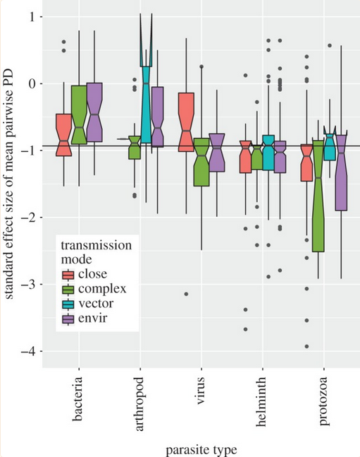

<style type="text/css">
.main-container {
  max-width: 800px;
  margin-left: auto;
  margin-right: auto;
}
h2 { 
 color: #3399ff;		
}
h3 { 
 color: #3399ff;		
}
</style>

```{r setup, include=FALSE} 
knitr::opts_chunk$set(warning = FALSE, message = FALSE) 
```
---


<!-- use the week 2 Park info to fill out the major groups of parasites ("terminology/diversity" lecture) -->


### Learning objectives

+ Appreciate the multiple forms parasites can take
+ Be able to define general parasite terms (e.g., obligate, facultative, etc.)
+ Understand parasite life history tradeoffs
+ Be able to quantify parasite specialism


---

### Parasite diversity 

{width=100%}

<sub> Byers et al. 2019 _PRSB_ </sub> 


---

### Parasite diversity 

{width=100%}

<sub> Dallas et al. 2018 _GEB_ </sub> 


---

### How do we really define parasite diversity? 

**Diversity in:**

+ number (taxonomic)
+ phylogenetic
+ functional 
+ infection modes
+ tissue infected 
+ impacts
+ host specificity
+ ...


---

### Diversity in numbers 

{width="90%"}


---

### Diversity in phylogenetics 

+ A host is infected with two parasite species
  + they could be closely related parasites, or quite distantly related parasites 

+ So when quantifying parasite diversity (either within a region or within a host species), considering the phylogenetic distance between parasites can be used as a measure of diversity 


---

### Phylogenetic diversity for free-living animals 

+ Take the tree of free-living species 
+ Calculate some index of dispersion for species found in the local community 
+ Mean pairwise distance is a common one 

{width=60%}


---

### Quantifying phylogenetic diversity for parasites 

<div class="columns-2">

+ For a given host community, what is the distance between host species that a given parasite infects? 

+ So it still uses the host phylogeny 

{width=100%}

</div> 


---

### Phylogenetic specificity across parasite groups

> What parasites would be most (or least) phylogenetically specific? 


---

### Phylogenetic specificity across parasite groups

+ This is broken down by parasite group and transmission mode 

+ More negative values indicate higher phylo-specificity 

{width=40%}

<sub> Park et al. 2018 _PRSB_ </sub>


---

### Phylogenetic specificity versus phylogenetic diversity 

+ The last slide was phylogenetic specificity (single parasite in host community) 

+ Phylogenetic diversity could be defined at the parasite community level, so it would use the parasite phylogeny

+ So keep in mind the distinction here between <font color='green'> diversity </font> and <font color='green'> specificity </font>


---

### Functional diversity 

+ Scientists have been obsessed with functional diversity for the last 15 years or so 

+ Argument: quantifying the differences in species traits provides information that the phylogeny may not 

+ In free-living species, this would be the variance in host body size or plant height or feeding mode


---

### Functional diversity/specificity 

+ For parasite species, it is some measure of the variance in the traits of infected host species (<font color='green'> specificity </font>)

+ For entire parasite communities, it is the variance in traits of the parasites (<font color='green'> diversity </font>)

> Can you give me an example of both of these? 


---

### Diversity in infection modes

+ macroparasites versus microparasites 

+ direct versus indirect transmission 

+ simple versus complex life cycle


---


{width=100%}


---

### Env-transmitted pathogen (simple)

{width=80%}


---

### Complex life cycle

{width=85%}


---

### Diversity in infection modes 

+ Six parasite strategies:
  + parasitic castration 
  + directly transmitted parasitism 
  + trophically-transmitted parasitism
  + vector-transmitted parasitism
  + parasitoidism
  + micropredation
  


---

### parasitic castrators

+ remove the host's ability to reproduce
+ take that energy and/or space 
+ tradeoff between consumption and longevity faced by parasites

{width=100%}

<div class="notes">

Parasitic castrators partly or completely destroy their host's ability to reproduce, diverting the energy that would have gone into reproduction into host and parasite growth, sometimes causing gigantism in the host. The host's other systems remain intact, allowing it to survive and to sustain the parasite
</div>


---

### parasitic castrators

{width=100%}


---

### directly transmitted parasitism 

+ do not require vector 
+ this includes environmentally-transmitted pathogens (e.g., cholera)

{width=50%}


<div class="notes">

Directly-transmitted parasites, not requiring a vector to reach their hosts, include such parasites of terrestrial vertebrates as lice and mites; marine parasites such as copepods and cyamid amphipods; monogeneans; and many species of nematodes, fungi, protozoans, bacteria, and viruses. 
</div>


---

### trophically-transmitted parasitism

+ transmitted through predation of the host 
+ complex life cycle parasites 
+ can modify host behavior (why?)


{width=50%}


<div class="notes">

Trophically-transmitted parasites are transmitted by being eaten by a host. They include trematodes (all except schistosomes), cestodes, acanthocephalans, pentastomids, many round worms, and many protozoa such as Toxoplasma (Poulin 2015). They have complex life-cycles involving hosts of two or more species. In their juvenile stages they infect and often encyst in the intermediate host. When the intermediate-host animal is eaten by a predator, the definitive host, the parasite survives the digestion process and matures into an adult; some live as intestinal parasites. Many trophically-transmitted parasites modify the behavior of their intermediate hosts, increasing their chances of being eaten by a predator. As with directly transmitted parasites, the distribution of trophically transmitted parasites among host individuals is aggregated (Poulin 2015).
</div>


---

### vector-transmitted parasitism

+ Rely on other organisms for transmission (e.g., mosquitos, ticks, lice, fleas, etc.) 
+ Sometimes reproduce in vector, sometimes only reproduce in definitive host 

{width=70%}


<div class="notes">
Vector-transmitted parasites rely on a third party, an intermediate host, where the parasite does not reproduce sexually (Australian Society of Parasitology 2010) to carry them from one definitive host to another (Poulin and Randhawa 2015). These parasites are microorganisms, namely protozoa, bacteria, or viruses, often intracellular pathogens (disease-causers) (Poulin and Randhawa 2015).  Their vectors are mostly hematophagic arthropods such as fleas, lice, ticks, and mosquitoes 
</div>


---

### parasitoidism

+ Insects that kill their hosts (so more like predation)
+ Larvae live as parasites within infected host 

{width=50%}


<div class="notes">
Parasitoids are insects which sooner or later kill their hosts, placing their relationship close to predation (Stevens 2010). Most parasitoids are parasitoid wasps or other hymenopterans; others include dipterans such as phorid flies. They can be divided into two groups, idiobionts and koinobionts, differing in their treatment of their hosts (Gullan and Cranston 2010). 

Idiobiont parasitoids sting their often large prey on capture, either killing them outright or paralyzing them immediately. The immobilized prey is then carried to a nest, sometimes alongside other prey if it is not large enough to support a parasitoid throughout its development. An egg is laid on top of the prey and the nest is then sealed. The parasitoid develops rapidly through its larval and pupal stages, feeding on the provisions left for it 
</div>


---

### micropredation

+ attacks more than one host (reducing each host individual fitness by small amount)

+ e.g., leeches, mosquitos, fleas, ticks, lice


<div class="notes">
A micropredator attacks more than one host, reducing each host's fitness by at least a small amount, and is only in contact with any one host intermittently. This behavior makes micropredators suitable as vectors, as they can pass smaller parasites from one host to another (Poulin and Randhawa 2015; Lafferty and Kuris 2002; Wilson et al. 2017).  Most micropredators are hematophagic, feeding on blood. They include annelids such as leeches, crustaceans such as branchiurans and gnathiid isopods, various dipterans such as mosquitoes and tsetse flies, other arthropods such as fleas and ticks, vertebrates such as lampreys, and mammals such as vampire bats

</div>


  


---

### Diversity in tissue infected 

+ **Tissue tropism**: range of host tissue types which the pathogen can infect 

+ e.g., viruses tht must bind to specific cell surface receptors to enter a cell


---


### How much diversity is there in tissue tropism? 

+ A fair bit, often related to transmission mode

+ <font color='green'>Tissue specialist</font>: mumps (parotid salivary glands)

+ <font color='green'>Tissue generalist</font>: ebola (monocytes, macrophages, dendritic cells, endothelial cells, fibroblasts, hepatocytes, adrenal cortical cells, and epithelial cells)


---

### Defining tissue tropism is hard 

+ Could define by system (e.g., circulatory, hepatic, respiratory, etc.) 

+ By organ (e.g., stomach) 

+ Or by cell type (e.g., endothelial)

+ Or probably some other ways 


--- 

### Diversity in impacts 

+ Some parasites have little impact (e.g., some parasitic worms), some have pronounced impact (e.g., anthrax)

+ Impacts quantified as 
  + morbidity/mortality 
  + energetic cost to host
  + fitness cost 
  + etc. 


<div class="notes">

You have all been infected by a parasite, but it was likely pretty mild? 

But what about things like anthrax, rabies, or ebola? 

</div>


---

### Diversity in host specificity 

+ **Host specificity**: range and diversity of types of hosts a parasite can infect 

+ Generalism versus specialism 

+ We've talked about specialism in a couple of ways (taxonomic, phylogenetic, and functional)


<br> 

> What's the most generalist parasite you can think of? 


---

<br> 
<br> 
<br> 

<h2> <center> End of lecture 1 </center> </h2> 


---

### What have we learned

+ Parasites are cool 

+ Parasite diversity can be defined in a bunch of different ways 

+ Parasites can be specialists or generalits in different ways 

> today we will dive into parasite specificity 


---

### Why specialize? 

+ High infectivity/transmission in preferred host


### Why generalize? 

+ Need a host to reproduce
+ Potential for invasion of new habitats 
+ Co-extinction is bad 


---

### How do we quantify parasite specialism? 

+ number of host species infected (host range; taxonomic)
+ functional dispersion of host community (functional) 
+ phylogenetic dispersion of host community (phylogenetic) 

<br> 

+ relative utilization of different host species (tropism)?


---

### Specialism-generalism tradeoffs 

+ Jack of all trades, master of none? 

  + Proposes a relationship between ability to infect and host specificity 

  + Generalist parasites should tend to infect with low success (reduced prevalence or intensity)


> But do we see evidence for this relationship? 


<div class="notes">

Animal species with larger local populations tend to be widespread across many localities, whereas species with smaller local populations occur in fewer localities. This pattern is well documented for free-living species and can be explained by the resource breadth hypothesis: the attributes that enable a species to exploit a diversity of resources allow it to attain a broad distribution and high local density. In contrast, for parasitic organisms, the trade-off hypothesis predicts that parasites exploiting many host species will achieve lower mean abundance on those hosts than more host-specific parasites because of the costs of adaptations against multiple defense systems. We test these alternative hypotheses with data on host specificity and abundance of fleas parasitic on small mammals from 20 different regions. Our analyses controlled for phylogenetic influences, differences in host body surface area, and sampling effort. In most regions, we found significant positive relationships between flea abundance and either the number of host species they exploited or the average taxonomic distance among those host species. This was true whether we used mean flea abundance or the maximum abundance they achieved on their optimal host. Although fleas tended to exploit more host species in regions with either larger number of available hosts or more taxonomically diverse host faunas, differences in host faunas between regions had no clear effect on the abundance-host specificity relationship. Overall, the results support the resource breadth hypothesis: fleas exploiting many host species or taxonomically unrelated hosts achieve higher abundance than specialist fleas. We conclude that generalist parasites achieve higher abundance because of a combination of resource availability and stability.

http://dx.doi.org/10.1086/423716

</div>


---

### Not really (at least for fleas)

+ Why does parasite type matter here? 

{width="70%"}

<sub> Krasnov et al. 2004 _Am Nat_ </sub>


---

### We don't see it for Plasmodium in birds either 

{width="70%"}


---

### But there's a caveat here 

+ These figures differ a bit
  + First was mean abundance of flea parasite 
  + Second was maximum prevalence in most common host 

+ The distribution of prevalence is important here
  + If I infect one host really well, but 5 other hosts less well, how much of a generalist am I? 

> The costs of being a generalist are difficult to clearly define and test 


---

### Host-parasite coevolution 

+ Infection is costly to hosts in terms of fitness, leading to evolution of host defenses 

+ Parasites _want_ to infect, leading to evolution of novel infection strategies 


<div class="notes">

Be sure to not imply 'want' (e.g., hosts do not want to become infected), as it's not really that, it's that hosts that have the 'correct' level of defense will have higher fitness, such that selection will favor different levels of host investment in immune defense dependent on parasite pressure (leave a lot of this for later, but good to mention it now). 

</div>


---

### Host-parasite coevolution 

+ Possible trajectories of host-parasite coevolution 

{width="50%"}

<sub> Buckingham & Ashby 2022 _J Evol Biol_ </sub> 


---

### Host-parasite coevolution 

+ The difference between deterministic and stochastic systems 

{width="50%"}

<sub> Buckingham & Ashby 2022 _J Evol Biol_ </sub> 


---

### Host-parasite coevolution 

+ Resistance evolution as a function of the cost on host fitness 

{width="70%"}

<sub> Buckingham & Ashby 2022 _J Evol Biol_ </sub> 


---

### Host-parasite coevolution 

+ This cyclic pattern of selection/evolution is often referred to as <font color='green'> Red Queen </font> dynamics 

+ Idea comes from _Through the Looking Glass_, where the Alice was running just to keep her place 

{width="90%"}


---

### What happens when resistance is either cheap or hugely beneficial? 

{width="90%"}


---

### What happens when resistance is either cheap or hugely beneficial? 

{width="60%"}

<sub> Cooke et al. 2023 _Epidemiol Infect_</sub>


---

### Why is this not a great example of Red Queen dynamics? 


---

### What is the "goal" of the parasite? 

+ To reproduce. So it doesn't really _want_ to kill the host, right? 

+ But it also has to reproduce and consume some aspect of the host, which comes at a fitness consequence for the host. 

+ There's a conflicting balance between 
  + trying to reproduce (which causes harm to host) 
  + flying under the radar (transmission to the next host) 


<div class="notes">
Ties into resistance-tolerance tradeoffs but don't bring this up yet. Or if you do, differentiate it from virulence evolution. 


</div>


---

### optimal virulence 

+ **Virulence**: pathogen-induced mortality of infected host

+ Pathogen needs to grow in infected host, but dead hosts don't transmit

+ So the optimal strategy is not maximal virulence, but some intermediate (or even low) virulence 


---

### What examples do you know of related to changes in virulence in an evolving pathogen? 


--- 

### Many SARS-COV2 strains through time 

{width="80%"}

+ Initial strain had highest pathogenicity (even though we saw greatest mortality with Alpha)
+ Omicron has the lowest pathogenicity 


---

### How have we used virulence evolution to our benefit? 

+ the creation of live attenuated vaccines 

+ live vaccines use avirulent strains of the pathogen to induce host immune memory 

+ e.g., Sabin (oral) polio vaccine; the measles, mumps, rubella, yellow fever, and chicken pox (varicella) vaccines; one of the influenza vaccines (flu mist); the tuberculosis (BCG) vaccine; etc. etc. 


---

### What parasites would not follow this general pattern of virulence attenuation? 

>- Fungal pathogens, generally
>- Pathogens with a long-lived environmental stage (e.g., anthrax)


---

### optimal virulence 

+ Essentially a balance between parasite growth and host exploitation 

+ Idea in this tradeoff model is to maximize lifetime transmission success (LTS)

+ This leads to a non-linear relationship between LTS and virulence 

> the ideal parasite maximizes LTS 


---

### optimal virulence 

+ LTS is y-axis, virulence is x-axis

{width="60%"}

<sub> Jensen et al. 2006 _PLoS Biology_ </sub> 


---

### But we've only been thinking about parasite evolution 

+ It takes two to Red Queen, so we might expect hosts to evolve resistance 

+ And they do, but sometimes they don't


---

### Why would a host not evolve resistance to a parasite? 

>- parasite does not impact host fitness _too much_ 

>- resistance is costly 

>- they simply can't (it's not really a choice, right?) 


---

### Resistance-tolerance tradeoffs 

+ A host can evolve to resist the effects of a parasite or to reduce parasite impacts 

+ These are often depicted as two separate responses to parasite pressure 

+ <font color='green'> Resistance </font>: infected hosts actively reduce parasite burden

+ <font color='green'> Tolerance </font>: infected hosts try to limit damage to host fitness 


---

### Resistance-tolerance tradeoffs 

+ This happens at individual level, but with implications to evolutionary trajectories 

+ Host fitness at one generation determines the allele frequency in the next 

+ So if tolerant hosts have highest fitness, it might result in evolution towards tolerating the parasite 

+ But at the population-level, this is a bad strategy (unless you're a bat) 

> Why is tolerance a bad population-level strategy? 


---

### Let's end on a community note 

+ Parasites can exert pressures on host communities 

+ Differential effects on host species can drive interesting dynamics 

{width="100%"}

<sub> Rohr & Best 2010 _Functional Ecology_ </sub> 


