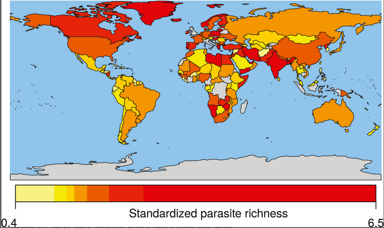
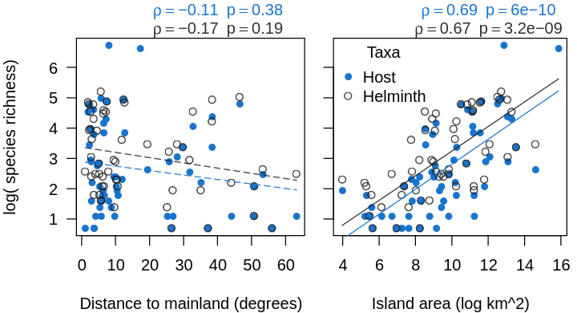
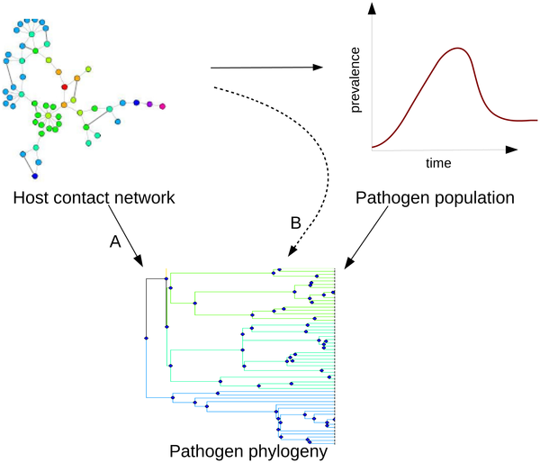
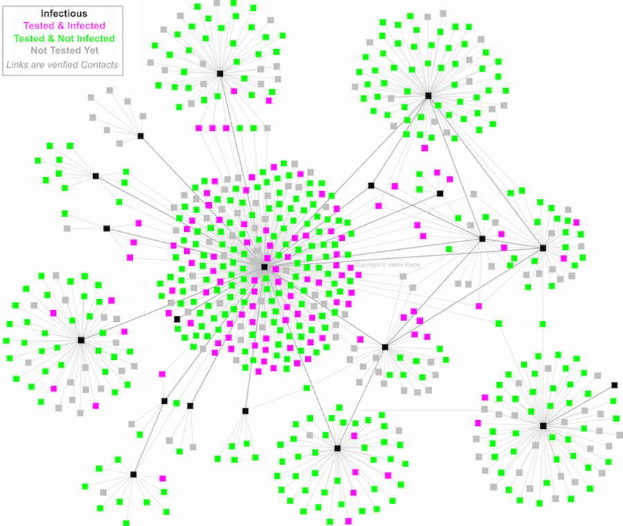

<style type="text/css">
.main-container {
  max-width: 800px;
  margin-left: auto;
  margin-right: auto;
}
h2 { 
 color: #3399ff;		
}
h3 { 
 color: #3399ff;		
}
</style>

```{r setup, include=FALSE} 
knitr::opts_chunk$set(warning = FALSE, message = FALSE) 
```


---

### What is macroecology? 

{width="90%"}


---

### What is macroecology? 

{width="90%"}


---

### How do we do it? 

+ Large observational data 

+ Some theory, but not much currently 

+ <font color='green'> Makes it tough to get at mechanism </font> 

+ ...but maybe that's not the point 


---

### What do parasites have to do with macroecology? 

+ Parasites can provide good tests of macroecological ideas 

An example: 

+ Some macreocological ideas claim that metabolic constraints on thermoregulation determine the distribution of diversity. Ectotherms (like parasites) could provide a good test of this specific hypothesis 


---

### I pitched this in 2011!!

<div class="columns-2">

{width="100%"}

{width="100%"}

</div> 


---

### What's the scope of parasite macroecology we'll cover 

+ the standard flavors (ldr, range size stuff, parasite body size scaling, etc. )

+ host-parasite networks (<font color='green'> the next frontier!</font>)


---

### first we need some data  

London Natural History Museum Host-Helminth data 

+ 299 geopolitical locations 

+ 23601 parasite species 

+ 14933 host species 

+ 94561 interactions 


---

### London Natural History Museum Host-Helminth data 

{width="90%"}

<sub> others exist, like VIRION, GMPD2.0, etc. </sub> 


---

### Recall this figure of parasite taxonomic diversity? 

{width="100%"}


---


{width="100%"}


---

### Latitudinal diversity gradient 

> tendency for species richness to be highest near the equator and lowest near the poles 

Think-pair share (3 minutes): How many of the putative mechanisms underlying this pattern can we come up? 


<div class="notes">

+ tropics have more habitat diversity 
+ tropics have more energy 
+ tropics have more stable climate 
+ evolutionary hypotheses related to evotime bits
+ others? 

</div>


---

### Latitudinal diversity gradient 

{width="100%"}


---

### Latitudinal diversity gradient (but with parasites)

{width="70%"}


---

### Another potential mechanism 

<font color='green'> The mid-domain effect </font> 

+ Interesting because it is essentially a null model

+ Ignores all species differences and generates the relationship


---

### Bergmann's rule 

> tendency for species body size to be larger away from equator 

Main proposed mechanism is larger body mass increases surface-to-volume ratio, important for heat retention. 

+ <font color='green'> Do we expect parasites to follow Bergmann's rule? </font>

+ Can be examined across species or within a single species! 


---

### Bergmann's rule 

{width="70%"}


---

### Bergmann's rule 

> Is this support? 

> What's going on with temperature in the right panels? 


---

### Harrison's rule 

> Large parasites should only infect large host species 

{width="60%"}

This is a modified Harrison's rule from Poulin (how?)


---

### Island biogeography theory 

{width="100%"}


---

### Island biogeography theory (but with parasites)

{width="80%"}


---

### Island biogeography theory (but with parasites)

{width="100%"}


---

### Distance decay relationships 

+ Island biogeography is supposed to give us equilibrial species richness

+ But macroecology can also relate to species composition 

> Increasing geographic distance should result in more dissimilar communities 


---

### Distance decay relationships 

{width="100%"}


---

### What if all these patterns are just driven by host richness? 

> Totally possible. Parasites are simply tracking their hosts, and their showing macroecological patterns is simply a function of the host community 

{width="50%"}


---

### Ways around this 

+ standardize parasite diversity by host diversity 

+ compare strength of macroecological relationships between host and parasite communities 

+ give up (jk) 


---

### Parasite macroecology special issue 

Check out this special issue for some neat parasite macroecology 

https://royalsocietypublishing.org/toc/rstb/2021/376/1837


---

### The macroecology of species interaction networks 

We've seen networks before 

{width="60%"}


---

### The macroecology of species interaction networks 

We've seen networks before 

{width="65%"}


---

### The macroecology of species interaction networks 

We've seen networks before 

{width="100%"}


---

### The macroecology of species interaction networks 

We've seen networks before 

{width="70%"}


---

### The macroecology of species interaction networks 

<br>
<br>

<h2><center><font color='green'> That's because networks are awesome! </font></center></h2>


---

<br> 
<br> 
<br> 

<h2> <center> End of lecture 1 </center> </h2> 


--- 

### What have we learned 

+ There are many ways to study host-parasite interactions 

+ Macroecology is one way, which looks at large spatial/taxonomic/temporal patterns 

+ Ignores a lot of detail and specifics of host-parasite interactions 

+ But is still neato 

+ Now let's talk about networks 


---

### Why networks? 

+ They are also neato 

+ They relate to concepts we've already covered (specificity, host range, parasite species richness, etc. etc.) 

+ Host-parasite interactions do not exist in isolation (we saw that!)


---

### Unipartite networks 

+ consist of one class of interactor and the links between them 

  + transportation networks 
  + social networks
  + sexual contact networks 
  + etc.


---

### Bipartite networks 

+ consist of two classes of interactors 

  + actor-movie 
  + artist-listener
  + plant-pollinator 
  + host-parasite 


---

### The web of interactions between small mammals and their parasites in New Mexico

{width="100%"}


---

### What can we measure about these networks? 

Centrality

+ <font color='green'> degree </font>: sum of links for a given interactor 

+ <font color='green'> closeness </font>: weighted distance between interactors 

+ <font color='green'> betweenness </font>: weighted by shortest paths that pass through an interactor 


> What does each of these correspond to in a host-parasite network? (5 minute paired discussion)

<div class="notes">

+ degree <- taxonomic specificity 
+ closeness <- tendency of the host to interact with parasites that infect key hosts
+ betweenness <- tendency for host or parasite to serve as bridges between groups

</div>


---

### What can we measure about these networks? 

+ <font color='green'> Nestedness </font>: tendency of interactions to form into nested subsets 

{width="80%"}

> Have we seen concepts like this before? What does this start to get at? 


<div class="notes">

+ Parasite distributions among host individuals 
+ maybe something else? 

</div>


---

### The macroecology of host-parasite networks 

+ A lot of this is beyond the course, so we won't really cover it. 

+ The core goal is to leverage macroecological ideas into thinking about how host-parasite networks change across spatial and environmental gradients 


---

### And folks have been thinking about this! 

{width="80%"}


---

### But what if we simplify our approach to just considering social networks (unipartite)? 

{width="80%"}


---

### Disease spread in networked populations 

We saw this in the sexual contact network lecture! 

```{r, echo=FALSE}
g <- igraph::sample_gnm(40, 70)
sm <- sir(g, beta = 5, gamma = 1)
plot(sm)
```


---

### But we didn't talk about mitigation 

> Who would you vaccinate in this network? 

```{r, echo=FALSE}

plotGraph <- function(g, lay=layout_nicely(g), colz=c('dodgerblue')){
	plot(g, layout=lay, edge.width= E(g)$weight, 
    vertex.size=degree(g)*2, directed=FALSE,
		vertex.color= colz, 
    vertex.label=NA)
}
plotGraph(g)

```


---

### Removing a single well-connected individual 

```{r, echo=FALSE}

g2 <- igraph::delete_vertices(g, which.max(degree(g)))
layout(matrix(1:2, ncol=2))
plot(sm)
plot(sir(g2, beta = 5, gamma = 1))

```


---

### Removing the top interactors (compared to random, based on degree)

```{r, echo=FALSE}
topz <- which(degree(g)>4)
g2 <- igraph::delete_vertices(g, topz)
g3 <- igraph::delete_vertices(g, sample(V(g), length(topz)))
layout(matrix(1:2, ncol=2))
plot(sir(g3, beta = 5, gamma = 1), ylim=c(0, 25), main='random removal')
plot(sir(g2, beta = 5, gamma = 1), ylim=c(0, 25), main='targetted removal')

```


---

### Removing the top interactors (compared to random, based on closeness)

```{r, echo=FALSE}

topz2 <- sort(order(closeness(g)), decreasing=TRUE)
g4 <- igraph::delete_vertices(g, topz2[1:length(topz)])
g3 <- igraph::delete_vertices(g, sample(V(g), length(topz)))
layout(matrix(1:3, ncol=3))
plot(sir(g3, beta = 5, gamma = 1), ylim=c(0, 25), main='random removal')
plot(sir(g2, beta = 5, gamma = 1), ylim=c(0, 25), main='degree removal')
plot(sir(g4, beta = 5, gamma = 1), ylim=c(0, 25), main='closeness removal')

```


---

### That was fun, right!? 

+ The structure of the network really matters when considering control options 

+ This is why targeted vaccination campaigns work!

+ We don't 'ring cull' people, right? 


---

### But what if we simplify our approach to just considering spatial networks? 

{width="100%"}


---

### We can think about disease transmission in these networks 


parasites in metapopulations 
+ hall and becker work 

+ other bits? spectralSpread bits? 
https://onlinelibrary.wiley.com/doi/full/10.1111/eva.12294
+ 


