<style type="text/css">
.main-container {
  max-width: 800px;
  margin-left: auto;
  margin-right: auto;
}
h2 { 
 color: #3399ff;		
}
h3 { 
 color: #3399ff;		
}
</style>

```{r setup, include=FALSE} 
knitr::opts_chunk$set(warning = FALSE, message = FALSE) 
```


<!-- (pop cycling, 
epidemic v. endemic, 
freq v dep transmission) 
talk about variety of transmission modes of microparasites (emphasize vectors)
(no; save for env transmission week) lead into water-borne pathogens and talk about cholera (week 12 lecture 20 from Park)
end with intro of SIR model idea
week 2 from Park 2019 --> 
 
 
 
 

---

### What are microparasites?

+ Fungal, bacterial, viral, and protozoan parasites

+ Small, typically fast reproduction, often lead to lasting immunity


<div class="notes">
This is my *note*.

</div>


---

### Transmission modes 

+ Can be transmitted many ways (water, direct, vectors)

+ Direct 
  + direct contact (e.g., respiratory droplets)
  + sexual contact 

+ Indirect 
  + environment
  + water 
  + vector


<div class="notes">
This is my *note*.

</div>


---

### Bacterial microparasites 

+ Unicellular prokaryotes (no mitochondria, unbound genetic material)

+ Can be intracellular or extracellular 

+ Asexual reproduction (potential for horizontal gene transfer through plasmid transfer between cells)

+ Many bacteria are good (e.g., your gut bacteria)

+ e.g., black death (bubonic and pneumonic plague; _Yersinia pestis_), Cholera, Tuberculosis


---

### A relevant bacterial microparasite 

<br> 

<font color='green'> Cholera (_Vibrio cholerae_)</font> 

+ water-borne or contaminated food 

+ acute diarrhoeal disease 

+ severe symptoms can lead to death within hours 

+ oral vaccine available, but still 1.3-4 million cases per year (21k - 143k deaths)

+ can be endemic or epidemic 


---

### Fungal microparasites 

+ Rigid cell wall made of chitin 

+ Vegetative growth via mycellium or budding 

+ Hyphae can growth through host cells

+ Produce sexual or asexual spores 

+ e.g., last of us? Athlete's foot, ringworm, etc. Many more crop fungal pathogens (ergot and the Salem witch trials) 


---

### A relevant fungal microparasite 

<font color='green'> White nose syndrome (_Geomyces destructans_) </font>

+ external fungal pathogen 

+ grows well in cooler temperatures 

+ death caused by dehydration or starvation (bats wake up early from hiberation)

+ transmitted directly and through environment


--- 

### A relevant fungal microparasite 

White nose syndrome (_Geomyces destructans_)

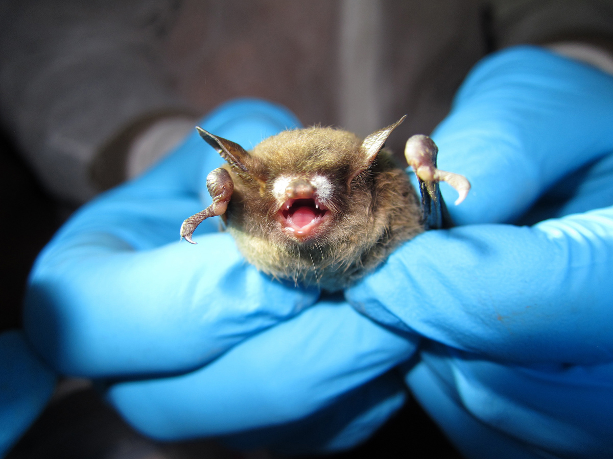{width="80%"}


---

### Viruses 

+ Structurally simple = protein coat + genetic material (RNA or DNA)

+ RNA virsues has small genomes and high mutation rates, DNA viruses larger, more genes, and lower mutation rates. 

+ Inert outside of hosts 

+ Hijack host cell's machinery to replicate (obligate intracellular parasite) 

+ e.g., DNA: poxviridae (smallpox), herpesviridae (herpes, chicken pox)
+ e.g., RNA: flaviviridae (yellow fever, dengue), retroviridae (HIV) 


---

### A relevant virus 

<font color='green'> Dengue (DENV) </font> 

+ mosquito-transmitted (100-400 million infections per year) 

+ fever, headache, nausea, vomiting, rash

+ Dengvaxia vaccine, but only for previously infected people where risk of reinfection is high

+ 4 types of dengue. No cross-type immunity, so reinfection happens and is bad 


---

### Another virus just for fun 

<font color='green'> West Nile Virus (WNV) </font> 

+ Most common mosquito-borne disease in USA 

+ Infects birds (no bird to human transmission known)

+ Asymptomatic cases common

+ high fever, stiff neck, headache, stupor, coma, tremors, muscle weakness, vision loss, numbness

+ lifelong immunity


---

### So I guess all viruses are just vector-borne? 

<br> 

+ No, just the coolest ones. 

+ Influenza virus is directly transmitted and comes in a nice variety of flavors


---

### Influenza 

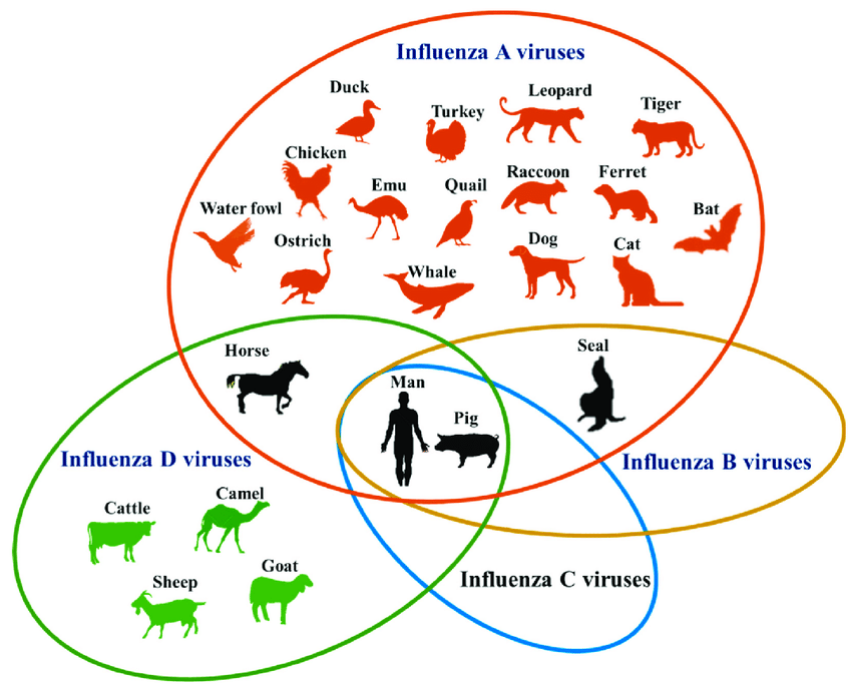{width="80%"}


---

### Influenza 

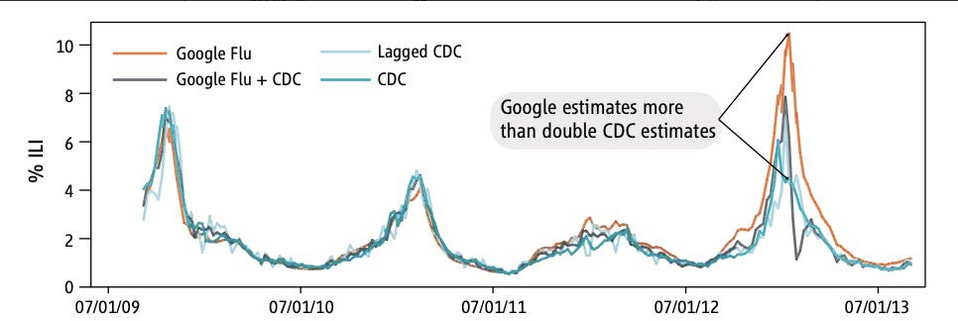{width="100%"}


---

### Protozoan microparasites 

+ Single-celled eukaryotes

+ Extremely diverse, loads of transmission modes and tissues infected

+ Can be intracellular or extracellular

+ Some host-specific, some incredibly broad host range 

+ e.g., _Plasmodium_, _Trypanosoma_, _Leishmania_, etc. 


---

### A relevant protozoan 

<font color='green'>Leishmaniasis</font> 

+ 3 main forms (visceral, cutaneous, and mucocutaneous) 

+ visceral is almost always fatal without treatment 

+ transmitted by phlebotomine sandflies (90+ species can transmit)

+ associated with malnutrition, population displacement, poor housing, weakened immune function, etc. 

+ 700k-1 million cases

+ Interaction with HIV means coinfection tends to produce really negative outcomes


---

### The importance of vectors 

+ All of those protozoans listed are vector-borne and many or most of the other examples were vector-borne 

+ <font color='green'> Vectors are incredibly important! </font> 

+ We will spend an entire week on vector-borne disease. 

+ Get excited, because vectors add a neat layer of complexity onto disease systems 


---

### Density dependent transmission 

+ Transmission depends on the density of susceptible and infected hosts (the well-mixed assumption of contact) 

+ Transmission requires:
  
  + contact between individuals ($cN$)
  + the right sort of contact (needs to be susceptible with an infected, right?)
  + successful parasite establishment ($a$)


---

### Density dependent transmission 

+ For one infected individual, the probability that they encounter a susceptible individual is $\frac{S}{N}$

+ For all infected individuals in the population, this scales to $I\frac{S}{N}$

+ Transmission requires:
  
  + contact between a susceptible and an infected individual ($c$)
  + successful parasite establishment ($a$)

+ Transmission = $cN\frac{S}{N}Ia$ = $\beta SI$


<div class="notes">

Be clear about S and I terminology, as it's going to be used at the end of this lecture to introduce the SIR model and such. How did I go from cNa(S/I) to bSI? ca is beta, the N cancels.

</div>


---

### Frequency dependent transmission 

+ Transmission depends on the number of contacts you have (e.g., sexually-transmitted infections)

+ Transmission requires:
  
  + contact between a susceptible and an infected individual ($c$)
  + successful parasite establishment ($a$)

+ Transmission = $c\frac{S}{N}Ia$ = $\beta\frac{SI}{N}$


---

### Transmission and the force of infection 

<font color='green'> Force of infection </font>: per capita rate at which susceptible individuals get infected

+ But it's different dependent on if the pathogen is frequency or density dependent, right? 

\[ DD: \dfrac{dI}{dt} = \beta S \]
\[ FD: \dfrac{dI}{dt} = \beta' S \]

but $\beta \neq \beta'$

and this is because $\beta$ is a combination of contact $c$ and parasite establishment $a$. 


---

### Density dependent transmission assumes that you contact everyone

<br> 

+ Density-dependent transmission = $cN\frac{S}{N}Ia$ 

+ ...that $cN$ is the contact of everyone with everyone. 


---

### How does contact scale with population density? 

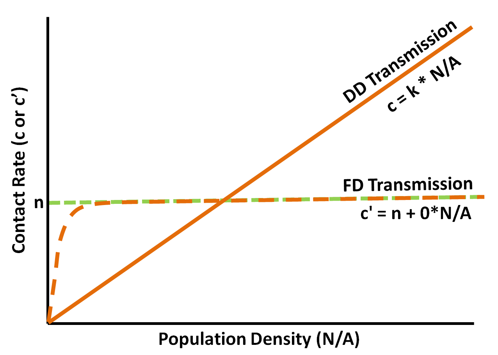{width="90%"}


---

### Threshold host density 

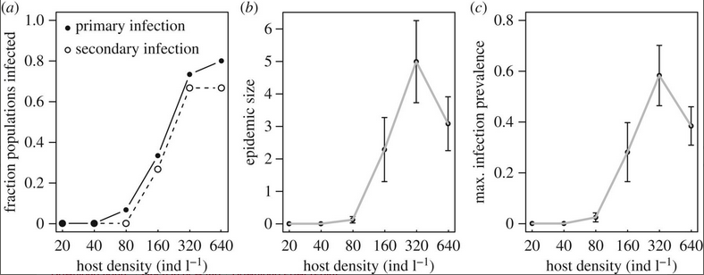{width="90%"}

<sub> Dallas et al. 2018 _PRSB_ </sub> 


---

### What determines this threshold host density? 

>- Recovery rate of infected hosts 

>- Pathogen-induced mortality (virulence) 

>- Pathogen survival in the environment 


---

### Why do we need to worry about 'secondary infections'? 

{width="90%"}

<sub> Dallas et al. 2018 _PRSB_ </sub> 


---

### Would frequency or density dependent transmission result in lower threshold host density? 

<br> 

> 5 minutes to discuss this in small groups. 


<div class="notes">
Density-dependent should be higher host density threshold, since density-dependent relies on host density. That is, the impact of density-dependent transmission would be greatest at high host density, where frequency-dependent pathogens do the same damage once some level of contact is hit (recall that contact rate by density figure). 

One could argue that frequency-dependent transmission would have a higher threshold, as the force of infection is standardized by the total population size, bringing dI/dt down. Mathematically, frequency-dependent transmission should not have a threshold host density at all, meaning that it would be lower than density-dependent transmission. 

</div>


--- 

### Maybe this is a tougher question than I intended 

+ It really depends on _where_ the host density threshold is 

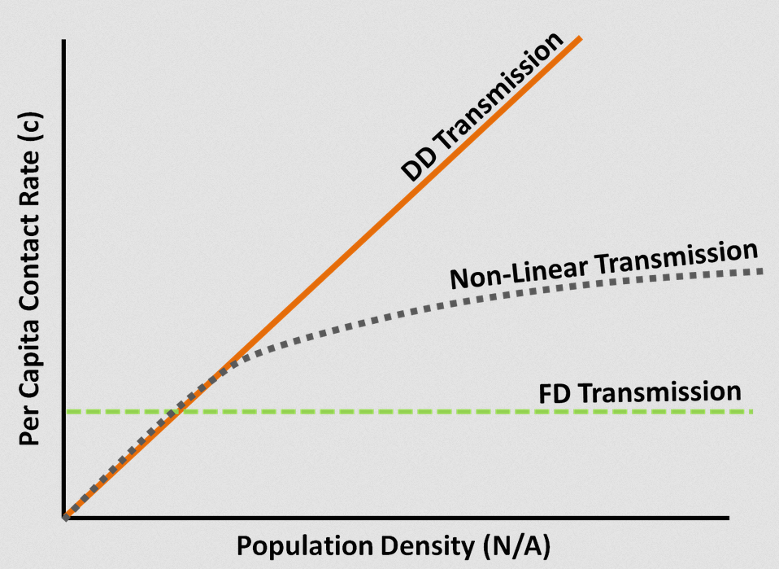{width="80%"}


---

### But let's simplify things 

+ Parasites with frequency-dependent transmission don't _really_ have a threshold host density in theory, but they often do in practice
  + Think about pathogen spread at very low host densities and refer back to 2-3 figures ago 

+ This is a heady problem to think about, because we are acting like the same parasite can be transmitted as frequency or density dependent

+ And we aren't even considering the pathogen challenge (are we just introducing 1 infected person into the population, or 10?)


---

### One last note about this for clarity 

<font color='green'> Frequency-dependent transmission </font> 

\[ 0 < \beta \dfrac{SI}{N} - \gamma I \]

\[ \gamma < \beta \dfrac{S}{N}  \]

+ Pre-outbreak, $S=N$, so as host density never comes into the equation 


---

### Compare this with density-dependent transmission 

\[ 0 < \beta SI - \gamma I \]

\[ \dfrac{\gamma}{\beta} < S \]

+ So host density is in the equation, where an outbreak will occur is $\frac{\gamma}{\beta}$ is less than $S$. 


---

+ This will make more sense in the next lecture, where we will go a bit more into how we model infectious diseases, focusing on microparasites 


---

<br> 
<br> 
<br> 

<h2> <center> End of lecture 1 </center> </h2> 


<!-- intro to SIR terminology (talk about transmission, recovery, mortality, etc. etc. etc.)
lead into the next lecture, which will focus on the SIR and modeling bits around epidemics -->


---

### What have we learned 

+ A bit about microparasites and their different forms 

+ A primer on how pathogens are transmitted (density/frequency dependent transmission) 

+ A little bit of the fun math that we'll use throughout the semester 


---

### Impacts of parasites

+ Population extinction 

+ Invasive species (enemy release and biotic resistance)

+ Alter population dynamics 

+ Weird knock-on effects (e.g., alter competitive landscape)


---

### Population extinction (extirpation)

+ Do we expect parasites with density-dependent transmission to cause host extirpation? 

+ Under what mechanisms could this happen? 
  + stochasticity/small populations 
  + non-DD transmission (inhomogeneous mixing)
  + reservoirs 

<sub> de Castro and Bolker 2005 _Ecology Letters_ </sub> 


---

### How often does parasite-induced extinction occur? 

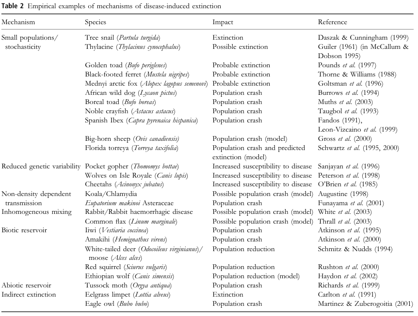{width="90%"}


---

### Invasive species (enemy release and biotic resistance)

+ <font color='green'> enemy release </font>: invasive species are less impacted by enemies than native species (lose parasites in process of invasion or parasites in invaded range not a good fit)

+ <font color='green'> biotic resistance </font>: invasive species more impacted by enemies than native species (can happen in a bunch of ways)
  + let's think about some of the ways this could happen without leading to a net loss for both host species 


<div class="notes">

If native host is less affected by the parasite, or has a lower transmission rate, or doesn't really encounter the invasive host all that much. Otherwise, an increase in infection in the invasive will also feedback into the native species, right? This assumes density-dependent transmission, as the effect would be way weaker with FD transmission. What about spatial heterogeneity? If the parasite prefers a certain microenvironment, differences in habitat use, activity period, etc. could result in differential infection of the invasive. Finally, think about the burden of disease (if burden is proportional to the negative effects of disease, hosts that harbor larger burdens will pay a higher cost, maybe without an increase in parasite shedding or transmission potential). 

</div>


---

### Enemy release 
 
<div class="columns-2">


{width="100%"}

+ European green crab _Carcinus maenas_ has reduced parasite species richness (and infection prevalence) in its invasive range compared with its natural range


</div> 


---

### Biotic resistance

<div class="columns-2">

 + Eastern white pine (_Pinus strobus_) could not be introduced into Europe (after many attempts) because of a native blister rust (_Cronartium ribicola_) which is sustained by more tolerant indigenous European pines 


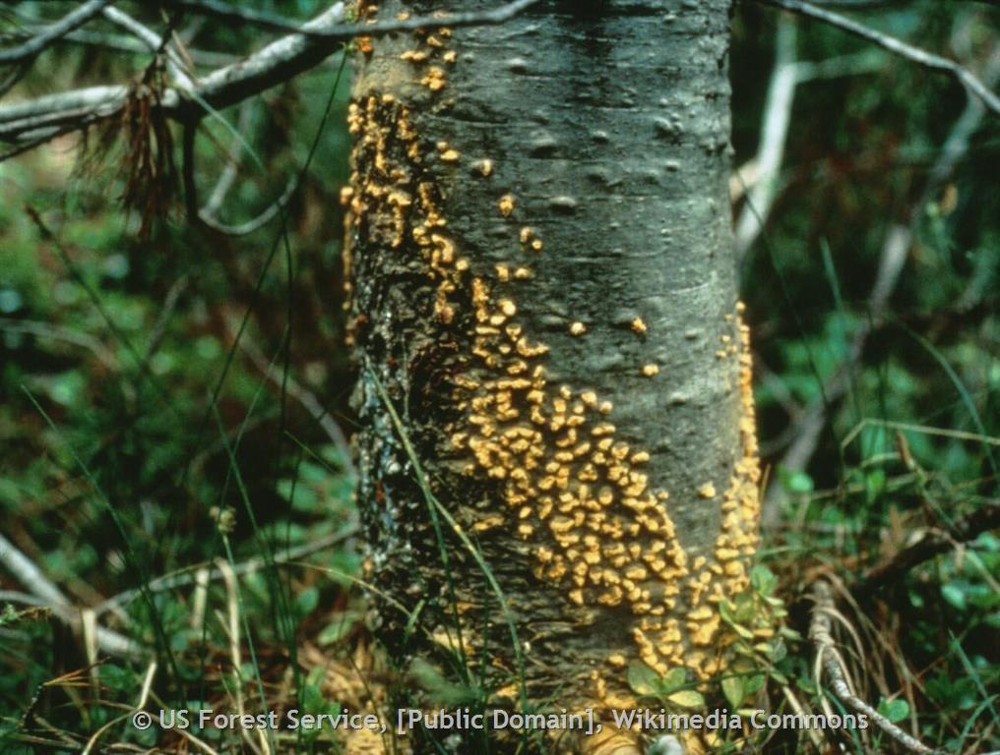{width="100%"}

</div> 


---

### Alter population dynamics 

<div class="columns-2">

+ Red grouse dynamics in Britain are famously cyclic 

+ The cause of these fluctuations is a nematode parasite whose impact is directly related to host demographic parameters ($r_t$ and breeding mortality) 

> Hubson et al. 1998 _Science_ 

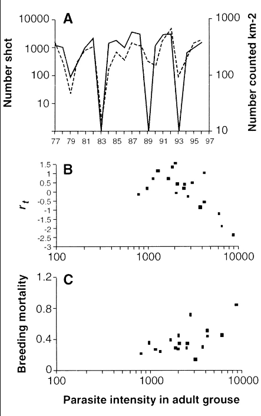{width="80%"}

</div> 


---

### Take out parasite, take out cycling 

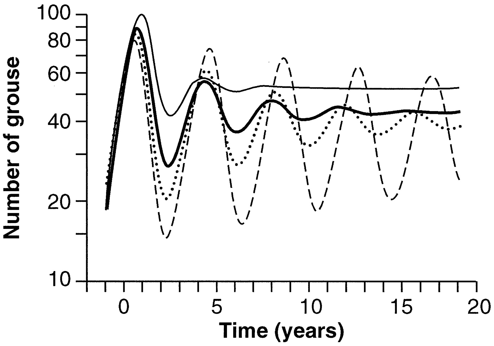{width="90%"}


---

### Weird knock-on effects (e.g., alter competitive landscape)

+ Population dynamics (growth is determined by birth and death)

+ $N = B - D$

+ but parasites can result in additional mortality ($N=B-D-\omega$)

+ this extra mortality can cause competition between species to change, or affect food web dynamics (e.g., deer infected by chronic wasting disease alter wolf population dynamics)

> _Parasite-mediated competition_ 


---

### Microparasite dynamics in host populations 

+ <font color='green'>Outbreaks</font>: Sudden increase in disease in a population that forms _epidemic curve_ 

+ <font color='green'>Sequential epidemics</font>: Multiple waves or peaks of infection 

+ <font color='green'>Endemic parasites</font>: Increase in prevalence that eventually settles to some equilibrial amount of infection 


---

### Outbreaks

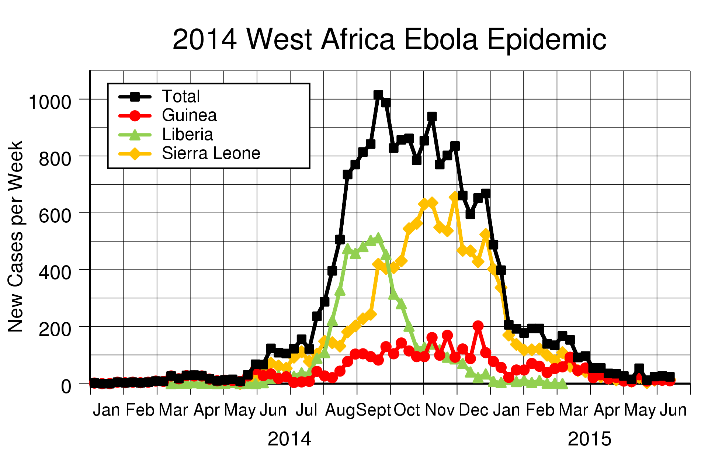{width="90%"}


---

### Sequential epidemics

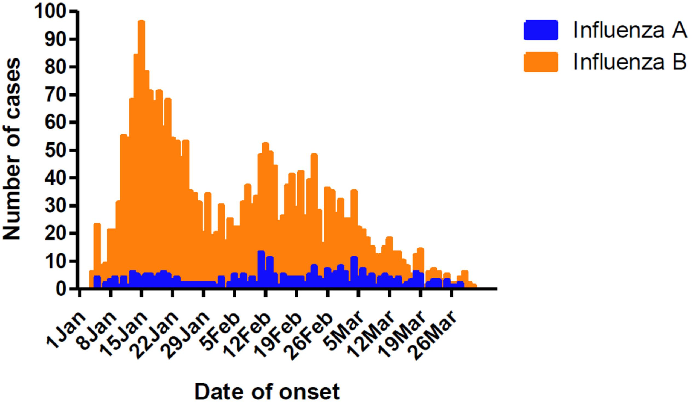{width="90%"}


---

### Endemic parasites 


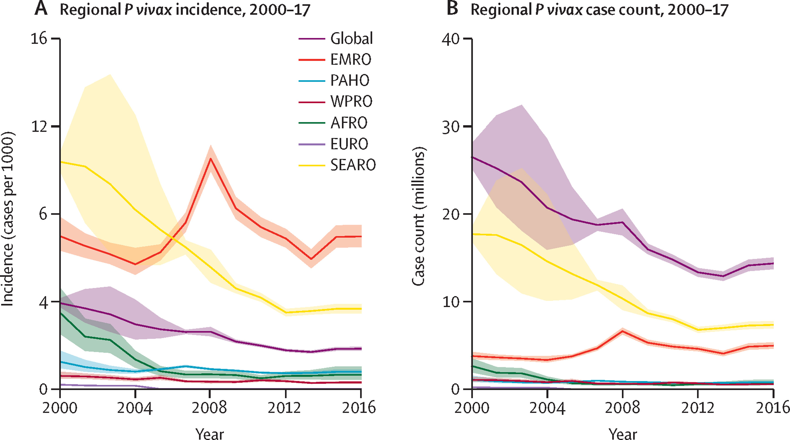{width="90%"}


---

### Modeling microparasite infections 

+ To understand, forecast, and mitigate infectious disease, we need to be able to model them (or at least fit a model to them). 

+ <font color='green'> statistical modeling </font>: fitting a model to data to gain inference or prediction. 

+ <font color='green'> phenomenological modeling </font>: building a model from first principles to describe a system's behavior. Can then be fit to data. 


---

### Some examples to help distinguish 

+ Campylobacter: bacterial pathogen (infection comes from animals or animal feces, mainly poulty) 

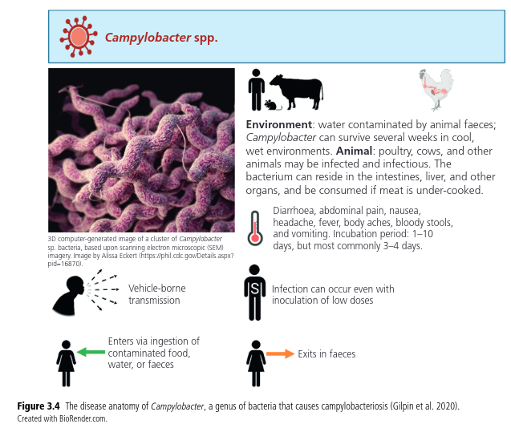{width="70%"}


---

### Don't eat chicken liver pâté at holiday parties 

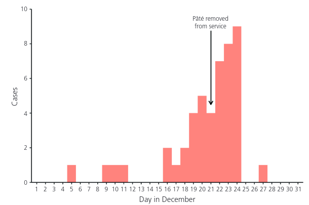{width="85%"}


<sub> O'Leary et al. 2009 _Epidemiology and Infection_ </sub> 


---

### Campylobacter cases in Germany from 2001-2011 

{width="80%"}


---

### Statistical modeling 

Fit a statistical model just based on case counts over time

+ good for exploring periodicity in infections 
+ could be useful for forecasting 


---

### A fit statistical model 

{width="90%"}


<sub> https://epirhandbook.com/en/time-series-and-outbreak-detection.html </sub> 


---

### Phenomenological modeling 

+ SEIR model of humans (h) and houseflies (f) 


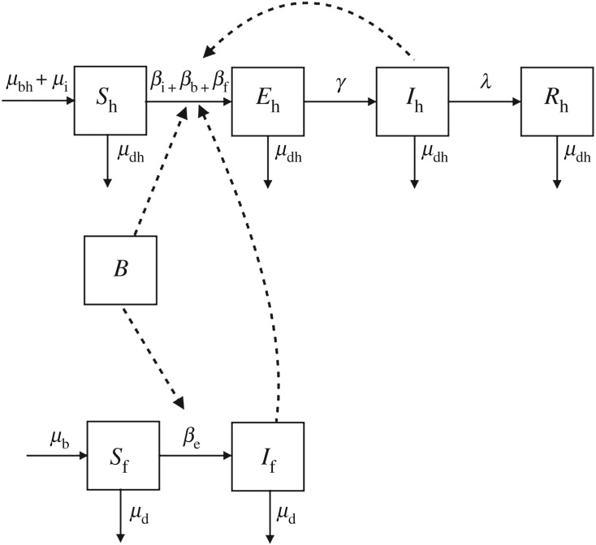{width="60%"}


> https://www.ncbi.nlm.nih.gov/pmc/articles/PMC6408420/


---

### Phenomenological modeling 

+ Built from knowledge about transmission, without looking at data first 


+ can still be fit to data, so some of the resulting outputs may be similar between the two approaches

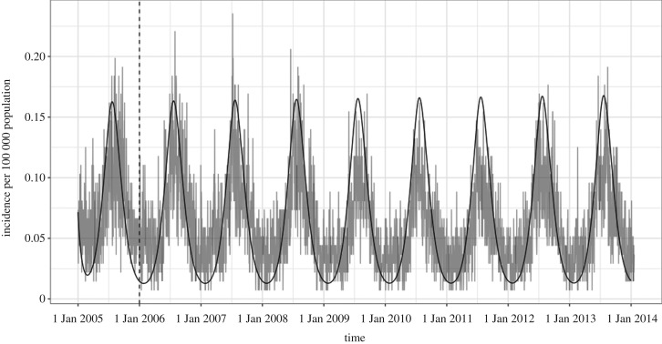{width="90%"}

> https://www.ncbi.nlm.nih.gov/pmc/articles/PMC6408420/


---

### How can simple models produce all of these complex patterns? 

+ Next lecture we'll be going over modeling infectious disease

+ Most of the models we will go over produce outbreak-like dynamics (epidemics) 

> Before next class, think about when you would expect to see sequential epidemics or endemic infections 


---

### Modeling infectious disease : S-I-R

*S* : susceptible individuals

*I* : infectious individuals

*R* : recovered (and immune) individuals


> Costs of parasitism do not have to involve death


---

### S-I-R model

\[
 \begin{aligned}
  \frac{dS}{dt}   &=  -\beta SI  \\
  \frac{dI}{dt}   &=  \beta SI - dI  \\
  \frac{dR}{dt}  &=  dI 
 \end{aligned}
\]

+ Is this density or frequency dependent transmission? 


---

### SIR curves
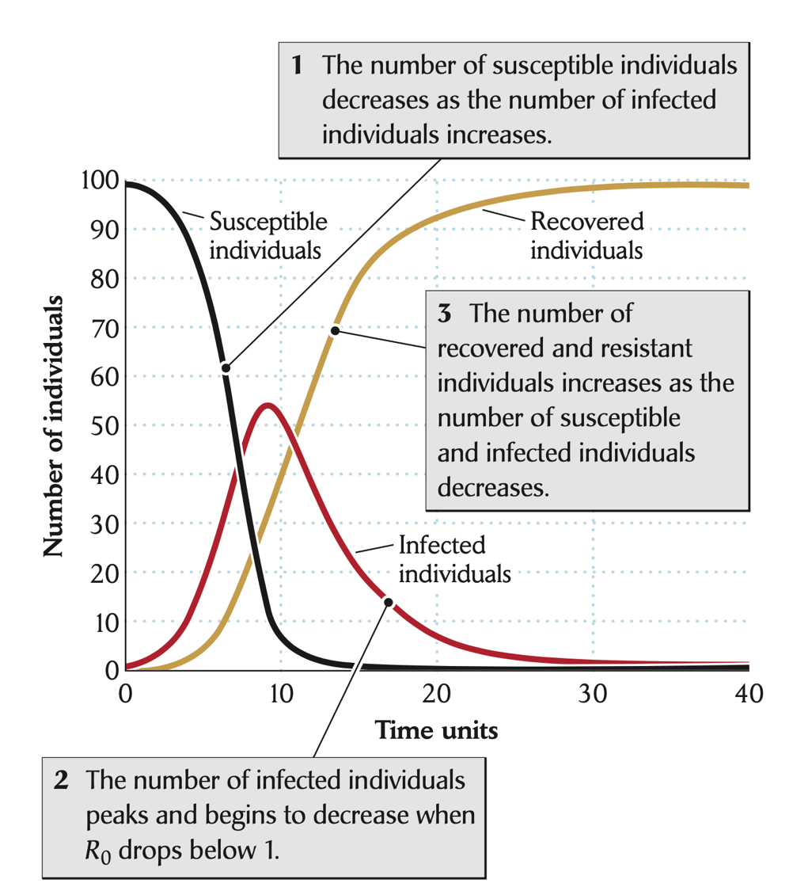{width="50%"}


---

### S-I-R model 

+ frequency-dependent transmission 

\[
 \begin{aligned}
  \frac{dS}{dt}   &=  -\beta \dfrac{SI}{N} \\
  \frac{dI}{dt}   &=  \beta \dfrac{SI}{N} - dI  \\
  \frac{dR}{dt}  &=  dI 
 \end{aligned}
\]


---

### Host population size still matters for frequency-dependent transmission 

+ But in terms of infection prevalence, not in terms of pathogen invasion 

+ This also makes the odd assumption that there is no recovery of infected hosts 

```{r, echo=FALSE}
SIRf <- function(t, y, p) {
  {
        S <- y[1]
        I <- y[2]
        R <- y[3]
        N <- S + I + R
    }
  with( as.list(c(y,p)), {
    dS.dt <- -B*I*S/N
    dI.dt <- B*I*S/N - g*I
    dR.dt <- g*I
   return( list(c(dS.dt, dI.dt, dR.dt)) )
  } )
}
S <- 4^(0:4);  I <- 1; parmsf <- c(B=1, g=0)
Months <- seq(0, 12, by=0.1)
outf <- sapply(S, function(s) {out <- ode(c(s,I,R), Months, SIRf, parmsf)
                               out[,3]/apply(out[,2:4], 1, sum) } )
outf.t <- cbind.data.frame(Months=Months, Transmission="Frequency", outf)
names(outf.t)[3:7] <- paste("N =", S+1)
outf.tl <- tidyr::pivot_longer(outf.t, cols=3:7, names_to="N", values_to="Prevalence")
outf.tl$N <- factor(outf.tl$N, levels = paste("N =", S+1) )

ggplot2::ggplot(outf.tl, ggplot2::aes(Months, Prevalence, colour=N)) + ggplot2::geom_line()  

```


---

### If we include a recovery term, we see shifted epidemic curves 

```{r, echo=FALSE}

S <- 4^(0:4);  I <- 1; parmsf <- c(B=1, g=0.25)
Months <- seq(0, 12, by=0.1)
outf <- sapply(S, function(s) {out <- ode(c(s,I,R), Months, SIRf, parmsf)
                               out[,3]/apply(out[,2:4], 1, sum) } )
outf.t <- cbind.data.frame(Months=Months, Transmission="Frequency", outf)
names(outf.t)[3:7] <- paste("N =", S+1)
outf.tl <- tidyr::pivot_longer(outf.t, cols=3:7, names_to="N", values_to="Prevalence")
outf.tl$N <- factor(outf.tl$N, levels = paste("N =", S+1) )

ggplot2::ggplot(outf.tl, ggplot2::aes(Months, Prevalence, colour=N)) + ggplot2::geom_line()  
```


---

+ In the next lecture, we'll focus much more on density-dependent transmission and the underlying modeling framework.

+ We'll also be incorporating further realism into the simple SIR model to think about epidemics and endemic disease

