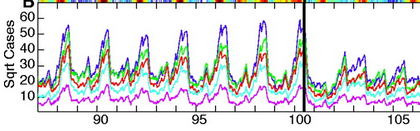
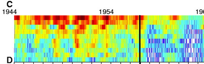
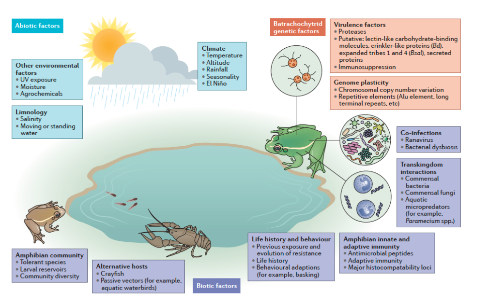
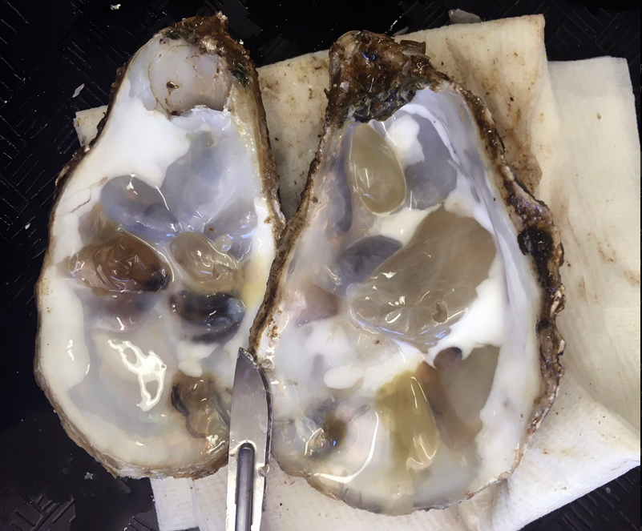
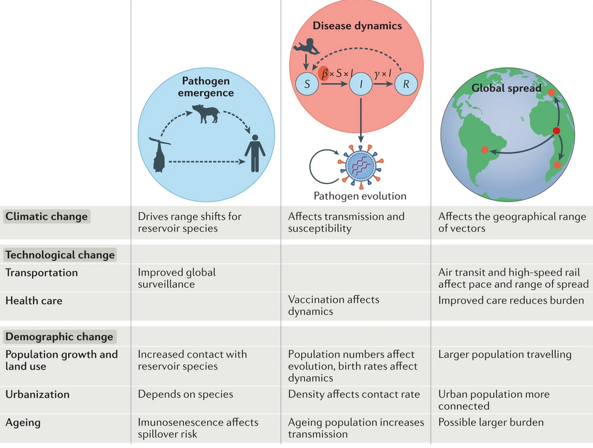
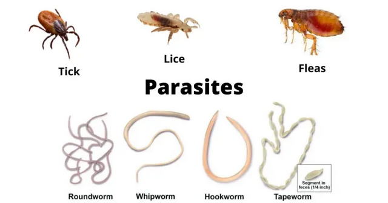

---

### Introductions 

I can start this off. Then we can go around the room, thinking about

+ what you want to get out of the course
+ any worries/feelings/questions/concerns about the course
+ your favorite parasite

---

### A bit about me 

+ my background is quantitative disease ecology
+ started with ticks and small mammals
+ host-parasite interactions are incredibly interesting, parasites are gross. 
+ [lab research here](https://taddallas.github.io)

---

### A bit about course structure 

+ lecture (3 hrs) + lab (1 hr)
+ structure of lecture
+ structure of lab
+ [course website](https://dallaslab.github.io/diseaseEcology/syllabus/)

---

### Syllabus

Work through syllabus, clarify structure, etc. 

- [syllabus](https://dallasLab.github.io/diseaseEcology/syllabus/)

_why is the website called "diseaseEcology" if this is a "parasitology" course?_

---

### Course website 

Go through the course website and make sure everyone has easy access and is clear on how to get the lecture notes, readings, and homeworks. 

---

  
  
  

<h2> 
 End of lecture 1 
 </h2> 

---

### What is parasitology? 

+ The study of parasites and parasite-related disease

+ The difference between parasites and disease

+ Parasitology, disease ecology, and epidemiology 

--- 

### Parasitology, epidemiology, ecology

+ Parasitology: the study of parasites 

+ Epidemiology: study of human infectious disease 

+ Ecology: study of interactions with organisms and their environment 

> So how would we define disease ecology? 

--- 

### What's the difference between disease ecology and epidemiology? 

> Raise your hand if you've taken an epidemiology course 

+ What were the big takeaways? 
  + Focus on mitigation, less on complexity?
  + Incorporating individual heterogeneity or environmental impacts?
  + Model environmental pathogen or vector populations, or were human case counts the main data? 

--- 

### What's the difference between disease ecology and epidemiology? 

+ Disease ecology uses some of the underlying theoretical models from epidemiology, but incorporates the role of species interactions and environmental drivers of infection dynamics 

---

### What this looks like in practice 

+ Measles across England and Wales (1944-1994) 

+ Time series of case counts in largest 10 cities reveals the clear effect the development and uptake of the vaccine

{width=80%}

---

### But it also changes the synchrony in case counts 

+ synchrony is the tendency to have correlated fluctuations between two neighboring systems 

+ here, the synchrony was driven by disease spreading across cities pre-vaccination 

+ the synchrony went away after the vaccine was developed, because vaccine uptake through time tended to not be correlated between cities (and probably for other reasons) 

{width=80%}

---

> What parts of that study are more epidemiological, and what parts are more ecological? 

---

### What about ecology and parasitology? 

> During a job interview I was once called a parasitologist 

+ Why I am not a parasitologist 
  + I don't study individual parasites
  + I can't identify parasites to species 
  + I've rarely handled parasites 
  + I don't care about what many parasitologists care about 

---

### But you could call me a parasite ecologist 

+ I care less about describing parasites and more about 
  + how they infect their hosts 
  + how this process is mediated by the environment 
  + what the costs to host fitness are 
  + if I can generalize across systems and gain common insight 

---

### How many parasites are there? 

+ Around 40% of species diversity 

+ Incredibly varied in life history

+ Tough to say
  + We keep finding more
  + [Sampling is limited](https://pubmed.ncbi.nlm.nih.gov/33203333/) 
  + Depends on what you want to call a parasite (viruses?)
  + Guesses range around 6 to 10 million species 
  

---

### Why are parasites important? 

+ Regulation of population and community dynamics 
  + Classic Hudson work ([population cycles as function of parasitism](https://pubmed.ncbi.nlm.nih.gov/9856948/))
  
+ They are costly (human health, economic loss, etc.)

+ [Use of parasites as biocontrol](https://csiropedia.csiro.au/myxomatosis-to-control-rabbits/)

+ An interesting ecological interaction (why study plant-pollinator interactions?)

---

### What is the worst parasite? 

> 5 minutes chatting in small groups

> But every person gets 1 answer 

I want

  + name of parasite 

  + why it's the worst 

--- 

### Microparasites 

+ Generally microscopic 

+ e.g., viruses, protozoans, bacteria, fungi 

--- 

### Macroparasites 

+ Visible with naked eye

+ Generally rely less on the host for everything 

+ e.g., helminths, ticks 

---

### Microparasites versus macroparasites 

+ Microparasites mulitply within the host, macroparasites release juveniles outside 

+ So...botflies are microparasites?

+ But enough people use this as a definition to where we should at least recognize it. 
 
+ So macroparasite (e.g., cestode worm releases proglottids from host) different from microparasite (e.g., _Yersenia pestis_ bacterial life cycle tons of times in same infected host). 

--- 

### Zoonotic parasites

+ A zoonotic parasite is a parasite that can infect humans. 

+ A lot of the examples we'll use in class will be on infectious diseases of humans 

+ But this is not solely a human infectious disease course, so we'll be pulling plenty of wildlife examples 

+ Let's name some zoonotic parasites 

+ Let's define some terms
  + spillover
  + emergence
  + re-emergence

--- 

### The idea of parasite conservation 

+ Parasites are incredibly diverse, and may represent a lot of extinctions 

+ How/why do parasites go extinct? 

+ [Which parasites should be conserved?](https://www.sciencedirect.com/science/article/pii/S0006320719319937)
  + tough to advocate for parasites which threaten human health or which threaten animal populations
  

---

### What is the difference between parasites and disease? 

+ Parasitism is being infected by a parasite. 
+ Disease is defined as the expression of symptoms related to the parasite. 

> So the parasite causes disease, but these terms should not be confused. 

---

### Why do we care about infectious disease? 

+ Impact on biodiversity 

+ Economic importance

+ Impacts on humans 

---

### Impact on biodiversity 

{width=90%}

 Fisher et al. 2020. _Nature Reviews Microbiology_ 

---

### Economic importance

{width=80%}

 Cassella. 2022. _High Country News_ 

---

### Impact on humans 

{width=80%}

 Baker et al. 2022. _Nature Reviews Microbiology_ 

--- 

### Koch's postulates

+ Microorganism must be present in diseased individuals and absent in healthy individuals.

+ Microorganism must be isolated from a diseased organism and grown in pure culture.

+ Cultured microorganism should cause disease when introduced into a healthy organism.

+ Microorganism must be re-isolated from the inoculated, diseased experimental host and identified as being identical to the original specific causative agent.

---

### Limitations of Koch's postulates

+ Super important when originally introduced for characterizing disease (TB, cholera, etc.)

+ Many infectious diseases subvert the postulates
  + some pathogens can't be cultured yet (e.g., many prion diseases)
  + asymptomatic folks (e.g., Koch himself saw this with cholera)
  + low prevalence of infection given inoculation (hence the 'should' in postulate 3, which was previously 'must')
  
  

---

### Even Koch had to bend his own postulates 

+ Asymptomatic carriers of _Vibrio cholera_ exist, so first postulate was already bent before it's first application 

---

### Start of the wrap-up for the easy week 1 introduction 

--- 

### Welcome to parasite ecology or disease ecology 

{width=100%}

---

### But we will also learn 

+ some epidemiological modeling bits 

+ a fair bit of ecology 

+ a decent amount of human infectious diseases 

+ some definite fun wildlife diseases

---

### Let's have a good semester 

+ We're going to learn a lot

+ Stay on top of readings

+ Ask when you have questions

+ Have fun
