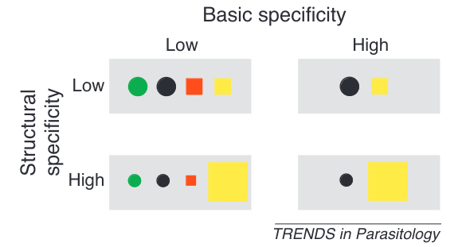

```{r setup, include=FALSE} 
knitr::opts_chunk$set(warning = FALSE, message = FALSE) 
```


<style type="text/css">
.main-container {
  max-width: 800px;
  margin-left: auto;
  margin-right: auto;
}
h2 { 
 color: #3399ff;		
}
h3 { 
 color: #3399ff;		
}
</style>


---

### What is parasite species richness? 

+ Number of parasite species known to infect a given host

Does consider:

+ the total number 
+ phylogenetic relationships (sometimes)
+ functional traits (sometimes)


Does not consider:

+ relative utilization of hosts 
+ effects on host fitness 


---

### What is parasite host range?

+ Number of host species known to be infected by a given parasite

Does consider:

+ the total number 

Does not consider: 

+ relative utilization of hosts 
+ effects on host fitness 
+ etc. 


<div class="notes">
This is my *note*.

</div>


---

### Parasite host range 

What are some potential challenges in estimating parasite host range? 


<div class="notes">

Parasites often infect with low infection prevalence, so estimating parasite host range is difficult. The transition from this is that specificity is multi-faceted, but even knowing the number of hosts a parasite can infect is tough. 

</div>


---

### Predicting parasite host range 

+ What are some approaches to estimating parasite host range? 
+ At what scale is host range defined (a country? a species?)

<div class="notes">
This is my *note*.

</div>


---

### Predicting parasite host range 

{width="80%"}


<sub> Dallas et al. 2017 _PRSB_ </sub> 

<div class="notes">
This is my *note*.

</div>


---

### Estimating host range 


{width="65%"}

<sub> Dallas et al. 2017 _PRSB_ </sub> 


---

### What determines parasite host range? 

+ physical factors (skin thickeness)
+ environmental factors?!
+ host phylogenetics


<div class="notes">
Env ties into geographic specificity and host availability.

</div>


---

### Host range is just a number 

The number of host species a parasite infects. How might this not be a good measure of specificity? 


<div class="notes">
could infect lots of host within the same genus. could infect the same tissue across all host species, so it may be a taxonomic generalist, but a tissue specialist. 

</div>


--- 

### What is host specificity? 

+ Broad term related to the diversity of host species a parasite can infect 
+ Parasites may be specific in multiple ways 
  + number of hosts (host range)
  + tissue tropism 
  + morphological specificity 
  + 


<div class="notes">

Talk about tissue tropism as a measure of specificity, as well as phylogenetic constraints on specificity, morphological constraints on specificity, etc. etc. (have some pictures or examples). Weird tongue infecting fish parasite, gill parasites, etc. etc. show the diversity of infection modes as a way to break down specificity. Talk about flip side of this as well, where some parasites are exceptional generalist (the mites that cause sarcoptic mange, certain viruses like influenza). 

</div>


--- 

### Different measures of specificity 

+ taxonomic (basically host range)
+ phylogenetic
+ functional


{width="100%"}

<sub> Dallas et al. 2020 _J Animal Ecology_ </sub> 


<div class="notes">
Use this figure as a way to talk about different forms of specificity. 

</div>


---

### What are the benefits and costs of specializing? 

When would specificity be good/bad? 


<div class="notes">

Tie into Park's ideas about reliability of host. 

</div>


---

### Maybe specificity does not exist? 


{width="100%"}

<sub> Canard et al. 2014 _American Naturalist_ </sub> 


---

### ...but it does. 


<br> 
<br> 

How do we know that it does? 


---

### What other ways can we think about specificity? 

+ structural specificity 

{width="80%"}

<sub> Poulin et al. 2011 _Trends in Parasitology_ </sub> 


---

### What other ways can we think about specificity? 

+ phylogenetic specificity 

{width="60%"}

<sub> Poulin et al. 2011 _Trends in Parasitology_ </sub> 


---

### What other ways can we think about specificity? 

+ specificity across space

{width="80%"}

<sub> Dallas & Jordano 2022 _Global Ecology and Biogeography_ </sub> 


---

### Are there tradeoffs in different specificities? 

{width="80%"}

<sub> Poulin et al. 2011 _Trends in Parasitology_ </sub> 


<div class="notes">

Structural specificity (differentially using host species) should be negatively related to phylogenetic specificity, because similar host species will be similar in their infectability, so the evenness of burden will fall equally across hosts. 

</div>


<!-- maybe stop here for first lecture? --> 


---

<br> 
<br> 
<br> 

<h2> <center> End of lecture 1 </center> </h2> 


---

### Host range versus parasite species richness 

+ Host range is from the parasite's perspective. 

+ Parasite species richness is from the host's perspective. 


<div class="notes">
Be clear about this distinction. 

</div>


---

### What controls parasite species richness? 

{width="100%"}

<sub> Dallas et al. 2020 _J Animal Ecology_ </sub> 


<div class="notes">

So there has been a lot of work done on this, and I'll mainly point to host traits here. 

</div>


---

### What controls parasite species richness? 

+ Body size
+ Geographic range size 
+ Host population density 

+ Host immune function?

<sub> Kamiya et al. 2013 _Biological Reviews_ </sub> 


<div class="notes">
Kamiya finds meta-analytical evidence for positive effects of body size, geographic range size, and host population density. Try to link to the actual underlying traits that are driving these compared to the neutral process of encounter (geographic range size and body size could just be encounter, but hosts with large body size and big geographic ranges might also tend to have physiological traits which make them susceptible)
</div>


---

### A note about parasite diversity 


<br> 

<br> 

Have we sampled host species well enough to know who infects who? 


<div class="notes">

Nope. So we don't know who infects who, but we also don't even have a good estimate of how many parasite species there are! 

</div> 


---

### The global distribution of undiscovered helminth parasites 

{width="50%"}

<sub> Carlson et al. 2020 _Proceedings B_ </sub> 


<div class="notes">

Nope. So we don't know who infects who, but we also don't even have a good estimate of how many parasite species there are! 

</div> 


<!-- This is the dividing line for the two classes (fill the entire second lecture with predicting host-pathogen interactions) probably need about 20-30 slides per class.  --> 


---

### Predicting host-parasite interactions 


+ Why is it important? 

+ What are the features of host and parasite that allow for infection? 


<br> 

+ What's the goal of this? 

+ How do we do it? 


---

### Let's brainstorm what information we'd want to have


---

### Sevilleta host-parasite network 

{width="100%"}

<sub> Dallas et al. 2017 _PLOS computational biology_ </sub> 


---

### Potentially important traits

{width="100%"}

<sub> Dallas et al. 2017 _PLOS computational biology_ </sub> 


---

### What traits came out of model as important?

{width="60%"}

<sub> Dallas et al. 2017 _PLOS computational biology_ </sub> 


---

### Meaning to host range/parasite species richness? 

{width="65%"}

<sub> Dallas et al. 2017 _PLOS computational biology_ </sub> 


---

### Predicting potentially zoonotic parasites

{width="60%"}

<sub> Albery et al. 2021 _Nature microbiology_ </sub> 


<div class="notes">

There are different ways to go about predicting interactions. We could care about predicting actual interactions (top left), potential geographic hotspots of emergence (top right), how traits influence the probability that a pathogen can infect humans (bottom left), or the probability that two hosts will share a pathogen (bottom right). 
</div> 


---

### Using phylogenetic information to predict associations 

{width="90%"}

<sub> Farrell et al. 2022 _J of Animal Ecology_ </sub> 


---

### Using latent network structure to predict associations 

{width="100%"}

<sub> Poisot et al. 2023 _Patterns_ </sub>


---

### Using latent network structure to predict associations 

{width="100%"}

<sub> Poisot et al. 2023 _Patterns_ </sub>


<div class="notes">

</div> 


---

### What have we learned? 

+ What is parasite host range, specificity, and parasite species richness. 
+ Different ways to measure parasite specificity 
+ How we can predict unknown host-parasite interactions (and what this means for specificity)


<div class="notes">

</div> 


