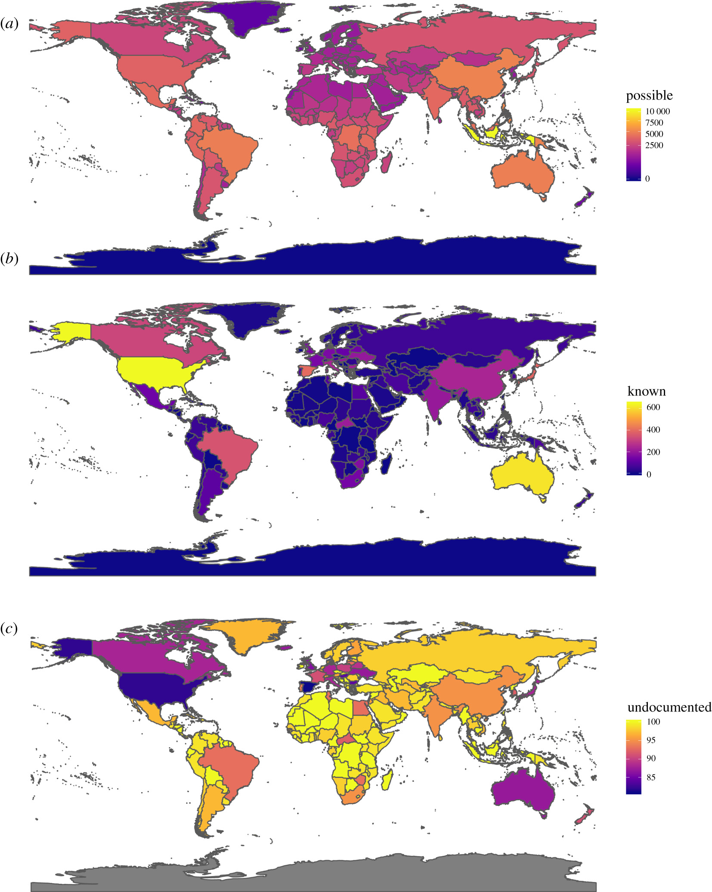
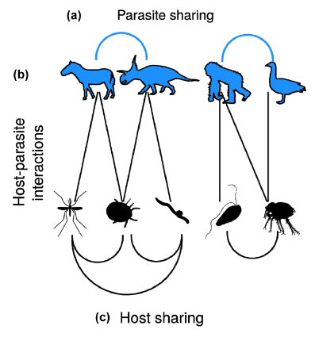
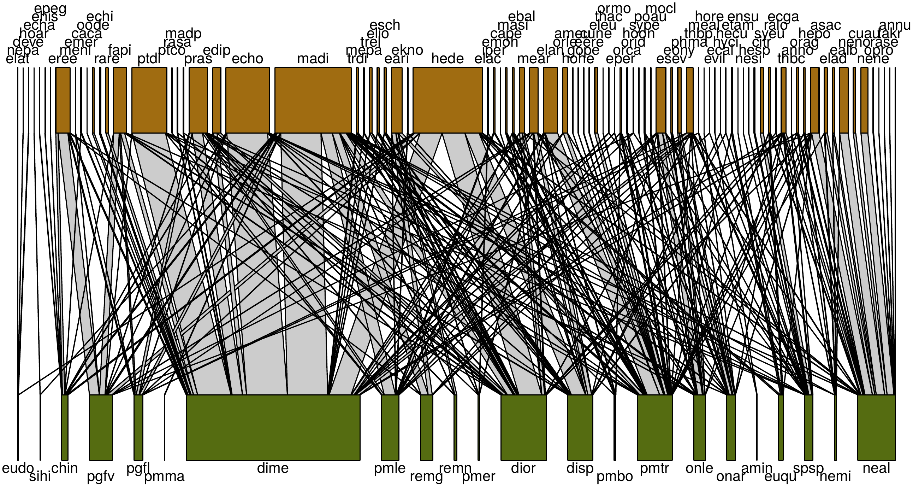

```{r setup, include=FALSE} 
knitr::opts_chunk$set(warning = FALSE, message = FALSE) 
```


<style type="text/css">
.main-container {
  max-width: 800px;
  margin-left: auto;
  margin-right: auto;
}
h2 { 
 color: #3399ff;		
}
h3 { 
 color: #3399ff;		
}
</style>


--- 

### Parasite diversity 

+ Previous lectures have gone over parasite diversity a bit 

+ Here, we will focus on two things: 
  + Parasite species richness 
  + Parasite specificity (host range) 


---

### What is parasite species richness? 

+ Number of parasite species known to infect a given host

Does consider:

+ the total number 
+ phylogenetic relationships (sometimes)
+ functional traits (sometimes)


Does not consider:

+ relative utilization of hosts 
+ effects on host fitness 


---

> Parasite species richness is not all the parasites found in a given location. 

+ It is dependent on the host species considered 

+ <font color='red'>The parasite species richness of France is 100 (weird to say, let's avoid this)</font>

+ <font color='green'>The parasite species richness of the white-footed mouse is 23 (less weird, let's do this) </font> 


---

### The scale of how we talk about parasite species richness 

+ It can be location-specific, as we expect parasite species richness to change across the host's geographic range

+ It's more about being deliberate and clear with the scale of the estimate than anything else


---

### What are some challenges in estimating parasite species richness? 

+ Cryptic infections (low prevalence or hard to find parasites) 

+ Undescribed species 

+ Biased sampling of host species 


---

### What is parasite host range?

+ Number of host species known to be infected by a given parasite

Does consider:

+ the total number 

Does not consider: 

+ relative utilization of hosts 
+ effects on host fitness 
+ etc. 


---

### What are some potential challenges in estimating parasite host range? 

+ Low prevalence

+ Biased sampling of host community 

+ Transient infections 


<div class="notes">

Parasites often infect with low infection prevalence, so estimating parasite host range is difficult. The transition from this is that specificity is multi-faceted, but even knowing the number of hosts a parasite can infect is tough. 

</div>


---

+ So parasite species richness is a property of the host, and parasite host range is a property of the parasite 

+ Both can be scale dependent, meaning they could be global estimates, or they could be regional estimates


---

### Estimating parasite host range 

+ What are some approaches to estimating parasite host range? 

+ At what scale is host range defined (a country? a species?)


---

### Predicting parasite host range 

{width="80%"}


<sub> Dallas et al. 2017 _PRSB_ </sub> 


---

### Estimating host range 


{width="65%"}

<sub> Dallas et al. 2017 _PRSB_ </sub> 


---

### How do we do this? 

+ An estimator used for free-living species but adapted to parasites 

+ The type of data you have is records of a single parasite across a number of hosts 

\[ S = S_{a} + \frac{S_{r}}{C}+\frac{f_1}{C}\gamma^{2} \]

> Let's break this down 


---

### How do we do this? 

\[ S = S_{a} + \frac{S_{r}}{C}+\frac{f_1}{C}\gamma^{2} \]

$S_a$: Number of abundant host species (above some threshold)

$S_r$: Number of rare host species (below some threshold)

$C$: the coverage estimator ($1-\frac{f_1}{n_r}$)

$\gamma^2$: the coefficient of variation 

---

### You will not be calculating anything 

+ What I want you to get a sense of is how it is estimating host range 

+ It is adding the common species, and trying to use information about the distribution of those rare species (including <font color='green'> singletons</font>) to infer the true host range given unlimited sampling

+ The same estimator can be used to estimate parasite species richness


---

### What determines parasite host range? 

+ host functional traits (e.g., skin thickness)

+ host phylogenetics

+ parasite transmission mode 

+ environmental factors


> Important note: parasite infection intensity is not necessarily related to host range 


<div class="notes">

Env ties into geographic specificity and host availability.

</div>


---

### Host functional traits 

+ Parasites may have a range of host 'types' that they can infect 

+ So a host community with similar functional traits (body size, habitat use, etc.) could lead to a parasite with a broader host range (if defined at a single location) than a host community with divergent traits 


---

### Host phylogenetics 

+ Phylogenetic information is just host trait information plus some fun evolutionary history 

+ So more evolutionarily similar host species should have similar parasite communities, resulting in those parasites having similar host ranges 


---

### Parasite sharing probability as function of taxonomic rank 

{width="50%"}

<sub> Dáttilo et al. 2020 _J Animal Ecology_ </sub> 


---

### Parasite transmission mode 

+ There will be differences in host range as a function of the parasite 

+ e.g., parasites that can survive well in the environment and rely on encounter may be more generalist and have broader host range (like fleas and ticks) 


---

### Would complex life cycle parasites have a broad or narrow host range? 


{width="90%"}

<sub> Benesh et al. 2021 _Am Nat_ </sub> 


---

### Environmental factors 

+ Environmental factors can determine if a parasite can infect 

{width="100%"}

<sub> Mordecai et al. 2019 _Ecology Letters_ </sub> 


---

### Host range is just a number 

The number of host species a parasite infects. 

> How might this not be a good measure of specificity? 


<div class="notes">

could infect lots of host within the same genus. could infect the same tissue across all host species, so it may be a taxonomic generalist, but a tissue specialist. 

</div>


--- 

### What is host specificity? 

+ Broad term related to the diversity of host species a parasite can infect 
+ Parasites may be specific in multiple ways 
  + number of hosts (host range)
  + phylogenetic specificity 
  + functional specificity 
  + tissue tropism 
  


<div class="notes">

Talk about tissue tropism as a measure of specificity, as well as phylogenetic constraints on specificity, morphological constraints on specificity, etc. etc. (have some pictures or examples). Weird tongue infecting fish parasite, gill parasites, etc. etc. show the diversity of infection modes as a way to break down specificity. Talk about flip side of this as well, where some parasites are exceptional generalist (the mites that cause sarcoptic mange, certain viruses like influenza). 

</div>


--- 

### Different measures of specificity 

+ taxonomic (basically host range)
+ phylogenetic
+ functional


{width="100%"}

<sub> Dallas et al. 2020 _J Animal Ecology_ </sub> 


---

### What are the benefits and costs of specializing? 

<br> 
<br> 

<h3> When would specificity be good/bad, and at what scales?  </h3>


<div class="notes">
Tie into Park's ideas about reliability of host. 
</div>


---

### Reliability of host species 

+ Parasites may be completely obligate, needing an available host for transmission 

+ Andrew Park has referred to this as 'reliability'. Parasites should preferentially parasitize 'reliable' hosts. How does this relate to Canard's work? 


---

### Specialism-generalism tradeoff 

+ Should generalism come at a cost? In what units is that cost paid? 

+ There doesn't tend to be much evidence for a cost 

{width="60%"}

<sub> Krasnov et al. 2004 _Am Nat_ </sub> 


---

### Except when you consider host phylogenetic distance 

+ Specialists were more abundant on hosts shared with generalists, but only if specialism was measured considering host taxonomic distance. 

{width="60%"}

<sub>Straub et al. 2011 _Am Nat_ </sub> 


---

### Depends on parasite type and transmission mode, right? 

+ Parasitoids should tend to specialize (cost of getting into a non-suitable host is high)

+ Environmentally-transmitted pathogens should be fairly generalist 

+ Parasites with high tissue tropism are more likely to generalize 


---

### Maybe specificity does not _really_ exist? 

{width="100%"}

<sub> Canard et al. 2014 _American Naturalist_ </sub> 


---

### ...but it does. 

<br> 
<br> 

How do we know that it does? 

+ Sometimes it's not just driven by species abundance 

+ Canard et al. is not _exactly_ a null model 

+ Canard is only for ectoparasitic fleas 
  + So what would happen if we tossed viruses into the mix? 

+ Canard's analysis still shows variation in both parasite species richness and host range, so specificity still exists, it's just solely driven by species abundance 


---

### What other ways can we think about specificity? 

+ structural specificity (distribution of prevalence and intensity)

{width="80%"}

<sub> Poulin et al. 2011 _Trends in Parasitology_ </sub> 


---

### What other ways can we think about specificity? 

+ phylogenetic specificity 

{width="60%"}

<sub> Poulin et al. 2011 _Trends in Parasitology_ </sub> 


---

### What other ways can we think about specificity? 

+ geographic specificity

{width="70%"}

<sub> Dallas & Jordano 2022 _Global Ecology and Biogeography_ </sub> 


---

### Are there tradeoffs in different specificities? 

{width="80%"}

<sub> Poulin et al. 2011 _Trends in Parasitology_ </sub> 


<div class="notes">

Structural specificity (differentially using host species) should be negatively related to phylogenetic specificity, because similar host species will be similar in their infectability, so the evenness of burden will fall equally across hosts. 

</div>


---

### What other ways can we think about specificity? 

+ How specific a parasite is (geographically) depends on the available host community 

+ This gets at the underlying question <font color='green'> at what level should we estimate specificity? </font> 


---

### Host range versus parasite species richness 

+ Host range is from the parasite's perspective. 

+ Parasite species richness is from the host's perspective. 

{width="100%"}


> So what control's parasite species richness? 

<sub> Dallas et al. 2020 _J Animal Ecology_ </sub> 


---

<br> 
<br> 
<br> 

<h2> <center> End of lecture 1 </center> </h2> 


---

### What have we learned? 

+ Parasites may specialize on a subset of hosts 

+ This specialism may come with a cost, but a lot of times it doesn't 

+ Parasite species richness is determined by host traits 

+ Defining the scale at which specificity is estimated is tough 


---

### Host range versus parasite species richness 

+ Host range is from the parasite's perspective. 

+ Parasite species richness is from the host's perspective. 

{width="100%"}


> So what control's parasite species richness? 

<sub> Dallas et al. 2020 _J Animal Ecology_ </sub> 


---

### Parasite species richness is pretty variable 

{width="60%"}

<sub> Dáttilo et al. 2020 _J Animal Ecology_ </sub> 


---

### What controls parasite species richness? 

+ Body size
+ Geographic range size 
+ Host population density 

<sub> Kamiya et al. 2013 _Biological Reviews_ </sub> 


<div class="notes">
Kamiya finds meta-analytical evidence for positive effects of body size, geographic range size, and host population density. Try to link to the actual underlying traits that are driving these compared to the neutral process of encounter (geographic range size and body size could just be encounter, but hosts with large body size and big geographic ranges might also tend to have physiological traits which make them susceptible)
</div>


---

### Also metabolic rate and host longevity

<div class="columns-2">

{width="100%"}

+ Note that the authors tried to correct for other variables. Why? 


<sub> Morand & Harvey 2000 _PRSB_ </sub> 

</div> 


---

### Why is host longevity negatively related to parasite species richness? 

>- long-lived species may invest more in immune response 

>- maybe parasite species richness is driving host longevity (virulence!)

>- How would we test that second hypothesis? 


---

### Do these host traits always increase parasite species richness? 

+ Think about what types of parasites would (and would not!) be influenced by things like body size, geographic range size, and population density


---

### Even the ones you think would do the thing...


<div class="columns-2">

{width="65%"}

+ Why don't ectoparasites of bats and rodents seem to follow the richness-body size relationship? 

<sub> Dáttilo et al. 2020 _J Animal Ecology_ </sub> 

</div> 


---

### Does parasite species richness depend on the type of parasite? 

<div class="columns-2">

+ Probably, but recall that parasite species richness is more of a host-level measure 

+ Hosts that are susceptible to helminths may also be susceptible to viruses, even with vast differences in transmission modes and life history


{width="100%"}

</div> 


---

### A note about parasite diversity and parasite species richness


<br> 

<br> 

+ Have we sampled host species well enough to know who infects who? 

+ What ways did we previously talk about to try to get around biased sampling and such? 


<div class="notes">

Nope. So we don't know who infects who, but we also don't even have a good estimate of how many parasite species there are! 

</div> 


---

### The global distribution of undiscovered helminth parasites 

{width="50%"}

<sub> Carlson et al. 2020 _Proceedings B_ </sub> 


<div class="notes">

Nope. So we don't know who infects who, but we also don't even have a good estimate of how many parasite species there are! 

</div> 


---

### Given limited sampling, how can we estimate parasite species richness or host range? 

+ We went over a model to predict host range previously 

{width="60%"}

<sub> Dallas et al. 2017 _PRSB_ </sub> 


--- 

### There's an interesting caveat to this model 

+ It can predict host ranges larger than the overall number of sampled host species in the community 

+ Rare, but it can do it 

+ <font color='green'> That's not ideal </font> 


---

### What are other ways to get at parasite species richness and host range? 

+ What if we assumed that all species were sampled, and it's just that we don't know who interacts with who? 


---

### Construct a network of known interactions between host and parasite species 

<div class="columns-2">
 
{width="100%"}


+ We have host species connected to parasite species by links of known parasitism

</div> 


---

### Predicting host-parasite interactions 


+ Why is it important? 

+ What are the features of host and parasite that allow for infection? 


<br> 

+ What's the goal of this? 

+ How do we do it? 


---

### Let's brainstorm what information we'd want to have


---

### Sevilleta host-parasite network 

{width="100%"}

<sub> Dallas et al. 2017 _PLOS computational biology_ </sub> 


---

### Potentially important traits

{width="100%"}

<sub> Dallas et al. 2017 _PLOS computational biology_ </sub> 


---

### What traits came out of model as important?

{width="60%"}

<sub> Dallas et al. 2017 _PLOS computational biology_ </sub> 


---

### Meaning to host range/parasite species richness? 

{width="65%"}

<sub> Dallas et al. 2017 _PLOS computational biology_ </sub> 


---

### Some questions for thought 


+ How do we go from probabilistic predictions to actual host range/parasite species richness?

+ Why do the interactions appear to be in a kind of 'triangle'?

+ How could these predictions be used to target sampling? 


---

### Predicting potentially zoonotic parasites

{width="60%"}

<sub> Albery et al. 2021 _Nature microbiology_ </sub> 


<div class="notes">

There are different ways to go about predicting interactions. We could care about predicting actual interactions (top left), potential geographic hotspots of emergence (top right), how traits influence the probability that a pathogen can infect humans (bottom left), or the probability that two hosts will share a pathogen (bottom right). 
</div> 


---

### Using phylogenetic information to predict associations 

{width="90%"}

<sub> Farrell et al. 2022 _J of Animal Ecology_ </sub> 


---

### Using latent network structure to predict associations 

{width="100%"}

<sub> Poisot et al. 2023 _Patterns_ </sub>


---

### Using latent network structure to predict associations 

{width="100%"}

<sub> Poisot et al. 2023 _Patterns_ </sub>


---

### Let's loop back to ideas around parasite species richness and host range 

+ How do these models help us understand parasite species richness and host range 

+ <font color='green'> What do they tell us about parasite specificity? </font> 


