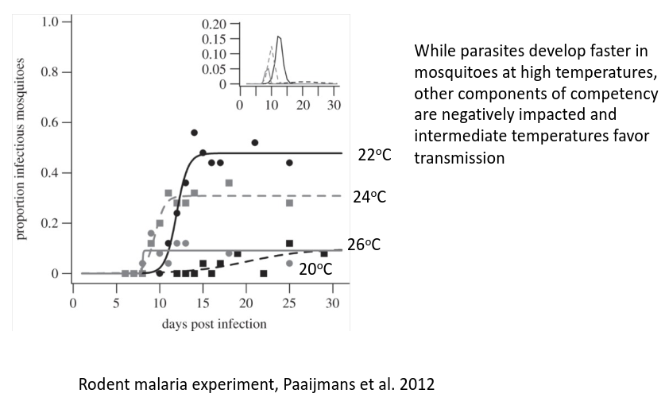
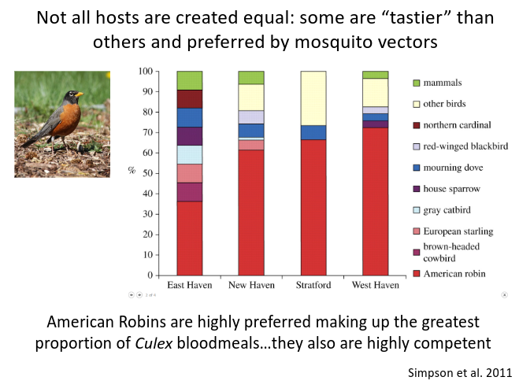

<style type="text/css">
.main-container {
  max-width: 800px;
  margin-left: auto;
  margin-right: auto;
}
h2 { 
 color: #3399ff;		
}
h3 { 
 color: #3399ff;		
}
</style>

```{r setup, include=FALSE} 
knitr::opts_chunk$set(warning = FALSE, message = FALSE) 
```


<!-- (mosquito/tick/etc., vector biology, modeling issues, R0, human health impacts, env constraints, ) week 9 from Park 2019 --> 


<!--
importance of vectors 
  + vectors control who gets disease
  + they put pathogens in different species (flying syringes)
  + human health 
  + 

why vectors make disease hit different
  + importance of vector communities
  + importance of vector presence for infection 
  + the pathogen is sort of along for the ride 
  + pathogen can influence vector behavior 
  + 

modeling vector-borne disease 
  + vector models
  + R0 weird shit
  + 


-->


---

### What is vector-borne disease? 

+ A micro- or macroparasite transmitted among vertebrate hosts by an arthropod vector 

+ Vector-borne diseases represent some of the deadliest, most impoverishing diseases of mankind and wildlife


---

### Vectors 

{width="100%"}


---

### Vectors 

{width="100%"}


---

### Importance of vector-borne disease 

+ Vectors are flying syringes 

+ Host preference determines encounter 

+ Huge economic cost 

+ Some rough diseases 


---

### Vectors are flying syringes 

+ Vectors take blood or host tissue (including pathogen) and transmit to same (or different) species

+ Means reservoir hosts are really important 


---

### Host preference determines encounter 

+ Vectors prefer certain hosts, and host preference determines the resulting disease burden 

{width="100%"}

<sub> Eigenbrode & Gomulkiewicz 2022 _J Economic Entomology_</sub> 


---

### Huge economic cost 

+ $12 billion per year (Chilakam et al. 2023 doi:10.2196/50985)

+ $100 billion economic costs per year ([USDA-ARS report](https://www.ars.usda.gov/research/annual-report-on-science-accomplishments/fy-2019/mitigating-impacts-of-vector-borne-diseases/))

+ More important is the cost in terms of impacts to human and wildlife 


---

### Should we 'extinct' some species? 

> "Keep their (_Anopheles gambiae_) DNA for future research and let them go" -EO Wilson 

{width="80%"}

<sub> Fang 2010 _Nature_; and associated 4+ replies </sub> 


---

### Some rough diseases 

Mosquitos 

+ Malaria, Dengue, West Nile, Chikv, Zika, yellow fever, 

Ticks:

+ Lyme, E equine encephalitis, Ehrlichiosis, Rocky Mtn spotted fever, Tularemia 

Other: 

+ Plague (fleas), Chagas (Tiatome bugs), Schisto (aquatic snails), Sleeping sickness (Tsetse flies)


---

### Plague

+ _Yersinia pestis_, a bacterial pathogen

+ Vectored by fleas 

+ Killed 25% of Europe's pop in 1300's

+ Exists in enzootic cycles with transmission between rodents and fleas


---

### Lyme disease

+ _Borrelia burgdorferi_, a bacterial pathogen 

+ Vectored by ticks (_Ixodes scapularis_ as main vector)

+ Ancient disease (plagued humans prior to European Colonization)

+ Disappeared around 1850's due to deforestation


---

### Lyme disease

{width="70%"}


---

### Mosquito-borne disease is different 

+ Dengue (33%+ of world pop at risk) 

+ Chikungunya (45 countries affected)

+ Zika (61 countries affected, 47 in Americas) 

+ Malaria (kills ~1 million people per year)


---

### Mosquito-borne disease is different 

 
{width="100%"}

<sub> Flores & O'Neill 2018 _Nature Reviews Microbiology_ </sub> 


---

### And we should be worried 

{width="50%"}

<sub> Ainsworth 2023 _Nature_ </sub> 


---

{width="80%"}


---

### How do we model vector-borne disease? 

+ Recall the SIR model 

{width="60%"}


---

### Ross-MacDonald model 

{width="100%"}


---

### Ross-MacDonald model 

{width="100%"}


---

### Ross-MacDonald model 

{width="60%"}

+ Host and vector terms are both in there 

+ We can look across probable parameter ranges to see the effect of each component

+ Is it more important to reduce vector infection probability (<font color='red'> $b_v$ </font>) or host duration of infection (<font color='blue'> $1/r$ </font>)

---

### Ross-MacDonald model 

{width="100%"}


---

### Ross-MacDonald model 

+ Controlling mosquitoes has largest effect 

{width="80%"}


---

### Let's kill the mosquitoes 

<div class="columns-2">
+ $R_0$ is most sensitive to changes in mosquito survival

{width="50%"}

</div> 


---

### Let's *not* kill the mosquitoes (or at least find better ways)

{width="90%"}

<sub> Hancock et al. 2018 _PNAS_ </sub>


---

### What about the other terms in $R_0$? 

{width="70%"}


---

### What about the other terms in $R_0$? 

{width="100%"}


---

### How variable is $R_0$? 

{width="90%"}

<sub> Liu et al. 2020 _Environmental Research_</sub> 


---

### Is this variability related to transmission mode? 

{width="40%"}

<sub> Dhungel et al. 2022 _Int J Environ Res Public Health_</sub> 


---

<br> 
<br> 
<br> 

<h2> <center> End of lecture 1 </center> </h2> 


---

### What have we learned? 

+ Vector-borne disease is pretty rough 

+ We have a decent model of vector-borne disease 

+ It can help identify suitable mitigation strategies 


---

### The role of environment on vector-borne disease 

{width="100%"}


---

### The role of environment on vector-borne disease 

{width="100%"}


---

### The role of environment on vector-borne disease 

{width="100%"}


---

### Does this mean climate change is 'good'? 

+ Mixed, but probably not 

+ How could it be _good_? 

+ Why is it especially _not good_ for us? 


---

### Climate change could cause disease shifts 

{width="80%"}


---

### or vector distribution shifts

{width="40%"}


<div class="notes">
Yellow dots on light grey means a known occurrence was not predicted by the model. And projected distributions under climate shifts don't generally move the vector into much more new territory. Points to need for better models. 
</div>


---

### or vector distribution shifts

_Anopheles gambiae_ is the biggest malaria vector, currently limited in distribution

{width="90%"}

<sub> Li et al. 2021 _J Biosafety & Biosecurity_ </sub> 


---

### or vector distribution shifts

Projected distribution is a bit scarier

{width="80%"}

<sub> Li et al. 2021 _J Biosafety & Biosecurity_ </sub> 


---

### but the vectors are already here in the USA 

{width="80%"}

<sub> Evans et al. 2017 _eLife_ </sub> 


--- 

### the bigger question is...

<br> 
> if the vector species are already here, why is the pathogen not found as often? 

This points to either the importance of the <font color='green'> reservoir host community </font> or <font color='green'> environmental control of pathogen presence </font> 


---

### This is not to say that vector-borne disease is not increasing in the US 

+ Some diseases we were already struggling with (e.g., Lyme; 20-30k cases per year) 

+ Some we are now starting to grapple with (e.g., Zika; local transmission back in 2016-2017, but not since) 

+ Some are right around the corner (e.g, Dengue; local transmission in Florida, Texas and Arizona)


---

### The role of vector preference on resulting disease dynamics 

{width="90%"}


---

### The role of vector preference on resulting disease dynamics 

{width="85%"}


---

### The role of vector preference on resulting disease dynamics 

<font color='green'> Important</font> because:

+ Vector feeding preferences are particularly important for multi-host systems

+ Can introduce variation in exposure across different groups of individuals within a host population

+ Vector preference can inform intervention strategies based on vector and reservoir communities 


---

### But let's not be silly about it 

{width="100%"}


---

### But let's not be silly about it 

+ Response to this (and other bat-vectored disease) is to try to kill bats 

+ Often killed the wrong bats

+ Some efforts potentially increased disease in humans 


---

### But let's not be silly about it 

{width="100%"}

<sub> https://www.reuters.com/investigates/section/global-pandemic-bats-overview/ </sub> 


<div class="notes">
Bats may be likely for more infectious diseases in humans. There are many emerging diseases that start in bats. But this article details how land use change is one of the largest drivers of this emergence. So burning trees is not really a solution. 
</div>


---

### Plus bats are pretty cool

{width="80%"}

<sub> https://www.batcon.org/ </sub> 


---

### The role of pathogen infection on vector behavior

{width="100%"}


---

### The role of pathogen infection on vector behavior

{width="100%"}


---

### The role of pathogen infection on vector behavior

{width="100%"}

---

### The role of pathogen infection on vector behavior

{width="100%"}


---

### Parasite manipulation of host behavior

1. _Plasmodium_ can direct uninfected mosquito blood-seeking and feeding behavior via alteration of vertebrate-host odor profiles and production of phagostimulants 

2. Plasmodium also manipulates its vector during the sporogony cycle to increase transmission (infected mosquitos bite more and take longer bloodmeals)


> So the malaria pathogen can shift host preferences and increase transmission rates through manipulation of host behavior

<sub> Emami et al. 2019 _Pathog Glob Health_ </sub> 


---

### The role of vector behavior in response to interventions 

{width="100%"}


---

### The role of vector behavior in response to interventions 

{width="100%"}

---

### The role of vector behavior in response to interventions 

{width="100%"}


--- 

### Questions to think about

+ What determines how widespread a vector-borne pathogen can be? 

+ Why are vector-borne diseases so tough to control? 


<div class="notes">


</div>


