<style type="text/css">
.main-container {
  max-width: 800px;
  margin-left: auto;
  margin-right: auto;
}
h2 { 
 color: #3399ff;		
}
h3 { 
 color: #3399ff;		
}
</style>

```{r setup, include=FALSE} 
knitr::opts_chunk$set(warning = FALSE, message = FALSE) 
```


<!-- 
  Split this with final exam review, so this becomes just one lecture to finish it off. 

  what are zoonoses and how do they happen, 

  define emergence/re-emergence/outbreak, 
  
  climate change/land use/human-wildlife interface, 

  risk factors for zoonoses - phylo relationship to reservoir, interaction with reservoir, routes of spillover 
  
  predicting zoonotic potential 

  week 12 and week 13 from Park 2019
  
-->


--- 

### Last actual lecture of the term! 

We've learned a lot and had some fun 


---

### Zoonotic disease 

+ We've talked about zoonoses before (Lyme disease in the last lecture, Ebola, avian flu, trichinosis, etc.) 

+ <font color='green'> zoonosis </font> a pathogen that can be transmitted into humans through animals 

+ <font color='red'> reverse zoonosis </font> a pathogen that is transmitted from humans into animals 


---

### Zoonotic disease 

+ This distinction is not super important, but it does get at a key part of many zoonotic diseases, <font color='blue'> transmission from animals into humans is rare, and humans are normally dead end hosts capable of human-to-human transmission only </font> 


---

### Zoonotic disease 

+ Pretty common (let's name some examples) 

+ Around 60% of all human pathogens are zoonotic 


---

### Emerging infectious disease (EID) 

+ Newly appeared pathogens, or those that have increased in prevalence/range recently 

+ Recall definitions previously about outbreak, emergence, and re-emergence 

+ Around 75% of EIDs affecting humans are zoonotic 


--- 

### The rise of EID 

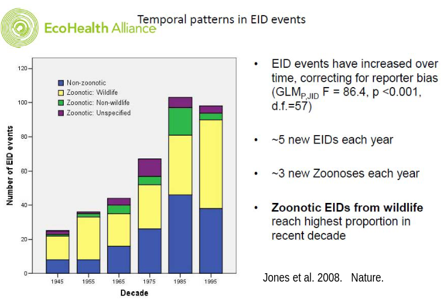


---

### Why the increase in EIDs? 

+ human-wildlife interface 

+ antibiotic resistance 

+ increased connectivity and movement of human populations 

+ poverty

+ health care infrastructure  


---

### Preventable disease 

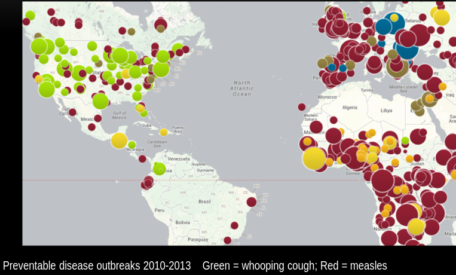


--- 

### Spillover 


<div class="columns-2">

+ Transmission from animals into humans 

+ Rare events that then lead to sustained human-to-human transmission 


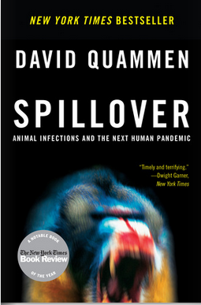

</div>


--- 

### Spillover

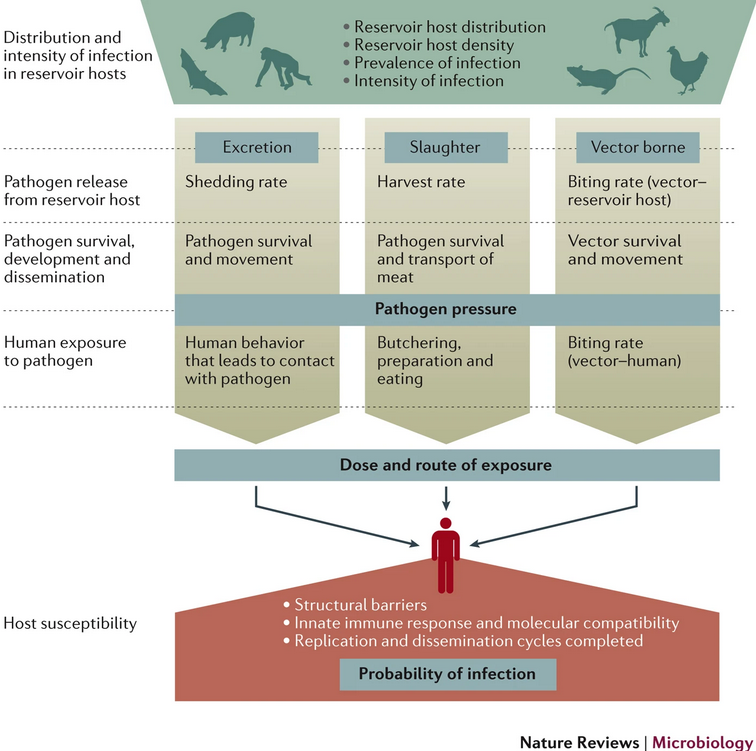{width=60%}

<sub> Plowright et al. 2017 _Nature Reviews Micro_</sub>

--- 

### Spillover

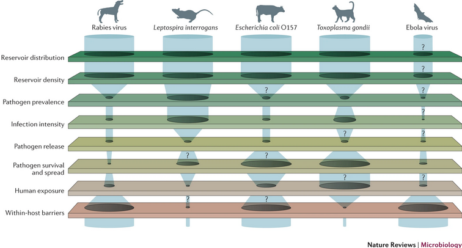

<sub> Plowright et al. 2017 _Nature Reviews Micro_</sub>


--- 

### Spillover

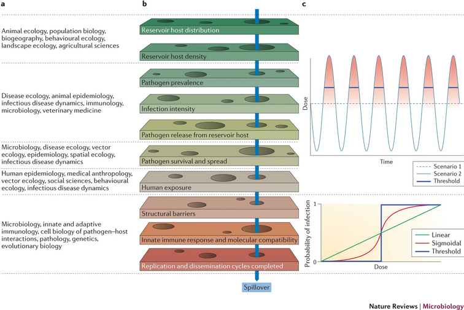

<sub> Plowright et al. 2017 _Nature Reviews Micro_</sub>


--- 

### One Health

+ Paradigm of infectious disease control which doesn't solely focus on human population outcomes (like more traditional epidemiology does) 

+ Considers 3 things: 

  + human health 
  + environmental health 
  + animal health 

+ The One Health approach argues that it's at the intersection of all these 


--- 

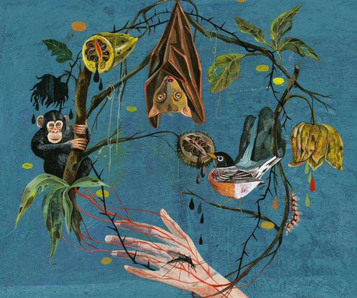


---

### The rise of One Health 

+ A conference in 2004 created the <font color='green'> Manhattan Principles </font>, a list of 12 recommendations 

+ A step forward (in my mind) and indicative of how we treat natural systems over time

+ But a huge departure from traditional thinking 

  + e.g., principle *4*: _Recognize that human health programs can greatly contribute to conservation efforts_


--- 

### An example of One Health 

+ _Salmonella_ that can infect humans are commonly found in migratory songbirds 

+ 2021 outbreak caused 3x more dead birds compared to 2016 

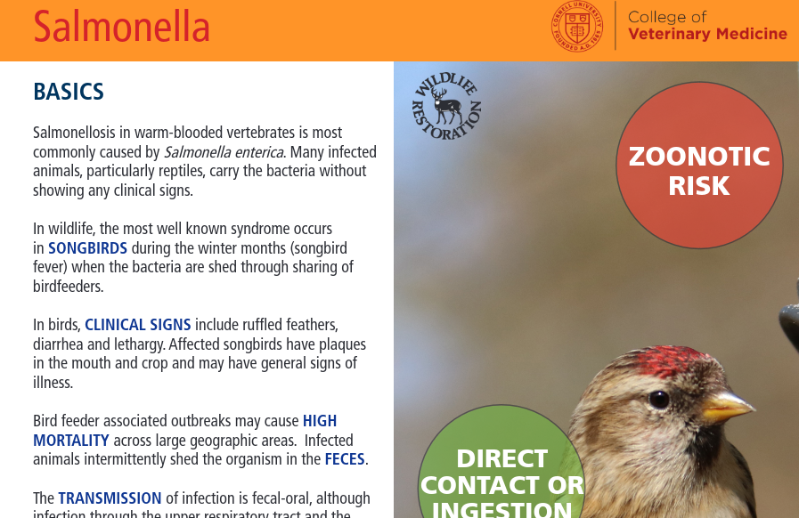{width="70%"}


---

### An example of One Health 

+ One Health approach: 
  
  + CDC messaging about bird feeders/baths and role of pets 
  
  + "wash your hands" (classic public health)

  + bird monitoring! 

  + cross-sector work (I research disease, but I rarely interface with CDC or conservation folks) 

<sub> https://www.cdc.gov/onehealth/in-action/investigating-salmonella-and-wild-songbirds.html </sub>


---

### A generalized example of One Health 

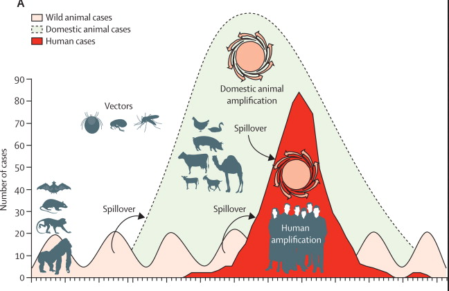

<sub> Karesh et al. 2012 _The Lancet_ </sub>


---

### A generalized example of One Health 

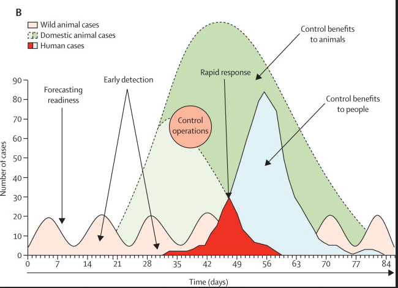

<sub> Karesh et al. 2012 _The Lancet_ </sub>


---

### Emphasizes surveillence 

> <font color='green'>3</font>: Include wildlife health science as an essential component of global disease prevention, surveillance, monitoring, control and mitigation. 

> <font color='green'>5</font>: Devise adaptive, holistic and forward-looking approaches to the prevention, surveillance, monitoring, control and mitigation of emerging and resurging diseases that take the complex interconnections among species into full account.


---

### Virus hunters 

+ Perhaps what surveillance should not look like? 

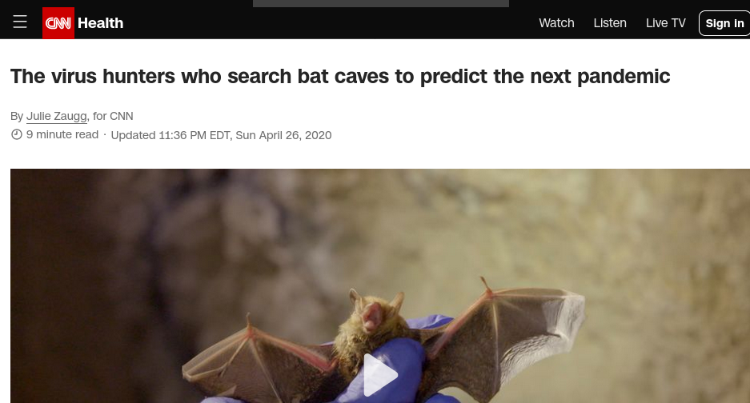{width=95%}


---

### Informed surveillance 

+ Link prediction methods like we went over previously can help target surveillance 

+ We shouldn't just be sampling bats 


--- 

### How do we do informed surveillance? 

(5 minutes small groups)

<div class='notes'> 

Don't look only for novelty. Target some hosts. Focus on areas of highest potential (human-wildlife overlap, domesticated animals, etc.) 

</div>


---

### Also emphasizes animal conservation in concert with ecosystem services 

 > Seek opportunities to fully integrate biodiversity conservation perspectives and human needs (including those related to domestic animal health) when developing solutions to infectious disease threats. 

+ <font color='green'> ecosystem services </font>: benefits to humans obtained from functioning ecosystems (e.g., pollination, recreation, etc.)


--- 

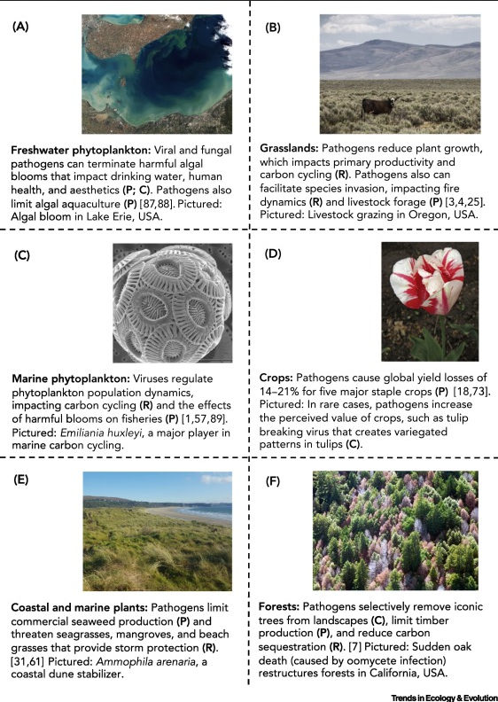{width=55%}


--- 

### The need for better communication 

> <font color='green'>12</font>: Invest in educating and raising awareness among the world's people and in influencing the policy process to increase recognition that we must better understand the relationships between health and ecosystem integrity to succeed in improving prospects for a healthier planet.


---

### What are the challenges in communicating science to the public? 

+ Think of what just happened with COVID-19, as well as the shifting landscape of (mis)information availability 


(5 minutes small groups)


<div class='notes'> 

messaging changed over time (which it should), which led to mistrust 

science needs uncertainty, but hard to communicate uncertainty 

there is no perfect prediction 

hindsight is 20/20 

people tend to 'do their own research' 

</div>


--- 

### Conclusions 

> "Multisectoral collaboration, including clinicians, public health scientists, ecologists and disease ecologists, veterinarians, economists, and others is necessary for effective management of the causes and prevention of zoonotic diseases"

<sub> Karesh et al. 2012 _The Lancet_ </sub> 


